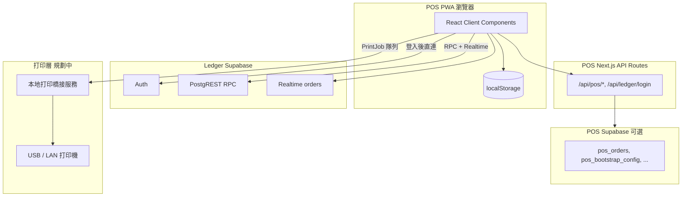
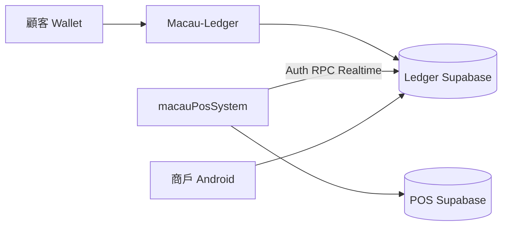

# 總體系統設計（Overall System Design）

> **版本**：MVP v0.1  
> **最後更新**：2026-08-12  
> **狀態**：開發中，可門店試運營（飲品店 / 輕快餐）

---

## 1. 專案定位

**Macau POS System** 是面向澳門餐飲門店的第一版 Web POS，服務場景：

- 奶茶店、咖啡店、炸雞小食、輕堂食
- 堂食 + 快餐 + 線上訂單（來自澳門會員通 Ledger）
- USB / LAN 打印（廚房單、收據、標籤）

**不做（v1 邊界）**：

- 藍牙打印
- 大型中餐酒樓複雜工位分單
- 平台託管金流（金額為 Ledger 記錄，非支付通道）
- Ledger Vercel HTTP 代理（線上訂單直連 Supabase）

---

## 2. 核心業務規則

| 規則 | 說明 |
|------|------|
| 訂單流程 | **先落單送廚房，後收錢** |
| 會員 | v1 在 POS 可查餘額／券；權威在 Ledger |
| 打印 | 僅 USB / LAN；前端生成 `PrintJob`，本地橋接層輸出 |
| 收銀規則 | 主系統下發，POS 只讀 + 快取 |
| 打印機設定 | 在 POS 終端設定，回寫後台 |
| 線上訂單 | Ledger `orders` 為唯一權威；Realtime 同步，**禁止 polling** |

---

## 3. 架構總覽



### 3.1 三層資料

| 層 | 技術 | 用途 |
|----|------|------|
| **本地** | `localStorage` | 離線優先：訂單、隊列、打印、設定、班次 |
| **Ledger Supabase** | 必配 | 登入、線上訂單讀寫、報表、菜單對照 |
| **POS Supabase** | 可選 | 雲同步、Admin、Backoffice、會員持久化 |

未配置 POS Supabase 時，系統以 `mock-data.ts` + localStorage 運行（除 Ledger 登入／線上單）。

### 3.2 雙 Supabase 說明

```
┌─────────────────────────────────────────────────────────────┐
│  Ledger Supabase（澳門會員通）                               │
│  • NEXT_PUBLIC_SUPABASE_URL / ANON_KEY                      │
│  • AUTH_PIN_PEPPER（伺服器 only）                            │
│  • 線上訂單、登入、報表 RPC                                   │
└─────────────────────────────────────────────────────────────┘

┌─────────────────────────────────────────────────────────────┐
│  POS Supabase（本 repo 自有，可選）                          │
│  • SUPABASE_URL / ANON_KEY / SERVICE_ROLE_KEY               │
│  • 店內訂單同步、bootstrap、device-config、admin 帳戶         │
└─────────────────────────────────────────────────────────────┘
```

---

## 4. 技術棧

| 類別 | 選型 | 版本 |
|------|------|------|
| 框架 | Next.js App Router | 16.3 |
| 語言 | TypeScript | 5.x |
| UI | React + Tailwind CSS | 19 / 4 |
| 資料庫客戶端 | @supabase/supabase-js | ^2.112 |
| MQTT（預留） | mqtt | ^5.15 |
| 部署 | Vercel | — |
| PWA | 自寫 Service Worker | `public/sw.js` |

---

## 5. 模組劃分

### 5.1 前台 POS（`/`, `/settings`, `/prints`…）

- **核心**：`src/components/pos-app.tsx`（收銀、堂食/快餐、結帳）
- **設備**：`device-settings.tsx`（打印機、分區、菜單打印）
- **打印中心**：`print-center.tsx`

### 5.2 線上訂單（`/orders`）

- **元件**：`online-orders.tsx`
- **整合**：`src/lib/ledger/*` — RPC + Realtime，不接 `/api/online-orders`（已 410）

### 5.3 登入與鑑權（`/login`）

- 8 位電話 + 4 位 PIN → `/api/ledger/login` → Ledger Supabase Auth
- `AuthGuard` 要求 `merchantId` + `ledgerAccessToken`

### 5.4 後台（`/backoffice`, `/admin`）

- 門店、帳戶、同步任務管理
- 需 POS Supabase service role

### 5.5 輔助模組

| 模組 | 路由 | 說明 |
|------|------|------|
| 會員 | `/members` | 餘額、券（可接 POS Supabase） |
| 沽清 | `/soldout` | 售罄管理 |
| 班次 | `/shift` | 交接班 |
| 報表 | `/reports` | 營業摘要（Ledger RPC） |

---

## 6. 關鍵流程

### 6.1 登入

```
用戶輸入電話+PIN
  → POST /api/ledger/login（伺服器 HMAC pepper）
  → signInWithPassword → Ledger Supabase
  → tokens 存入 macau-pos/auth-session
  → AuthGuard 放行
```

### 6.2 堂食點單

```
選桌 → 加菜 → 送廚（生成 PrintJob + QueueEvent）
  → 結帳 → ORDER_SETTLED 入 sync-queue
  → 有網時 POST /api/pos/sync → POS Supabase
```

### 6.3 快餐

```
點餐 → 自動切收銀 → 結帳後正式下單 → 打印收據
  → 待取餐 → 標記完成
```

### 6.4 線上訂單（Ledger）

```
/orders 頁 mount
  → ensureLedgerRealtimeAuth()
  → subscribe orders (merchant_id filter)
  → INSERT/UPDATE → 更新 UI + 提示音
  → 接單：accept_order_with_deduct / accept_order_in_store RPC
  → 重連：list_merchant_orders(since) 增量補洞
```

### 6.5 離線與同步

```
離線：操作寫入 localStorage + sync-queue
恢復：POST /api/pos/sync 批量上傳事件
事件類型：ORDER_CREATED, ORDER_UPDATED, ORDER_SETTLED,
          PRINT_JOB_CREATED, DEVICE_CONFIG_UPDATED, TEST_PRINT_REQUESTED
```

### 6.6 打印模型

```
菜品 → 打印分區 (zone) → 分區打印機
收據機 (receipt)：每台收銀台一台
標籤機 (label)：可按分區掛接

PrintJob → localStorage → 打印中心 / 本地橋接服務（規劃）
```

---

## 7. 生態系位置

本 POS 是 **homeu98-glitch 夥伴系統** 之一，與 [Macau-Ledger](https://github.com/EricChang1015/Macau-Ledger) 共用 Ledger Supabase 做線上訂單，**自有** POS Supabase 存店內資料。



詳見 [integration/ecosystem-modules.md](./integration/ecosystem-modules.md)。

---

## 8. 安全邊界

| 項目 | 做法 |
|------|------|
| PIN | `AUTH_PIN_PEPPER` 僅伺服器；不進 browser bundle |
| Ledger session | anon key + RLS + 商戶 session |
| Service role | 僅 POS API Routes；不暴露前端 |
| 顧客 PII | 線上單電話/地址僅當次畫面；不持久化 POS DB / localStorage |
| Ledger Vercel | **禁止** 請求 `macau-ledger.vercel.app/*` |

---

## 9. 已知限制與路線圖

### 當前限制

- 同步隊列在 `localStorage`（大資料量風險）
- 打印驅動層未落地（僅任務隊列 + 預覽）
- HiveMQ publisher 已寫但未接入
- `/api/online-orders` 已廢棄（410）
- 退款 / 退菜 / 取消結帳未完成

### 下一輪優先

1. Mock bootstrap → 真實主系統 API
2. sync-queue → IndexedDB
3. LAN 打印適配層
4. 後台訂單與付款回寫
5. 堂食退菜、加菜、重印閉環

完整清單見 [reviews/functional-review.md](./reviews/functional-review.md)。

---

## 10. 文檔交叉引用

| 主題 | 文檔 |
|------|------|
| 頁面與功能 | [05-pages-and-features.md](./05-pages-and-features.md) |
| 資料模型 | [04-data-model-and-storage.md](./04-data-model-and-storage.md) |
| API | [06-api-reference.md](./06-api-reference.md) |
| Ledger 契約 | [integration/ledger-client-api.md](./integration/ledger-client-api.md) |
| 主系統 API | [integration/main-system-integration.md](./integration/main-system-integration.md) |
| 開發環境 | [07-development-setup.md](./07-development-setup.md) |
