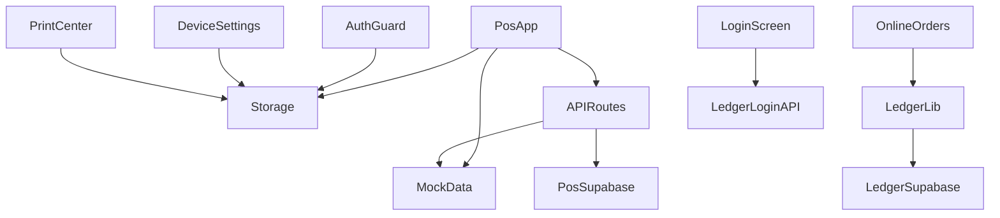

# 架構與程式碼結構

> **最後更新**：2026-08-12

---

## 目錄結構

```
macauPosSystem/
├── public/
│   ├── sw.js                 # Service Worker（PWA 離線）
│   └── sounds/               # 新單、取消提示音
├── src/
│   ├── app/                  # Next.js App Router
│   │   ├── layout.tsx        # 根布局 + PWA 註冊
│   │   ├── page.tsx          # 主收銀台
│   │   ├── login/            # 登入
│   │   ├── settings/         # 設備設定
│   │   ├── orders/           # 線上訂單
│   │   ├── prints/           # 打印中心
│   │   ├── members/          # 會員
│   │   ├── soldout/          # 沽清
│   │   ├── shift/            # 班次
│   │   ├── reports/          # 報表
│   │   ├── admin/            # Admin 帳戶
│   │   ├── backoffice/       # 營運後台
│   │   └── api/              # API Routes（見 06-api-reference）
│   ├── components/           # React 元件（見下表）
│   └── lib/                  # 業務邏輯、類型、整合
│       ├── types.ts
│       ├── storage.ts        # localStorage 封裝
│       ├── mock-data.ts      # 無 Supabase 時的預設資料
│       ├── supabase-server.ts
│       ├── ledger/           # Ledger 直連整合
│       └── ...
└── docs/                     # 本文檔目錄
```

---

## 分層架構

```
┌─────────────────────────────────────────┐
│  Presentation（Client Components）       │
│  pos-app, online-orders, device-settings │
└─────────────────┬───────────────────────┘
                  │
┌─────────────────▼───────────────────────┐
│  Application Logic                       │
│  storage.ts, ledger/*, bootstrap-normalizer│
└─────────────────┬───────────────────────┘
                  │
        ┌─────────┴─────────┐
        ▼                   ▼
┌───────────────┐   ┌───────────────────┐
│ localStorage  │   │ API Routes        │
│ (離線優先)     │   │ → POS Supabase    │
└───────────────┘   └───────────────────┘
                            │
        ┌───────────────────┼───────────────────┐
        ▼                   ▼                   ▼
  Ledger Supabase     POS Supabase         mock-data.ts
  (Auth/RPC/RT)       (可選雲同步)
```

---

## 核心元件

| 元件 | 檔案 | 職責 |
|------|------|------|
| 主收銀 | `pos-app.tsx` | 堂食/快餐、點單、結帳、同步狀態 |
| 線上訂單 | `online-orders.tsx` | Ledger Realtime + RPC 接單 |
| 設備設定 | `device-settings.tsx` | 打印機、分區、菜單、備註 |
| 打印中心 | `print-center.tsx` | 任務列表、預覽、重打 |
| 登入 | `login-screen.tsx` | 電話+PIN → `/api/ledger/login` |
| 鑑權 | `auth-guard.tsx` | 要求 Ledger session |
| 側欄 | `app-sidebar.tsx` | 導航 |
| 會員 | `members-page.tsx` | 會員查詢、充值 |
| 班次 | `shift-page.tsx` | 開班、交班 |
| 沽清 | `soldout-page.tsx` | 售罄 |
| 報表 | `reports-dashboard.tsx` | Ledger 報表 RPC |
| Backoffice | `backoffice-*.tsx` | 門店、同步、帳戶 |
| PWA | `pwa-register.tsx`, `pwa-install-button.tsx` | SW 註冊、安裝提示 |
| 錯誤 | `app-error-boundary.tsx` | 崩潰恢復、清快取 |

---

## lib 模組

| 模組 | 檔案 | 說明 |
|------|------|------|
| 類型 | `types.ts` | 全部 TS 介面 |
| 持久化 | `storage.ts` | localStorage 讀寫 |
| Mock | `mock-data.ts` | 預設 bootstrap、會員等 |
| POS Supabase | `supabase-server.ts` | 伺服器端 client |
| Admin | `admin-account-server.ts` | 帳戶 CRUD |
| Backoffice | `backoffice-server.ts`, `backoffice-client.ts` | 後台資料 |
| Bootstrap | `bootstrap-normalizer.ts` | 配置正規化 |
| HiveMQ | `hivemq-publisher.ts` | MQTT 發布（**尚未接入**） |

### Ledger 子模組（`src/lib/ledger/`）

| 檔案 | 職責 |
|------|------|
| `supabase-client.ts` | 前端 Ledger Supabase 單例 |
| `session.ts` | Session 還原 / 登出 |
| `pin.server.ts` | PIN HMAC（伺服器） |
| `phone.ts` | 澳門 8 位電話正規化 |
| `orders.ts` | `list_merchant_orders`, `get_order_detail` |
| `order-actions.ts` | 接單、改狀態 RPC |
| `order-mapper.ts` | Ledger row → UI 模型 |
| `ledger-pos-bridge.ts` | 接單後轉本地 PosOrder + PrintJob |
| `accept-idempotency.ts` | 扣點接單冪等 |
| `use-ledger-orders-realtime.ts` | Realtime hook |

---

## 設計原則

1. **離線優先**：所有店內操作先寫 localStorage，有網再 sync
2. **Client-heavy**：POS 頁面皆 client component
3. **雙 Supabase 分離**：Ledger（線上）vs POS（店內）職責清晰
4. **Mock 可運行**：無 POS Supabase 時用 mock-data 開發 UI
5. **Ledger 必配**：登入與線上單需 Ledger env

---

## 依賴關係圖



---

## 相關文檔

- [04-data-model-and-storage.md](./04-data-model-and-storage.md)
- [06-api-reference.md](./06-api-reference.md)
- [integration/ledger-client-api.md](./integration/ledger-client-api.md)
