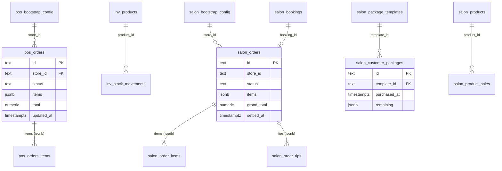

# Macau POS 報表數據 — Ledger 資料庫對接方案

> **文件編號**：83
> **版本**：v1.0
> **最後更新**：2026-08-31
> **對象**：Ledger 團隊（含對接嘅 AI Agent）
> **目標**：Ledger 直接接入 macau-pos 嘅 Postgres（Supabase），以**唯讀**、**按需**方式取得「報表」功能嘅全部可得數據
> **配套 SQL**：[`docs/sql/83-ledger-readonly-access.sql`](./sql/83-ledger-readonly-access.sql)（建角色 + 建 View + 驗收）

---

## 0. 點樣用呢份文件（畀 AI Agent 嘅最短路徑）

如果你係接手對接嘅 AI，按以下順序做就唔需要再問任何人：

1. 讀 **§2** 拎連線資訊（由 macau-pos 提供，格式固定）
2. 將 **§3** 對應嘅 SQL 交畀 macau-pos 管理員執行一次（建立唯讀角色 + View）
3. 用 **§2.4** 嘅連線範例試連，跑 **§3.4** 嘅驗收 SQL
4. 對照 **§4** 理解表結構，直接抄 **§5** 嘅查詢（每個報表模組一條 SQL）
5. **§6 一定要讀** —— 有 8 項報表數據**唔喺呢個 DB**，唔好浪費時間搵
6. **§7 係硬性約束** —— 禁止 polling，只可以按需查詢

⚠️ 本文所有 `<ANGLE_BRACKET>` 都係待填佔位符，由 macau-pos 交付時提供真實值（見 §2.1）。

---

## 1. 對接總覽

### 1.1 架構

```
┌──────────────────┐        ┌──────────────────────────────────────┐
│  POS 收銀 / Kiosk │        │  Vercel · macau-pos-system.vercel.app│
│  (離線優先)       │        │  /api/pos/sync   (service_role 寫入)  │
│  localStorage     │──────▶│  /api/salon/sync (service_role 寫入)  │
│  = 業務真源       │ HTTPS  │  /api/inventory/* (讀寫 inv_*)        │
└──────────────────┘        └───────────────┬──────────────────────┘
                                            │ 寫入（唯一寫入路徑）
                                            ▼
                          ┌─────────────────────────────────────────┐
                          │  macau-pos Supabase（Postgres）          │
                          │  db.<POS_PROJECT_REF>.supabase.co        │
                          │                                         │
                          │   pos_orders / pos_bootstrap_config      │
                          │   inv_products / inv_stock_movements     │
                          │   salon_orders / salon_customer_packages │
                          │   salon_package_templates / ...          │
                          │                                         │
                          │   ┌───────────────────────────────────┐ │
                          │   │ schema report_ro（唯讀 View 層）   │ │
                          │   └───────────────────────────────────┘ │
                          └──────────────┬──────────────────────────┘
                                         │ 唯讀 · 按需 · SSL
                                         │ role = ledger_report_ro
                                         ▼
                                  ┌──────────────┐
                                  │  Ledger 團隊  │
                                  └──────────────┘
```

### 1.2 三個 Supabase 專案（唔好搞混）

| 專案 | 用途 | 本方案是否涉及 |
|------|------|----------------|
| **macau-pos Supabase** | POS 訂單、庫存、salon | ✅ **本方案的目標** |
| Ledger Supabase | 會員、錢包、充值、線上訂單 | ❌ 唔經本方案（Ledger 自己有） |
| expenseRecorder Supabase | 採購收據（買貨成本） | ❌ 另一個獨立專案，唔開放 |

### 1.3 對接原則

| 原則 | 說明 |
|------|------|
| 唯讀 | 只有 `SELECT`。無 `INSERT` / `UPDATE` / `DELETE` / `TRUNCATE` / DDL 權限 |
| 按需（on-demand） | 只喺有人要睇報表時查。**嚴禁 polling**，見 §7 |
| 多租戶隔離 | 所有表都有 `store_id`。Ledger **必須**自行帶 `where store_id = ?` |
| 資料最小化 | `salon_customers`（含電話／生日／病歷）唔開放，只經 View 暴露客戶姓名 |
| 澳門時區 | 所有日期邊界統一 `Asia/Macau`，見 §4.7 |
| 語義對齊 | View 嘅計算口徑逐條對齊前端 `src/components/restaurant-daily-report.tsx` / `salon/reports.tsx` |

---

## 2. 資料庫連接資訊與存取方式

### 2.1 交付清單（macau-pos 填寫後交畀 Ledger）

| 項目 | 佔位符 | 說明 |
|------|--------|------|
| Project ref | `<POS_PROJECT_REF>` | Supabase 專案的 20 位識別碼 |
| Direct host | `db.<POS_PROJECT_REF>.supabase.co` | 直連（session mode） |
| Pooler host | `<POOLER_HOST>` | Supabase Dashboard → Database → Connection string → Transaction pooler |
| Database name | `postgres` | 固定 |
| Port（直連） | `5432` | |
| Port（pooler transaction） | `6543` | **推薦** |
| Port（pooler session） | `5432` | pooler 上的 session mode |
| User | `ledger_report_ro` | 唯讀角色 |
| Pooler user | `ledger_report_ro.<POS_PROJECT_REF>` | pooler 需帶 ref 後綴 |
| Password | `<LEDGER_RO_PASSWORD>` | 由 macau-pos 用密碼管理器交付 |
| SSL | `sslmode=require` | 必須 |

### 2.2 連線字串

**推薦（Transaction pooler，6543）**

```
postgresql://ledger_report_ro.<POS_PROJECT_REF>:<LEDGER_RO_PASSWORD>@<POOLER_HOST>:6543/postgres?sslmode=require
```

**備用（直連，5432）**

```
postgresql://ledger_report_ro:<LEDGER_RO_PASSWORD>@db.<POS_PROJECT_REF>.supabase.co:5432/postgres?sslmode=require
```

> 若 pooler 拒絕自訂角色（罕見，取決於 Supabase 方案），改用直連 5432。
> 若直連遇到網絡／IPv6 問題，改用 pooler session mode（`<POOLER_HOST>:5432`）。

### 2.3 連線規約（硬性）

| 規約 | 值 |
|------|-----|
| 同時連線數上限 | **3**（報表係低頻場景，唔需要多連線） |
| `statement_timeout` | 30 秒（角色級預設；單次報表查詢需要更長可自行 `SET statement_timeout = '60s'`） |
| `idle_in_transaction_session_timeout` | 60 秒 |
| `default_transaction_read_only` | `on` |
| `TimeZone` | `Asia/Macau`（已喺角色級設定，SQL 入面嘅 `at time zone` 不受影響） |
| `search_path` | `public, report_ro`（可直接寫 `v_pos_daily_summary`，唔使加 schema 前綴；建議仍寫全名） |

### 2.4 連線範例

**psql**

```bash
psql "postgresql://ledger_report_ro.<POS_PROJECT_REF>:<LEDGER_RO_PASSWORD>@<POOLER_HOST>:6543/postgres?sslmode=require" \
  -c "select current_user, current_setting('TimeZone'), current_setting('transaction_read_only');"
```

**Python（psycopg 3）**

```python
import os, psycopg

DSN = os.environ["MACAUPOS_REPORT_DSN"]  # 見 §2.2

# pooler transaction mode：唔好用 prepared statement / 唔好跨查詢持住交易
with psycopg.connect(DSN, autocommit=True) as conn:
    with conn.cursor() as cur:
        cur.execute("""
            select biz_date, order_count, revenue, avg_ticket
            from report_ro.v_pos_daily_summary
            where store_id = %s
              and biz_date between %s::date and %s::date
            order by biz_date
        """, ("macau-store-a", "2026-08-01", "2026-08-31"))
        for row in cur:
            print(row)
```

**Node（pg）**

```js
import pg from "pg";

const pool = new pg.Pool({
  connectionString: process.env.MACAUPOS_REPORT_DSN, // 見 §2.2
  ssl: { rejectUnauthorized: true },
  max: 3,                     // 連線數上限，見 §2.3
  connectionTimeoutMillis: 10_000,
  idleTimeoutMillis: 30_000,  // 唔好長期持有連線
  application_name: "ledger-report",
});

const { rows } = await pool.query(
  `select biz_date, order_count, revenue
     from report_ro.v_pos_daily_summary
    where store_id = $1 and biz_date between $2::date and $3::date
    order by biz_date`,
  ["macau-store-a", "2026-08-01", "2026-08-31"]
);
```

### 2.5 明確唔可以用嘅方式

| 方式 | 原因 |
|------|------|
| `service_role` key | 可 bypass RLS 兼有寫入權限，屬 macau-pos 伺服器專用，**絕不外發** |
| Supabase anon key + PostgREST | 可用但**唔提供**：本方案統一用 SQL 連線，方便做聚合與權限收斂 |
| Supabase Realtime 訂閱 | 屬 polling/推播範疇，§7 禁止 |
| 直連 5432 + 長連線 pool | 違反 §2.3 連線數與 idle 規約 |

---

## 3. 唯讀權限設定

### 3.1 執行方式

由 **macau-pos 管理員** 喺 Supabase Dashboard → SQL Editor 執行
[`docs/sql/83-ledger-readonly-access.sql`](./sql/83-ledger-readonly-access.sql) 嘅 **Part A + Part B + Part C**。
該檔全部語句冪等，可重複執行。

核心語句（摘要）：

```sql
-- 1) 建立角色
create role ledger_report_ro login password 'CHANGE_ME_STRONG_PASSWORD_32CHARS';

-- 2) 會話級防呆
alter role ledger_report_ro set default_transaction_read_only = on;
alter role ledger_report_ro set statement_timeout                  = '30s';
alter role ledger_report_ro set idle_in_transaction_session_timeout = '60s';
alter role ledger_report_ro set timezone                            = 'Asia/Macau';

-- 3) 連線 + schema（唔准建物件）
grant connect on database postgres to ledger_report_ro;
grant usage   on schema public     to ledger_report_ro;
revoke create on schema public     from ledger_report_ro;

-- 4) 逐表 SELECT（白名單）
grant select on public.pos_orders                to ledger_report_ro;
grant select on public.pos_bootstrap_config      to ledger_report_ro;
grant select on public.inv_products              to ledger_report_ro;
grant select on public.inv_stock_movements       to ledger_report_ro;
grant select on public.salon_orders              to ledger_report_ro;
grant select on public.salon_bookings            to ledger_report_ro;
grant select on public.salon_package_templates   to ledger_report_ro;
grant select on public.salon_customer_packages   to ledger_report_ro;
grant select on public.salon_product_sales       to ledger_report_ro;
grant select on public.salon_products            to ledger_report_ro;
```

### 3.2 唯讀點樣保證

| 層級 | 機制 | 是否硬性 |
|------|------|----------|
| 授權層 | 從未 `GRANT INSERT/UPDATE/DELETE/TRUNCATE` → Postgres 一律 `permission denied` | ✅ **硬性** |
| 物件擁有權層 | `ledger_report_ro` 唔擁有任何表、唔係 superuser、唔係 `postgres` 成員 | ✅ **硬性** |
| DDL | `revoke create on schema public`；`report_ro` schema 只 `usage` | ✅ 硬性 |
| 會話層 | `default_transaction_read_only = on` | ⚠️ 防呆（客戶端可 `SET` 覆寫） |
| 濫用防護 | `statement_timeout` / `idle_in_transaction_session_timeout` | ⚠️ 防呆 |

> **結論**：寫入喺權限層已經被拒絕；GUC 只係第二層，用嚟防止誤操作同長查詢拖垮 DB。

### 3.3 權限矩陣

| 表 / View | SELECT | 其他 |
|-----------|:------:|------|
| `pos_orders` | ✅ | ❌ |
| `pos_bootstrap_config` | ✅ | ❌ |
| `inv_products` / `inv_stock_movements` | ✅ | ❌ |
| `salon_orders` / `salon_bookings` | ✅ | ❌ |
| `salon_package_templates` / `salon_customer_packages` | ✅ | ❌ |
| `salon_product_sales` / `salon_products` | ✅ | ❌ |
| `report_ro.*`（全部唯讀 View） | ✅ | ❌ |
| `salon_bootstrap_config`（技師電話／薪資倍率） | ❌ | ❌ 只經 `v_salon_staff` / `v_salon_service_items` 暴露姓名、花名、角色、價目 |
| `salon_customers`（PII：電話／生日／病歷） | ❌ | ❌ 只經 `v_salon_expiring_packages` 暴露姓名 |
| `pos_device_configs`（打印機 IP／終端設定） | ❌ | ❌ |
| `pos_queue_events` / `salon_queue_events` | ❌ | ❌ |
| `pos_print_jobs` / `salon_print_jobs` | ❌ | ❌ |
| `pos_soldout` | ❌ | ❌（表建咗但程式無寫入，見 §6.4） |
| `pos_daily_sequences` | ❌ | ❌ |

### 3.4 驗收（Ledger 用 `ledger_report_ro` 連線執行）

| # | SQL | 預期結果 |
|---|-----|----------|
| C1 | `select current_user, current_setting('TimeZone'), current_setting('transaction_read_only');` | `ledger_report_ro` / `Asia/Macau` / `on` |
| C2 | `select count(*) from report_ro.v_pos_daily_summary;` | 回傳數字（可為 0），**唔可以**報 permission denied |
| C3 | `insert into public.pos_orders (id) values ('x');` | `ERROR: permission denied for table pos_orders` |
| C3 | `update public.inv_products set current_qty = 999;` | `ERROR: permission denied for table inv_products` |
| C3 | `delete from public.salon_orders where 1=0;` | `ERROR: permission denied for table salon_orders` |
| C3 | `create table public.t (id int);` | `ERROR: permission denied for schema public` |
| C4 | `select count(*) from public.salon_customers;` | `ERROR: permission denied for table salon_customers` |
| C5 | `select distinct store_id from report_ro.v_pos_orders order by 1;` | 至少一列；呢個值就係報表嘅必要過濾鍵 |

### 3.5 密碼輪換 / 撤銷

```sql
-- 改密碼
alter role ledger_report_ro with password 'NEW_STRONG_PASSWORD';

-- 暫停存取（保留角色）
alter role ledger_report_ro with nologin;

-- 踢走現有連線
select pg_terminate_backend(pid)
from pg_stat_activity
where usename = 'ledger_report_ro' and pid <> pg_backend_pid();
```

---

## 4. 資料表結構、欄位定義與關聯

### 4.1 總覽

| 表 | 用途 | 報表模組 |
|----|------|----------|
| `pos_orders` | 餐飲訂單主表（`items` 係 JSONB 整條存） | 營業額／訂單／菜品／桌台／尖峰／退菜／出餐 |
| `pos_bootstrap_config` | 餐飲門店主數據（菜牌、枱位、類目） | 菜名對照、枱名對照 |
| `inv_products` | 庫存品主檔 | 低庫存預警 |
| `inv_stock_movements` | 庫存盤點異動流水 | 庫存稽核 |
| `salon_orders` | salon 結帳單 | salon 全部營運模組 |
| `salon_bookings` | salon 預約 | 預約轉換（輔助） |
| `salon_package_templates` | 套票模板 | 套票使用率 |
| `salon_customer_packages` | 客戶持有嘅套票卡 | 套票使用率、即將到期 |
| `salon_product_sales` | 產品零售記錄 | 產品銷售（輔助） |
| `salon_products` | 產品目錄 | 產品對照 |
| `salon_bootstrap_config` | salon 主數據（技師、服務目錄） | 技師姓名對照 |

### 4.2 `pos_orders`（餐飲訂單主表）

| 欄位 | 型別 | 說明 | 報表用途 |
|------|------|------|----------|
| `id` | `text` PK | 訂單 UUID（前端 `PosOrder.id`） | Join key |
| `local_order_no` | `text` | 店內單號（同店同日遞增） | 對帳、匯出 |
| `store_id` | `text` | **店舖 ID（= Ledger merchantId）** | **必要過濾鍵** |
| `table_id` | `text` | 枱 ID（快餐 counter 單 = `counter`） | 桌台排行 |
| `table_name` | `text` | 枱名（冗餘快照） | 桌台排行顯示 |
| `status` | `text` | 見 §4.8 狀態列舉 | 篩「已結帳」 |
| `fulfillment_status` | `text` | `preparing` \| `ready`（快餐用） | 快餐完成狀態 |
| `items` | `jsonb` | 明細陣列，**整條 `OrderItem[]` 原樣存**，見 §4.3 | 菜品／退菜／份數 |
| `order_note` | `text` | 全單備註 | — |
| `subtotal` | `numeric` | 小計 | 對帳 |
| `tax_amount` | `numeric` | 稅 | 對帳 |
| `service_charge_amount` | `numeric` | 服務費 | 對帳 |
| `discount_amount` | `numeric` | 折扣金額 | 折扣佔比 |
| `total` | `numeric` | **應收總額（已扣折扣）＝ 報表嘅「營業額」** | KPI |
| `prepaid_amount` | `numeric` | 線上已付金额 | 線上單對帳 |
| `online_order_id` | `text` | **非空 = 線上單** | 線上／線下拆分 |
| `payment_method` | `text` | 自由文字（商家於設備設定自訂，例如「現金」） | 支付方式分析 |
| `sent_to_kitchen_at` | `timestamptz` | 首次送廚房時間 | 出餐時間 |
| `served_at` | `timestamptz` | 出餐時間 | 出餐時間 |
| `created_at` | `timestamptz` | 落單時間 | 尖峰時段、本月歸屬 |
| `updated_at` | `timestamptz` | 最後更新（結帳時會更新） | **報表歸屬日** |

索引：`pos_orders(store_id)`、`pos_orders(updated_at)`、`pos_orders(served_at)`。
⚠️ 缺 `(store_id, 澳門日期)` 複合索引；大範圍查詢建議先加（Part D-1 有語句）。

### 4.3 `pos_orders.items` JSONB 結構

陣列，每個元素係一條明細（**key 係 camelCase**）：

| JSON key | 型別 | 說明 |
|----------|------|------|
| `menuItemId` | string | 菜品 ID → join `report_ro.v_pos_menu_items.menu_item_id` |
| `name` | string | 菜品名稱（落單時快照） |
| `quantity` | number | 份數 |
| `price` | number | 單價（MOP，已含規格加價） |
| `printerGroup` | string | 出單分區（kitchen / bar / …） |
| `selectedSpecs` | array | `[{groupId, groupName, optionId, optionLabel, priceDelta}]` |
| `note` | string | 該品備註 |
| `voided` | boolean | **已退菜標記**（`true` = 退菜，不計營收） |
| `voidedAt` / `voidedReason` / `voidedBy` | string | 退菜稽核 |

> 退菜**唔會**由陣列移除，只係標 `voided: true` 並留低記錄 —— 呢個係前端 `voidQty` / `voidAmt` 嘅來源。

### 4.4 `inv_products`（庫存品主檔）

| 欄位 | 型別 | 說明 |
|------|------|------|
| `id` | `uuid` PK | |
| `store_id` | `text` | **必要過濾鍵** |
| `name` | `text` | 品名（store + lower(name) 唯一） |
| `category` | `text` | 分類 |
| `unit` | `text` | 單位（份 / g / ml / 包…），預設 `unit` |
| `current_qty` | `numeric(12,3)` | 現存量 |
| `avg_unit_cost` | `numeric(12,2)` | 加權平均成本（MOP） |
| `last_purchase_date` | `date` | 最近採購日 |
| `last_supplier` | `text` | 最近供應商 |
| `reorder_level` | `numeric(12,3)` | **安全存量（par）** |
| `is_active` | `boolean` | 是否啟用 |
| `created_at` / `updated_at` | `timestamptz` | |

低庫存條件（與前端一致）：`reorder_level > 0 AND current_qty <= reorder_level`。

### 4.5 `salon_orders`（salon 結帳單）

| 欄位 | 型別 | 說明 |
|------|------|------|
| `id` | `text` PK | |
| `store_id` | `text` | **必要過濾鍵** |
| `order_no` | `text` | 單號 |
| `booking_id` | `text` | → `salon_bookings.id` |
| `customer_id` | `text` | → `salon_customers.id`（**該表唔對 Ledger 開放**） |
| `customer_name` / `customer_phone` | `text` | 落單時快照 |
| `staff_id` / `station_id` | `text` | 主責技師 / 工位 |
| `items` | `jsonb` | 明細陣列，見 §4.6 |
| `subtotal` / `discount_amount` / `total` | `numeric(12,2)` | |
| `tips` | `jsonb` | `[{staffId, staffName, amount, method}]` |
| `tip_total` | `numeric(12,2)` | 小費合計 |
| `grand_total` | `numeric(12,2)` | **實收總額（＝ 報表嘅「營業總額」）** |
| `payments` | `jsonb` | `[{method, amount, ledgerTransactionId, note, createdAt}]` |
| `deposit_applied` | `numeric(12,2)` | 已付定金抵扣 |
| `change_due` | `numeric(12,2)` | 找贖 |
| `status` | `text` | 見 §4.8 |
| `started_at` / `completed_at` / `settled_at` | `timestamptz` | **報表歸屬日 = `coalesce(settled_at, created_at)`** |
| `ledger_order_id` | `text` | Ledger 線上單 ID（如有） |

### 4.6 `salon_orders.items` / `.tips` / `.payments`

**items**（陣列）：`kind`(`service`\|`product`)、`itemId`、`name`、`quantity`、`unitPrice`、`serviceItemId`、`staffId`、`staffName`、`specSelections`、`wageAmount`、`commissionAmount`、`note`

**tips**（陣列）：`staffId`、`staffName`、`amount`、`method`(`cash`\|`ledger_balance`)

**payments**（陣列）：`method`(`cash`\|`card`\|`ledger_balance`\|`external`)、`amount`、`ledgerTransactionId`、`note`、`createdAt`

### 4.7 套票表

**`salon_package_templates`**：`id`、`store_id`、`name`、`price`、`validity_days`、`items` jsonb（`[{serviceItemId, sessions}]`）、`bonus_points`、`bonus_balance`、`active`

**`salon_customer_packages`**：`id`、`store_id`、`customer_id`、`template_id`、`template_name`、`price`、`purchased_at`、`expires_at`、`remaining` jsonb（`[{serviceItemId, sessionsLeft}]`）、`status`(`active`\|`used_up`\|`expired`)、`payment_method`

### 4.8 關聯關係



> ⚠️ 冇實體 FK 約束。除咗 `inv_stock_movements.product_id → inv_products.id`（有 `on delete cascade`）之外，
> 其餘關聯全部係**邏輯關聯**，靠 `id` / `store_id` 字串對應。Join 時請一齊帶 `store_id`。

### 4.9 狀態與列舉值

**餐飲 `pos_orders.status`**

| 值 | 中文 | 是否計入報表（`is_closed`） |
|----|------|:--------------------------:|
| `draft` | 點單中 | ❌ |
| `sent_to_kitchen` | 製作中 | ❌ |
| `paid` | 已付款 | ❌ |
| `settled` | 已完成 | ✅ |
| `partially_refunded` | 部分退款 | ✅ |
| `refunded` | 已退款 | ✅ |
| `cancelled` | 已取消 | ❌ |
| `reopened` | 已返結 | ❌ |

**salon `salon_orders.status`**：`draft` / `in_service` / `ready_to_pay` / `settled`（✅ 計入）/ `reopened` / `cancelled` / `no_show`

**`salon_customer_packages.status`**：`active` / `used_up` / `expired`

**支付方式**

- 餐飲 `payment_method`：**自由文字**，由商家喺「設備設定 → 支付方式」自訂。建議先 `select distinct payment_method from pos_orders where store_id = ?` 睇實際值。
- salon `payments[].method`：`cash` / `card` / `ledger_balance` / `external`（固定列舉）

### 4.10 時區、金額、精度約定

| 項目 | 約定 |
|------|------|
| 時區 | 全部 `timestamptz`。**報表歸屬日必須用 `(ts at time zone 'Asia/Macau')::date`** |
| 餐飲報表歸屬日 | `coalesce(updated_at, created_at)` 嘅澳門日期（結帳日） |
| 餐飲落單日 | `created_at` 嘅澳門日期（「本月」類報表用） |
| salon 報表歸屬日 | `coalesce(settled_at, created_at)` 嘅澳門日期 |
| 金額 | `numeric`，單位 **MOP（澳門元）**。前端顯示四捨五入到 2 位 |
| JSONB 數值 | `(it ->> 'price')::numeric` 取值；缺失用 `coalesce(..., 0)` |
| 匯率 | 唔適用（全系統單一幣別 MOP） |

---

## 5. 報表查詢邏輯與範例 SQL

> 全部範例假設已執行 Part B 建立 `report_ro` View（**推薦**）。
> §5.9 提供無 View 時嘅原始 SQL 寫法。
> **每個查詢都必須帶 `store_id`**。

### 5.0 通用：時間範圍換算

前端篩選器（`ReportRangeKey`）→ SQL 區間對照：

| 前端篩選 | 餐飲本地訂單 | SQL 寫法（`biz_date`） |
|----------|--------------|------------------------|
| 今天 `today` | 澳門今日 | `= (now() at time zone 'Asia/Macau')::date` |
| 昨天 `yesterday` | 澳門昨日 | `= ((now() at time zone 'Asia/Macau') - interval '1 day')::date` |
| 7 天 `7d` | 含今日嘅 7 個日曆日 | `>= (now() at time zone 'Asia/Macau')::date - 6` |
| 30 天 `30d` | 含今日嘅 30 個日曆日 | `>= (now() at time zone 'Asia/Macau')::date - 29` |
| 全部 `all` | **無過濾，真·全部** | 唔加日期條件 |

⚠️ 注意：前端對 **Ledger RPC** 嘅 `all` 係 365 日窗口，但對**本地訂單**嘅 `all` 係真·全部。本方案查嘅係本地訂單 → `all` 唔加日期條件。

Salon 稍有唔同：

| 前端篩選 | salon 邏輯 | SQL 寫法 |
|----------|-----------|----------|
| 今日 `today` | 前端用**設備本地日**比較 | 本方案統一改澳門日：`= (now() at time zone 'Asia/Macau')::date` |
| 近 7 日 `week` | **滾動 7 日**（`d >= now - 7d`，唔係 7 個日曆日） | `>= ((now() at time zone 'Asia/Macau') - interval '7 days')::date` |
| 全部 `all` | 無過濾 | 唔加日期條件 |

---

### 5.1 報表 A1 — KPI 帶（營業額／毛利／訂單數／客單價／覆蓋人數／會員充值）

```sql
-- 參數：$1 = store_id, $2 = 起始日, $3 = 結束日
select
  sum(order_count)                          as order_count,
  sum(revenue)                              as revenue,           -- 營業額
  case when sum(order_count) > 0
       then sum(revenue) / sum(order_count) end as avg_ticket,    -- 客單價
  sum(discount_amount)                      as discount_amount,
  sum(online_revenue)                       as online_revenue,
  case when sum(revenue) > 0
       then sum(online_revenue) / sum(revenue) end as online_share,
  sum(void_qty)                             as void_qty,
  case when sum(sold_qty) > 0
       then sum(void_qty) / sum(sold_qty) end    as void_rate,
  sum(sold_qty)                             as sold_qty
from report_ro.v_pos_daily_summary
where store_id = $1
  and biz_date between $2::date and $3::date;
```

| KPI | 可否由本 DB 取得 | 備註 |
|-----|:--:|------|
| 營業額 | ✅ | `sum(total)`（已結帳單） |
| 毛利（估） | ❌ | 需要買貨成本，喺 expenseRecorder 專案，見 §6.6 |
| 訂單數 | ✅ | |
| 客單價 | ✅ | 營業額 ÷ 訂單數 |
| 覆蓋人數 | ❌ | `party_size` 未上雲，見 §6.1（可補，Part D） |
| 會員充值 | ❌ | 喺 Ledger 自己嘅 DB，見 §6.5 |

**7 日均值（前端「營運指標 · 同環比」模組）**

```sql
select
  sum(revenue) / 7                                        as rev_7d_avg,
  case when sum(revenue) > 0
       then sum(online_revenue) / sum(revenue) end        as online_share_7d
from report_ro.v_pos_daily_summary
where store_id = $1
  and biz_date between ((now() at time zone 'Asia/Macau')::date - 6)
                   and  (now() at time zone 'Asia/Macau')::date;
```

---

### 5.2 報表 A2 — 菜品銷售排行

前端語義：只計已結帳單、剔除 `voided`；分線下／線上份數；金額 = `quantity × price`；按總份數降序，取前 8。

```sql
select
  menu_item_id,
  max(item_name)   as item_name,
  sum(total_qty)   as total_qty,
  sum(offline_qty) as offline_qty,
  sum(online_qty)  as online_qty,
  sum(revenue)     as revenue,
  case when sum(online_qty) > 0 and sum(offline_qty) > 0 then 'mix'
       when sum(online_qty) > 0 then 'online'
       else 'offline' end as channel
from report_ro.v_pos_dish_ranking
where store_id = $1
  and biz_date between $2::date and $3::date
group by menu_item_id
order by sum(total_qty) desc
limit 8;
```

要補返門店菜牌嘅分類／現價，用 CTE 包一層：

```sql
with rank as (
  select
    menu_item_id,
    max(item_name)   as item_name,
    sum(total_qty)   as total_qty,
    sum(offline_qty) as offline_qty,
    sum(online_qty)  as online_qty,
    sum(revenue)     as revenue
  from report_ro.v_pos_dish_ranking
  where store_id = $1
    and biz_date between $2::date and $3::date
  group by menu_item_id
)
select r.*, m.menu_item_name, m.category_id, m.price as current_price
from rank r
left join report_ro.v_pos_menu_items m
  on m.store_id = $1 and m.menu_item_id = r.menu_item_id
order by r.total_qty desc
limit 8;
```

---

### 5.3 報表 A3 — 最熱門桌台排行

```sql
select
  table_id,
  max(table_name)  as table_name,
  sum(order_count) as order_count,
  sum(revenue)     as revenue
from report_ro.v_pos_table_ranking
where store_id = $1
  and biz_date between $2::date and $3::date
group by table_id
order by sum(order_count) desc
limit 6;
```

⚠️ 前端呢個模組仲有 `covers`（覆蓋人數），**本 DB 暫時無**，見 §6.1。

---

### 5.4 報表 A4 — 尖峰時段（每小時訂單）

```sql
select
  order_hour,
  sum(order_count) as order_count
from report_ro.v_pos_hourly
where store_id = $1
  and biz_date between $2::date and $3::date
group by order_hour
order by order_hour;
```

前端按 `created_at` 嘅澳門小時分桶（`extract(hour from created_at at time zone 'Asia/Macau')`），0–23。

---

### 5.5 報表 A5 — 退菜率 / 折扣佔比 / 線上佔比

已內建喺 `v_pos_daily_summary`：

| 指標 | 欄位 | 前端定義 |
|------|------|----------|
| 退菜率 | `void_rate` | `void_qty / sold_qty`（`sold_qty` 唔含退菜），閾值 3% |
| 折扣佔比 | `discount_ratio` | `discount_amount / revenue`，閾值 15% |
| 線上佔比 | `online_share` | `online_revenue / revenue` |

```sql
select
  sum(discount_amount) / nullif(sum(revenue), 0) as discount_ratio,
  sum(void_qty)        / nullif(sum(sold_qty), 0) as void_rate,
  sum(online_revenue)  / nullif(sum(revenue), 0)  as online_share
from report_ro.v_pos_daily_summary
where store_id = $1 and biz_date between $2::date and $3::date;
```

---

### 5.6 報表 A6 — 出餐時間（平均／中位數／P95）

前端邏輯（對齊後）：

- 有 `sent_to_kitchen_at` **同** `served_at` → **實測** `served_at - sent_to_kitchen_at`
- 否則 → **估算** `coalesce(served_at, updated_at) - coalesce(sent_to_kitchen_at, created_at)`，並標「含估算」
  - ⚠️ 前端估算嘅終點係 `originalSettledAt ?? updatedAt`，而 `originalSettledAt` **未上雲**，故 DB 版一律用 `updated_at`。

```sql
select
  -- 只計實測（最乾淨）
  sum(serving_measured_count)                                        as measured_count,
  sum(serving_avg_min_measured * serving_measured_count)
    / nullif(sum(serving_measured_count), 0)                         as avg_min_measured,
  -- 含估算（對齊前端 UI 顯示）
  count(*)                                                           as sample_count,
  avg(coalesce(serving_minutes_measured, serving_minutes_fallback))  as avg_min,
  percentile_cont(0.5)  within group (order by coalesce(serving_minutes_measured, serving_minutes_fallback)) as median_min,
  percentile_cont(0.95) within group (order by coalesce(serving_minutes_measured, serving_minutes_fallback)) as p95_min,
  bool_or(serving_is_estimated)                                      as contains_estimate
from report_ro.v_pos_orders
where store_id = $1
  and is_closed
  and ((coalesce(updated_at, created_at) at time zone 'Asia/Macau')::date)
      between $2::date and $3::date;
```

---

### 5.7 報表 A7 — 低庫存預警

```sql
select name, unit, current_qty, reorder_level, shortfall, stock_value, last_supplier
from report_ro.v_inv_low_stock
where store_id = $1
order by current_qty asc;
```

---

### 5.8 報表 A8 — 沽清菜品 ❌

**查唔到。** 沽清狀態只喺收銀端 localStorage（`macau-pos/sold-out`）；`pos_soldout` 表雖然建咗，但程式從未寫入。見 §6.4。

---

### 5.9 無 View 時嘅原始 SQL（直接用底表）

**菜品排行（自行展開 JSONB）**

```sql
select
  it ->> 'menuItemId'                                   as menu_item_id,
  max(it ->> 'name')                                    as item_name,
  sum((it ->> 'quantity')::numeric)                     as total_qty,
  sum((it ->> 'quantity')::numeric * (it ->> 'price')::numeric) as revenue
from public.pos_orders o
cross join lateral jsonb_array_elements(
  case when jsonb_typeof(o.items) = 'array' then o.items else '[]'::jsonb end
) as it
where o.store_id = $1
  and o.status in ('settled', 'partially_refunded', 'refunded')
  and coalesce((it ->> 'voided')::boolean, false) = false
  and ((coalesce(o.updated_at, o.created_at) at time zone 'Asia/Macau')::date)
      between $2::date and $3::date
group by 1
order by total_qty desc;
```

**每日 KPI**

```sql
select
  ((coalesce(o.updated_at, o.created_at) at time zone 'Asia/Macau')::date) as biz_date,
  count(*)          as order_count,
  sum(o.total)      as revenue,
  sum(o.discount_amount) as discount_amount,
  sum(case when o.online_order_id is not null then o.total else 0 end)    as online_revenue
from public.pos_orders o
where o.store_id = $1
  and o.status in ('settled', 'partially_refunded', 'refunded')
  and ((coalesce(o.updated_at, o.created_at) at time zone 'Asia/Macau')::date)
      between $2::date and $3::date
group by 1
order by 1;
```

---

### 5.10 報表 B1 — Salon 總覽（訂單數／營業總額／折扣／定金／小費／套票銷售額）

```sql
-- 營運部分
select
  sum(order_count)     as order_count,
  sum(revenue)         as revenue,           -- = sum(grand_total)
  sum(discount_amount) as discount_amount,
  sum(deposit_applied) as deposit_applied,
  sum(tip_total)       as tip_total,
  case when sum(order_count) > 0
       then sum(revenue) / sum(order_count) end as avg_ticket
from report_ro.v_salon_daily_summary
where store_id = $1 and biz_date between $2::date and $3::date;

-- 套票銷售額（依 purchased_at 歸屬，唔係結帳日）
select sum(sales_amount) as package_sales_amount
from report_ro.v_salon_package_usage
where store_id = $1 and purchase_date between $2::date and $3::date;
```

---

### 5.11 報表 B2 — Salon 付款方式拆分

```sql
select
  sum(payment_cash)           as cash,
  sum(payment_card)           as card,
  sum(payment_ledger_balance) as ledger_balance,
  sum(payment_external)       as external
from report_ro.v_salon_daily_summary
where store_id = $1 and biz_date between $2::date and $3::date;
```

顯示標籤：現金 / 信用卡・移動支付 / Ledger 餘額 / 外部平台。

---

### 5.12 報表 B3 — Salon 技師業績

```sql
select
  s.staff_id,
  coalesce(max(b.nickname), max(b.staff_name), max(s.staff_name), '未知技師') as display_name,
  sum(s.sales_amount) as sales_amount,
  sum(s.wage_amount)  as wage_amount
from report_ro.v_salon_staff_daily s
left join report_ro.v_salon_staff b
  on b.store_id = s.store_id and b.staff_id = s.staff_id
where s.store_id = $1 and s.biz_date between $2::date and $3::date
group by s.staff_id
order by sales_amount desc;
```

> 前端顯示名順序：`nickname ?? name ?? "未知技師"`（上面 SQL 已對齊）。

⚠️ 口徑：`sales_amount` 含 `kind='product'` 的明細（對齊前端實際計算，雖然 UI 標題寫「服務營業額」）。

---

### 5.13 報表 B4 — Salon 小費排行

```sql
select staff_id, max(staff_name) as staff_name,
       sum(tip_amount) as tip_amount,
       sum(tip_cash)   as tip_cash,
       sum(tip_ledger_balance) as tip_ledger_balance
from report_ro.v_salon_tips_daily
where store_id = $1 and biz_date between $2::date and $3::date
group by staff_id
order by tip_amount desc;
```

---

### 5.14 報表 B5 — Salon 服務銷量

```sql
select item_name, sum(total_qty) as total_qty, sum(total_amount) as total_amount
from report_ro.v_salon_service_ranking
where store_id = $1 and biz_date between $2::date and $3::date
group by item_name
order by total_qty desc;
```

只要純服務：加 `and kind = 'service'`（前端冇拆，會含產品）。

---

### 5.15 報表 B6 — Salon 套票使用率

```sql
select
  template_id,
  max(template_name)                                            as template_name,
  sum(sold_count)                                               as sold_count,
  sum(sales_amount)                                             as sales_amount,
  sum(total_sessions)                                           as total_sessions,
  greatest(0, sum(total_sessions) - sum(remaining_sessions))     as used_sessions,
  case when sum(total_sessions) > 0
       then greatest(0, sum(total_sessions) - sum(remaining_sessions))
            / sum(total_sessions) end                           as usage_rate
from report_ro.v_salon_package_usage
where store_id = $1
  and purchase_date between $2::date and $3::date
group by template_id
order by sales_amount desc;
```

> 唔使合併（只要某一日）就 `select * from report_ro.v_salon_package_usage where store_id = $1 and purchase_date = $2::date;`
> 前端 `usedSessions` 係**逐張卡** `max(0, total - remaining)` 之後再加總，上面嘅 SQL 係先加總再 `max(0, …)`；
> 只有當個別卡出現「用超咗」嘅負值時兩者先會有差異（極罕見）。

---

### 5.16 報表 B7 — Salon 即將到期套票（30 日內 · 催銷）

```sql
select customer_name, template_name, expires_at, days_left, remaining_sessions
from report_ro.v_salon_expiring_packages
where store_id = $1
order by days_left asc;
```

前端邏輯：`status = 'active'`、`expires_at` 非空、`0 <= days_left <= 30`；`days_left = ceil((expires_at - now) / 86400)`。
**唔套用範圍篩選**（同前端一致）。

---

## 6. 已知資料缺口（DB 查唔到嘅報表項目）

> 呢一節好重要：以下項目**唔喺本 DB**，請唔好嘗試用 SQL 搵。

| # | 報表項目 | 實際存放位置 | 可否補齊 |
|---|----------|--------------|----------|
| 6.1 | 餐飲「覆蓋人數」/ 桌台 covers | `PosOrder.partySize` 只喺 localStorage，**未寫入 `pos_orders`** | ✅ 可（Part D：加 `party_size` 欄 + 改 sync，僅新單有值） |
| 6.2 | 食材消耗（本月）、食材使用量排行 | 配方 BOM 喺 localStorage `macau-pos-bom:<merchantId>` | ⚠️ 需新表 + 功能開發 |
| 6.3 | 人流（入店人次）、堂食轉化率 | localStorage `macau-pos-footfall`（人手輸入） | ⚠️ 需新表 + 功能開發 |
| 6.4 | 沽清菜品 | localStorage `macau-pos/sold-out`；`pos_soldout` 表建咗但**程式無寫入** | ⚠️ 需改 sync 寫入 |
| 6.5 | 會員充值、會員數、線上餘額扣減 | **Ledger 自己嘅 DB**（RPC `get_merchant_report_summary`） | ➖ 唔使經本方案 |
| 6.6 | 毛利、買貨成本 | **expenseRecorder Supabase**（另一專案：`receipts` / `receipt_items`） | ❌ 本方案唔開放 |
| 6.7 | 退款金額 `refundedAmount`、退款明細 | 只喺 localStorage（報表亦無減除，營業額 = 原 `total`） | ⚠️ 需加欄 |
| 6.8 | Salon 返結稽核（`reopenedAt/By/Reason/Count`） | 只喺 localStorage；`salon_orders` 無呢啲欄 | ⚠️ 需加欄 |

**補充說明**

- **6.5**：前端報表嘅「會員充值 & 會員數」係 call Ledger RPC `get_merchant_report_summary(p_start, p_end)`，回傳 `topup_avos` / `member_count` / `order_balance_paid_avos`（avos，1 MOP = 100 avos）。Ledger 直接查自己 DB 即可，唔使經 macau-pos。
- **6.6**：前端「毛利（估）= 營業額 − 買貨成本（已付）」，買貨成本嚟自 `/api/inventory/receipts` → expenseRecorder 專案。若要對接需另開流程。
- **6.7**：前端 `aggregate()` 對 `refunded` / `partially_refunded` 單**照加 `total` 入營業額**，無扣退款。本方案沿用同一口徑（對齊 UI）；若要扣減，Ledger 需自行處理（但 DB 無 `refunded_amount`）。

---

## 7. 禁止 Polling — 只支援按需查詢

### 7.1 硬性約束（違反會被停用帳號）

| ❌ 禁止 | 說明 |
|---------|------|
| 定時輪詢 | cron / `setInterval` / Airflow / pg_cron / Kubernetes CronJob 定時打查詢 |
| Supabase Realtime | `postgres_changes` 訂閱 `pos_orders` 等表 |
| `LISTEN` / `NOTIFY` | 常駐連線等資料庫推播 |
| Materialized View + 定時 refresh | 變相定時掃全表 |
| Logical replication / CDC slot | 複製槽會阻塞 WAL，絕對禁止 |
| 長時間持有連線 | idle > 5 分鐘嘅連線會被 terminate（`idle_in_transaction` 60 秒即斷） |
| 全表掃描式備份 | `select * from pos_orders` 無 `store_id`、無日期條件 |

### 7.2 正確做法

```
使用者開啟報表頁
   └─▶ Ledger 後端收到請求
         ├─▶ （可選）查自己嘅 cache，未過期就直接回（建議 TTL ≥ 5 分鐘）
         └─▶ cache 冇 → 發**一次** SQL → 寫入 cache → 回傳
```

參考實作（Node + 5 分鐘 cache + 60 秒最小間隔）：

```js
const CACHE_TTL_MS   = 5 * 60 * 1000;   // 快取 5 分鐘
const MIN_GAP_MS     = 60 * 1000;       // 同一 store+報表 最少相隔 60 秒先會真正打 DB
const cache = new Map();                // key -> { at, data }

async function loadDailySummary(storeId, from, to) {
  const key = `daily:${storeId}:${from}:${to}`;
  const hit = cache.get(key);
  const now = Date.now();

  if (hit && now - hit.at < CACHE_TTL_MS) return hit.data;        // 直接用快取
  if (hit && now - hit.at < MIN_GAP_MS)   return hit.data;        // 太密，先畀舊資料

  const { rows } = await pool.query(
    `select biz_date, order_count, revenue, avg_ticket, online_share
       from report_ro.v_pos_daily_summary
      where store_id = $1 and biz_date between $2::date and $3::date
      order by biz_date`,
    [storeId, from, to]
  );
  cache.set(key, { at: now, data: rows });
  return rows;
}

// ❌ 絕對唔好寫：setInterval(() => loadDailySummary(...), 30_000);
```

### 7.3 配額建議

| 項目 | 建議值 |
|------|--------|
| 同時連線數 | ≤ 3 |
| 同一報表查詢頻率 | ≤ 1 次 / 60 秒（有 cache 時實際遠低於此） |
| 單次查詢時間 | ≤ 30 秒（`statement_timeout` 會強制截斷） |
| 單次查詢掃描日數 | 建議 ≤ 400 日；更長請先講 |
| 每日查詢總量 | 建議 ≤ 數千次；異常會收到通知 |

### 7.4 監控與後果

macau-pos 會用 `pg_stat_activity` / `pg_stat_statements` 觀察 `ledger_report_ro` 嘅連線與查詢。
若發現輪詢、長連線或異常掃描，會依次：

1. 書面通知 → 2. `alter role ledger_report_ro with nologin`（暫停）→ 3. 回收角色

---

## 8. 資料新鮮度與一致性

| 主題 | 說明 |
|------|------|
| **真源** | POS 收銀端 localStorage 先係業務真源；DB 係**伺服器鏡像**（離線優先設計） |
| **同步路徑** | 收銀端離線隊列 → `POST /api/pos/sync`（service_role）→ `pos_orders` upsert。Salon 走 `/api/salon/sync` |
| **正常延遲** | 秒級（有網時即時 flush） |
| **異常延遲** | 斷網／隊列積壓可達數小時。若發現「今日數據偏少」，先確認門店網絡 |
| **`ORDER_SETTLED` 只更新部分欄位** | 只更新 `status` / `fulfillment_status` / `sent_to_kitchen_at` / `served_at` / `payment_method` / `discount_amount` / `total` / `updated_at`，**唔重寫 `items`**。加菜後若 `ORDER_UPDATED` 同步失敗，明細可能滯後 |
| **刪除係硬刪** | 收銀端「刪除訂單」會 `DELETE FROM pos_orders`，**無 tombstone**。所以 DB 歷史可能少於收銀本機 |
| **`updated_at` 語義** | 結帳事件會把 `updated_at` 設為同步時間。若結帳後隔咗好耐先同步，`updated_at` 會偏後 → 歸屬日可能落到同步日 |
| **冇實體 FK** | Join 時請自行帶 `store_id`，避免跨店錯配 |
| **重複執行安全** | 所有 View 用 `create or replace`；底表用 `upsert on conflict (id)` |

---

## 9. 常見問題（FAQ）

**Q1：連線報 `password authentication failed`**
→ 確認 pooler 用嘅係 `ledger_report_ro.<POS_PROJECT_REF>`（帶 ref 後綴），直連先用 `ledger_report_ro`。

**Q2：報 `permission denied for table xxx`**
→ 正常，嗰張表唔喺白名單（見 §3.3）。請改用 `report_ro.*` View。

**Q3：查到 0 列，但門店報表有數**
→ 依次檢查：① `store_id` 係咪正確（`select distinct store_id from report_ro.v_pos_orders`）；
② 日期用錯時區（要用澳門日，見 §4.10）；
③ 門店未同步（見 §8）；
④ 訂單狀態唔係 `settled` 類。

**Q4：數字同門店 iPad 報表對唔上**
→ 常見原因：門店讀本機（含未同步單 + 已刪除單），DB 係伺服器鏡像（見 §8）。另外「覆蓋人數／食材消耗／人流／沽清」本來就查唔到（§6）。

**Q5：`(it ->> 'price')::numeric` 報 `invalid input syntax`**
→ `items` 入面有非數字值。請用 `nullif` 包一層，或先 `select jsonb_typeof(...)` 檢查資料品質。

**Q6：點樣知道有邊啲 `store_id`**
→ `select distinct store_id from report_ro.v_pos_orders order by 1;`
`store_id` 等於 Ledger 嘅 `merchantId`。

**Q7：可唔可以要寫入權限（例如回寫對帳結果）**
→ 唔可以。本方案嚴格唯讀；有需要請另開討論。

**Q8：可唔可以加新 View / 加欄**
→ 可以提出需求，由 macau-pos 評估後喺 `report_ro` schema 加。

---

## 10. 驗收檢查清單

### Ledger 端

- [ ] 用 `ledger_report_ro` 成功連上（§2.4）
- [ ] C1 身分 / 時區 / read_only 正確
- [ ] C2 讀得到 `report_ro.v_pos_daily_summary` / `v_salon_daily_summary`
- [ ] C3 四條寫入語句**全部**報 `permission denied`
- [ ] C4 `salon_customers` / `pos_device_configs` 報 `permission denied`
- [ ] 取得本店 `store_id`
- [ ] 逐個報表模組對數：**A1 / A2 / A3 / A4 / A5 / A6 / A7**、**B1–B7**
- [ ] 確認已知缺口（§6）已喺自己嘅 UI 做降級顯示（例如「覆蓋人數 —」）
- [ ] 已實作 cache，確認無 polling（§7）

### macau-pos 端

- [ ] 執行 `docs/sql/83-ledger-readonly-access.sql` Part A + B
- [ ] 設定強密碼並用密碼管理器交付（**唔好**經聊天／電郵明文傳）
- [ ] 提供 `<POS_PROJECT_REF>` / `<POOLER_HOST>` 真實值
- [ ] 執行 Part C 驗收語句
- [ ] 確認 `report_ro` 嘅 `alter default privileges` 已生效
- [ ] 決定係咪執行 Part D（補 `party_size`）
- [ ] 更新本文件版本與交付日期

---

## 11. 附錄

### 11.1 `PosOrder`（前端 camelCase）↔ `pos_orders`（DB snake_case）對照

| 前端欄位 | DB 欄位 | 備註 |
|----------|---------|------|
| `id` | `id` | |
| `localOrderNo` | `local_order_no` | |
| `tableId` / `tableName` | `table_id` / `table_name` | |
| `partySize` | ❌ 無 | §6.1 |
| `status` | `status` | |
| `fulfillmentStatus` | `fulfillment_status` | |
| `items` | `items` | JSONB 整條存，key 保持 camelCase |
| `orderNote` | `order_note` | |
| `subtotal` / `taxAmount` / `serviceChargeAmount` | `subtotal` / `tax_amount` / `service_charge_amount` | |
| `discountAmount` | `discount_amount` | |
| `total` | `total` | |
| `prepaidAmount` | `prepaid_amount` | |
| `onlineOrderId` | `online_order_id` | |
| `paymentMethod` | `payment_method` | 自由文字 |
| `sentToKitchenAt` / `servedAt` | `sent_to_kitchen_at` / `served_at` | |
| `createdAt` / `updatedAt` | `created_at` / `updated_at` | |
| `voidedItems` | ❌ 無 | 退菜保留喺 `items` 內 `voided: true` |
| `cancelledAt` / `refundedAt` / `refundedAmount` / `refundRecords` | ❌ 無 | §6.7 |
| `reopenedAt` / `reopenedBy` / `reopenReason` / `reopenCount` / `originalSettledAt` | ❌ 無 | 影響出餐時間估算終點（§5.6） |

### 11.2 Salon 前端 ↔ DB 對照

| 前端欄位 | DB 欄位 | 備註 |
|----------|---------|------|
| `id` / `orderNo` | `id` / `order_no` | |
| `items` | `items` | JSONB |
| `tips` / `tipTotal` | `tips` / `tip_total` | |
| `payments` | `payments` | JSONB |
| `grandTotal` | `grand_total` | |
| `depositApplied` / `changeDue` | `deposit_applied` / `change_due` | |
| `settledAt` | `settled_at` | |
| `packageDeduction` / `pointsDeduction` / `pointsRedeemed` / `pointsEarned` / `birthdayDiscount` | ❌ 無 | 需時可提出加欄 |
| `reopenedAt` / `reopenedBy` / `reopenReason` / `reopenCount` | ❌ 無 | §6.8 |

### 11.3 可用 View 一覽

| View | 粒度 | 用途 |
|------|------|------|
| `report_ro.v_pos_orders` | 一張單一行 | 餐飲萬用寬表 |
| `report_ro.v_pos_order_items` | 一條明細一行 | 菜品／退菜分析 |
| `report_ro.v_pos_daily_summary` | 店 × 日 | KPI、退菜率、折扣、出餐時間 |
| `report_ro.v_pos_dish_ranking` | 店 × 日 × 菜品 | 菜品排行 |
| `report_ro.v_pos_table_ranking` | 店 × 日 × 枱 | 桌台排行 |
| `report_ro.v_pos_hourly` | 店 × 日 × 小時 | 尖峰時段 |
| `report_ro.v_pos_covers_daily` | 店 × 日 × 枱 | 覆蓋人數（**需 Part D**） |
| `report_ro.v_inv_low_stock` | 即時快照 | 低庫存預警 |
| `report_ro.v_pos_menu_items` / `v_pos_tables` | 主數據 | 菜名／枱名對照 |
| `report_ro.v_salon_orders` | 一張單一行 | salon 萬用寬表 |
| `report_ro.v_salon_order_items` | 一條明細一行 | 技師業績、服務銷量 |
| `report_ro.v_salon_tips` | 一筆小費一行 | 小費明細 |
| `report_ro.v_salon_daily_summary` | 店 × 日 | salon KPI + 付款拆分 |
| `report_ro.v_salon_staff_daily` | 店 × 日 × 技師 | 技師業績 |
| `report_ro.v_salon_tips_daily` | 店 × 日 × 技師 | 小費排行 |
| `report_ro.v_salon_service_ranking` | 店 × 日 × 項目 | 服務銷量 |
| `report_ro.v_salon_package_usage` | 店 × 購買日 × 模板 | 套票使用率 |
| `report_ro.v_salon_expiring_packages` | 即時快照 | 30 日內到期套票 |
| `report_ro.v_salon_staff` / `v_salon_service_items` | 主數據 | 技師／服務對照 |

### 11.4 相關程式碼位置（macau-pos 內部參考）

| 檔案 | 用途 |
|------|------|
| `src/components/restaurant-daily-report.tsx` | 餐飲報表 UI + `aggregate()` 計算邏輯 |
| `src/components/salon/reports.tsx` | salon 報表 UI + 計算邏輯 |
| `src/lib/ledger/report-period.ts` | 時間範圍定義（`ReportRangeKey`） |
| `src/lib/restaurant-bom.ts` | BOM 配方（localStorage） |
| `src/lib/restaurant-footfall.ts` | 人流（localStorage） |
| `src/app/api/pos/sync/route.ts` | 餐飲同步寫入（唯一寫入路徑） |
| `src/app/api/salon/sync/route.ts` | salon 同步寫入 |
| `supabase/migrations/0011_pos_core_tables.sql` | `pos_*` 表 DDL |
| `supabase/migrations/0013_inv_products.sql` | `inv_*` 表 DDL |
| `supabase/migrations/0005~0007_salon_*.sql` | `salon_*` 表 DDL |

---

## 12. 變更紀錄

| 版本 | 日期 | 變更 |
|------|------|------|
| v1.0 | 2026-08-31 | 初版：唯讀角色 + `report_ro` View 層 + 餐飲／salon 報表查詢 + 反 polling 約束 |
