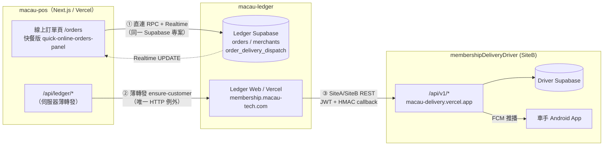
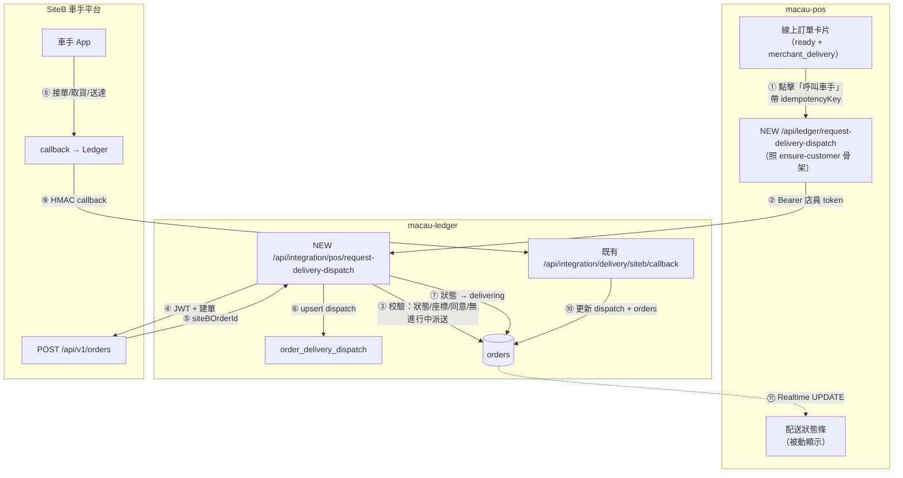

# 87 — POS 自送單派送至外賣車手平台（SiteB）系統分析與對接方案

> **狀態**：方案設計稿，待 Ledger 營運方確認後進入實施
> **最後更新**：2026-08-31
> **關聯文檔**：
> - [ledger-client-api.md](./integration/ledger-client-api.md) — POS × Ledger 契約 **v3.2**（權威）
> - [ecosystem-modules.md](./integration/ecosystem-modules.md) — 生態系拓樸與 SiteB API
> - [`macauMemebershipDeliveryDriver/sitea-siteb-api-spec-v3.html`](../macauMemebershipDeliveryDriver/sitea-siteb-api-spec-v3.html) — SiteB 對接規格 **v3**（權威）

---

## 0. 決策摘要（TL;DR）

| 項目 | 結論 |
|------|------|
| **「自送」是什麼** | Ledger `orders.fulfillment_type = 'merchant_delivery'`，由顧客下單時決定，**POS 唯讀** |
| **推薦方案** | **方案 A：POS → Ledger → SiteB（中樞模式）**。POS 不直連車手平台 |
| **核心理由** | 派單出口保持唯一（Ledger），避免狀態競爭；POS 不需持有 SiteB 憑證；顧客個資（PII）不經 POS 轉交第三方；callback 只需 Ledger 處理，POS 被動收 Realtime |
| **🔴 阻塞項 1** | 現行契約 §1.2 **明文禁止** POS 做 SiteB 派送（「僅 Ledger Web」），驗收清單第 10 項亦要求「POS 無 SiteB 派送按鈕／API」。**須先改約** |
| **🔴 阻塞項 2** | POS 端 `LedgerOrderRow` 拿不到 `delivery_latitude` / `delivery_longitude` / `delivery_phone_consented_at`，而 SiteB 建單**強制要座標** |
| **🟠 協調項** | Ledger 需新開 `POST /api/integration/pos/request-delivery-dispatch` |
| **預估 POS 端工作量** | 約 5–8 人天（不含 Ledger 端與聯調） |

---

## 1. 現有系統架構總覽

### 1.1 三個系統的定位

| # | 系統 | Repo / 網域 | 技術棧 | 角色 |
|---|------|-------------|--------|------|
| 1 | **macau-pos** | `macauPosSystem`<br/>`macau-pos-system.vercel.app` | Next.js 16.3 / React 19 | 店內收銀、線上訂單處理、打印 |
| 2 | **macau-ledger** | `Macau-Ledger`（private）<br/>`membership.macau-tech.com`<br/>UAT: `membership-uat.macau-tech.com` | Next.js + Supabase | **資料權威**：會員、錢包、線上訂單、報表 |
| 3 | **membershipDeliveryDriver**（SiteB） | `macauMemebershipDeliveryDriver`<br/>`macau-delivery.vercel.app` | Next.js backoffice + Android (Kotlin/Compose) + Firebase FCM | 外賣車手派單、軌跡、送達證明 |

### 1.2 三個 Supabase 專案（**重要：彼此獨立**）

| Supabase 專案 | 歸屬 | 內容 | POS 是否直連 |
|---------------|------|------|--------------|
| **Ledger Supabase** | macau-ledger | `orders`、`merchants`、`merchant_staff`、錢包、會員 | ✅ **是**（`NEXT_PUBLIC_SUPABASE_URL`） |
| **POS Supabase** | macau-pos | `pos_orders`、`pos_*`、`inv_*`、`salon_*` | ✅ 是（`SUPABASE_URL`） |
| **Driver Supabase** | SiteB | `orders`、`driver_profiles`、`callback_logs`… | ❌ 否 |
| expenseRecorder Supabase | 採購收據 | `receipts`… | ✅ 是（庫存模組，`inv_*`） |

> 💡 **關鍵認知**：POS 與 Ledger **共用同一個 Supabase 專案**。所以「POS 通知 Ledger」在絕大多數場景下不是發 HTTP，而是**直接寫同一個資料庫**。

### 1.3 拓樸圖



---

## 2. 現有對接盤點

### 2.1 Ledger ↔ POS：直連 Supabase 為主

契約鐵則（`ledger-client-api.md:35-46`）：

- 商戶以 **8 位電話 + 4 位 PIN** 登入，取得 Ledger Supabase session
- Client **直連 Ledger Supabase**（PostgREST RPC + Realtime），**不經** Ledger Vercel
- 線上訂單同步：Realtime `public.orders`（`merchant_id=eq.<uuid>`）+ 重連／回前景增量 RPC
- **禁止** polling；**禁止**呼叫 `macau-ledger.vercel.app` 任何 API

**POS → Ledger 的三種通知機制**

| 機制 | 做法 | 佔比 | 關鍵檔案 |
|------|------|------|----------|
| **A. 直連 RPC** | `client.rpc(fn, args)`，寫入即通知，Realtime 回流 | ~90% | `src/lib/ledger/order-actions.ts:34-46` |
| **B. Realtime** | 訂閱 `orders` UPDATE（單向 Ledger → POS） | 被動 | `src/lib/ledger/use-ledger-orders-realtime.ts:66-96` |
| **C. 伺服器薄轉發** | POS route → 帶店員 Bearer token → Ledger HTTP | 唯一例外 | `src/app/api/ledger/ensure-customer/route.ts` |

**白名單寫入 RPC 只有 4 支**（`ledger-client-api.md:40`）：
`accept_order_with_deduct`、`accept_order_in_store`、`update_order_status`、`set_order_paid_in_store`

> 📌 **機制 C 是本次方案的範本**：`ensure-customer/route.ts` 已完整實作「憑證檢查 → 參數校驗 → 限流（30 次/15min/店/操作者）→ 帶 Bearer 轉發 → 錯誤萃取」。新的派單 route 照此骨架擴充即可。

### 2.2 Ledger ↔ SiteB：SiteA/SiteB API（**本方案的參考範本**）

| 角色 | 系統 | clientId |
|------|------|----------|
| **SiteA** | macau-ledger | `macau-ledger` |
| **SiteB** | membershipDeliveryDriver | `membership-delivery-siteb` |

**出站（Ledger → SiteB）**

| Method | 路徑 | 用途 |
|--------|------|------|
| POST | `/api/v1/auth/token` | `clientId` + `clientSecret` 換 JWT（HS256，1h） |
| POST | `/api/v1/orders` | **建單**（`external_order_id` unique → 天然冪等） |
| GET | `/api/v1/orders/{externalOrderId}` | 查單（**補償漏 callback 用**） |
| POST | `/api/v1/orders/{externalOrderId}/cancel` | 取消派送 |
| POST | `/api/v1/orders/{externalOrderId}/raise-price` | 加價 |
| POST | `/api/v1/orders/{externalOrderId}/hurry` | 催單 |
| GET | `/api/v1/drivers/presence` | 車手在線／地區分佈 |

**入站（SiteB → Ledger callback）**

- 端點：`POST /api/integration/delivery/siteb/callback`
- 驗簽：`hex(HMAC_SHA256(secret, X-SiteB-Timestamp + "." + rawBody))`
- Headers：`Authorization: Bearer <JWT>`、`X-SiteB-Timestamp`、`X-SiteB-Signature`
- 事件：`order.accepted`、`order.picked_up`、`order.arrived_customer`、`order.delivered`、`order.canceled`、`order.exception_reported`、`order.shop_owner_confirmed_driver_cancel`
- v3 起所有 callback 統一帶 `driver.{fullName,phone}`、`acceptanceLocation`、`deliveryFeePaidBy`
- 重試：**同一次 HTTP 請求內 inline 3 次**（0s / 1s / 5s），**無排程重試**；失敗進 `callback_logs`，後台手動重送

**建單必要欄位（v3）**：`shop.name`、`shop.address`、`shop.latitude`、`shop.longitude`、`callback.url`
`customer.address` 非必填，但若無地址則 `images[].url` 至少要一張。

**Ledger 端既有守衛**：訂單處於進行中派送時，手動 `completed` 會被拒，錯誤碼 `delivery dispatch active`
（POS 端已翻成中文：「派送進行中，請先在 Ledger Web 處理。」— `order-actions.ts:26`）

### 2.3 目前**沒有**什麼

| 缺口 | 證據 |
|------|------|
| POS 端無任何 delivery / dispatch API route | `src/app/api/` 30 支 route 全數盤點，無一相關 |
| Ledger 端無 `/api/integration/pos/*dispatch*` 端點 | `ecosystem-modules.md:164-171` 入站表僅 7 支 |
| POS 端無 `fulfillment_type` 寫入邏輯 | 全專案唯讀 |
| POS 端 `LedgerOrderRow` 無配送座標欄位 | `src/lib/ledger/order-mapper.ts:2-23` |
| SiteB 端無 tenant／merchant 層級固定 webhook | 僅 per-order `callback.url` |

---

## 3. 「自送」訂單的現狀

### 3.1 欄位定義

| 項 | 值 |
|----|-----|
| DB 欄位 | `orders.fulfillment_type`（型別 `text`，**非 enum**） |
| 可能值 | `dine_in` / `takeaway` / **`merchant_delivery`** |
| 「自送」對應 | **`merchant_delivery`** |
| POS 正規化 | `mapFulfillmentToTab()` → `self_delivery`，顯示名「**外送**」 |
| POS 能否設定 | ❌ 唯讀，由顧客在會員通下單時決定 |

⚠️ **陷阱**：`order-mapper.ts:49-54` 的 `mapFulfillmentToTab()` 對**任何非** `dine_in`/`takeaway` 的值一律 fallback 到 `self_delivery`。
**判斷是否自送請一律用 `fulfillmentType === "merchant_delivery"`**，不要用 `tabType === "self_delivery"`。

### 3.2 狀態機（`public.order_status` enum）

```
pending ──accept──▶ accepted ──▶ preparing ──▶ ready ──┬──▶ delivering ──▶ completed
   │                   │             │                 └──────────────────────▶ completed
   └──cancel──▶ cancelled           └──cancel──▶ cancelled
```
- `ready → delivering` 與 `ready → completed` **僅 `merchant_delivery` 可用**
- `delivering → completed` 為自送單完成路徑
- 終態：`completed` / `cancelled`
- 餘額單（`payment_mode=balance` 且未付款）不可直接 `accepted`，須走 `accept_order_with_deduct`

### 3.3 POS 端現有 UI

| 位置 | 現況 |
|------|------|
| `src/components/online-orders.tsx:46-51` | 4 個 Tab：全部／堂食／外賣自取／**外送** |
| `:276` | `fulfillmentType === "merchant_delivery"` → 播 `new-delivery` 音效 |
| `:597-606` | `ready` 且自送 → 顯示紫色「**配送中**」按鈕（人工送） |
| `:755, 889` | 顯示狀態標籤、配送地址 |
| `quick-online-orders-panel.tsx` | 快餐版同上邏輯 |
| `ledger-pos-bridge.ts:49-51, 259` | 自送單打印時桌名映射為「外賣」，單號 `外送-{id前6碼}` |

**缺失**：無任何呼叫車手平台的操作入口。目前自送單只能靠店員自行配送，或到 Ledger Web 操作。

---

## 4. 設計約束（不可違反）

| # | 約束 | 來源 |
|---|------|------|
| C1 | 禁止 polling 拉線上訂單 | `ledger-client-api.md:56` |
| C2 | 除白名單外，禁止呼叫 Ledger Vercel 任何 API／Server Action | `ledger-client-api.md:53` |
| C3 | 顧客 PII（姓名／電話／地址）**render-only**，禁止寫入 POS DB、localStorage、IndexedDB、log | `ledger-client-api.md:595-601` |
| C4 | POS 不得索取或使用 Ledger `service_role` | `ledger-client-api.md` §7 |
| C5 | 線上訂單狀態／金額權威在 Ledger | `ledger-client-api.md:517-523` |
| C6 | Realtime 連線配額 ~200（Free tier），離頁須 unsubscribe | `ledger-client-api.md:569` |
| C7 | 缺座標或電話同意快照時，Ledger **不呼叫**夥伴 API | `ecosystem-modules.md:199` |
| C8 | 派單進行中，訂單不可手動 `completed` | `delivery dispatch active` 守衛 |

> 🔴 **C3 是方案選型的決定性約束**：若 POS 直連 SiteB 建單，就必須把顧客姓名／電話／地址傳給第三方平台——這等於把 render-only 的 PII **轉交出去**，直接違反契約。**這是「方案 A（經 Ledger 代傳）」壓倒性勝出的核心理由。**

---

## 5. 方案設計

### 5.1 方案選型

| 面向 | **A. POS → Ledger → SiteB**（推薦） | B. POS 直連 SiteB | C. POS 直連 SiteB + callback 收在 POS |
|------|-----------------------------------|-------------------|--------------------------------------|
| 派單出口 | **唯一（Ledger）** | 兩個（Ledger Web + POS） | 兩個 |
| 狀態競爭 | 無 | 需分散式鎖防重複派單 | 嚴重 |
| PII 合規（C3） | ✅ 由 Ledger 代傳 | ❌ **違反** | ❌ **違反** |
| 憑證持有 | POS 只需 Ledger session | POS 需持有 SiteB client secret | 同 B |
| callback 處理 | Ledger 既有邏輯，POS 被動收 Realtime | 指向 Ledger（需 Ledger 配合） | POS 自己收，再寫 Ledger |
| 對帳 | 集中 | 分散 | 最分散 |
| 契約衝突 | 需改約（§1.2） | 需改約 + 個資條款 | 同 B |
| 跨 repo 依賴 | 🟠 需 Ledger 開端點 | 🟢 低 | 🟢 低 |
| 長期可維護性 | ✅ 高 | ❌ 低 | ❌ 最低 |

> **結論：採用方案 A。** 若 Ledger 端時程無法配合，才退回 **方案 B 的強化版**（見 §5.8 備案）。

### 5.2 方案 A 架構



### 5.3 資料流詳解

#### 流程一：派單（happy path）

| 步 | 從 → 到 | 動作 |
|----|---------|------|
| 1 | POS UI → POS route | 店員點「呼叫車手」；前端先做樂觀鎖（按鈕 disable），產生 `idempotencyKey`（UUID v4，同一次點擊固定） |
| 2 | POS route → Ledger | `POST {LEDGER_INTEGRATION_BASE_URL}/api/integration/pos/request-delivery-dispatch`，帶店員 `Authorization: Bearer` |
| 3 | Ledger 校驗 | ① 店員屬於該 `merchant_id`；② `fulfillment_type = 'merchant_delivery'`；③ 狀態 ∈ {`ready`, `preparing`, `delivering`}；④ 已取得 `delivery_latitude/longitude` 與 `delivery_phone_consented_at`；⑤ 無進行中的 dispatch |
| 4 | Ledger → SiteB | 取 JWT → `POST /api/v1/orders`，`externalOrderId` = **Ledger order UUID**（見 §5.4），`callback.url` = Ledger callback 端點 |
| 5 | Ledger 寫入 | upsert `order_delivery_dispatch`；`orders.status` → `delivering` |
| 6 | Ledger → POS | Realtime 推 `UPDATE orders` → POS 卡片更新為「已派單 · 等待車手接單」 |

#### 流程二：車手狀態回推

| SiteB callback 事件 | Ledger 動作 | POS 顯示 |
|---------------------|-------------|----------|
| `order.accepted` | 記錄車手資訊，狀態維持 `delivering` | 「車手 XXX 已接單（電話 6XXX XXXX）」 |
| `order.picked_up` | `dispatch.picked_up_at` | 「車手已取貨，配送中」 |
| `order.arrived_customer` | `dispatch.arrived_at` | 「車手已抵達客戶」 |
| `order.delivered` | `orders.status → completed`，存送達證明 | 「已送達」+ 證明圖（可選） |
| `order.canceled` | 解除 dispatch，`orders.status → ready`（可重新派） | 「車手已取消，可重新派單」 |
| `order.exception_reported` | 標記異常，**不改狀態** | 「異常：{reason}」（紅色警示） |
| `order.shop_owner_confirmed_driver_cancel` | 確認取消 → 解除 dispatch | 「已確認車手取消」 |

> ⚠️ `order.exception_reported` **不是終態**，車手回報異常後訂單仍在配送中，需店員介入。

#### 流程三：取消與異常

| 情境 | 處理 |
|------|------|
| 店員主動取消派送 | POS → Ledger → SiteB `POST /orders/{id}/cancel`；`orders.status` 回 `ready` |
| 車手已取貨後取消 | SiteB 回 409 `order_conflict`；POS 提示「車手已取貨，請聯絡後台」 |
| callback 丟失 | POS 提供「**同步配送狀態**」按鈕 → Ledger → `GET /api/v1/orders/{externalOrderId}` 補償（**手動觸發，不是 polling**） |
| 長時間無車手接單 | 可用 SiteB `raise-price` 加價（Phase 2，POS 端先不做） |

### 5.4 API 規格

#### 5.4.1 Ledger 新端點（**需 Ledger 團隊開立**）

```http
POST {LEDGER_INTEGRATION_BASE_URL}/api/integration/pos/request-delivery-dispatch
Authorization: Bearer <店員 Ledger access_token>
Content-Type: application/json
```

Request：
```jsonc
{
  "orderId": "uuid",              // Ledger orders.id（必填）
  "merchantId": "uuid",           // 店別 scope（必填，須與 token 所屬一致）
  "idempotencyKey": "uuid-v4",    // 必填，防重複派單
  "requestedBy": "pos",           // 固定值，供 Ledger 區分派單來源
  "pickupReadyTimeText": "11:45 可取",   // 選填，顯示於車手端卡片
  "arrivalTimeText": "約 12:20 到",      // 選填
  "remark": "先打電話，不要按門鐘"        // 選填
}
```

Response 200：
```jsonc
{
  "success": true,
  "dispatchId": "uuid",
  "siteBOrderId": "uuid",
  "status": "new",            // SiteB 訂單狀態
  "orderStatus": "delivering" // Ledger orders.status
}
```

錯誤碼：

| HTTP | code | 情境 | POS 顯示文案 |
|------|------|------|--------------|
| 400 | `bad_request` | 缺參數 | 「參數錯誤，請重試。」 |
| 400 | `not_delivery_order` | `fulfillment_type ≠ merchant_delivery` | 「此訂單非外送單。」 |
| 400 | `missing_coordinates` | 缺配送座標（C7） | 「此訂單缺少配送座標，請到 Ledger Web 補充。」 |
| 400 | `missing_phone_consent` | 缺電話同意快照（C7） | 「顧客未提供電話同意，無法派單。」 |
| 409 | `dispatch_already_active` | 已有進行中派送 | 「此訂單已派送中，請勿重複派單。」 |
| 409 | `invalid_order_status` | 狀態不在允許集合 | 「目前訂單狀態無法派單。」 |
| 502 | `siteb_unavailable` | SiteB 呼叫失敗 | 「車手平台暫時無法連線，請稍後再試。」 |

> 🔑 **冪等語意**：同一 `idempotencyKey` 重複請求，回傳**首次結果**，不重複建單。
> 建議 Ledger 端以 `(order_id, idempotency_key)` unique 約束落地。

#### 5.4.2 POS 端新 route

```
src/app/api/ledger/request-delivery-dispatch/route.ts
```

照 `ensure-customer/route.ts` 骨架：憑證檢查 → 參數校驗（orderId/merchantId/idempotencyKey）→ 限流（建議 **10 次/5min/店**，派單比建檔敏感）→ 帶 `getLedgerAccessToken()` 轉發 → `extractMessage()` 萃取錯誤。

**前端 wrapper**（新檔）：
```
src/lib/ledger/delivery-dispatch.ts
```

#### 5.4.3 SiteB 建單 payload（由 Ledger 組裝，POS 不參與）

```jsonc
{
  "externalOrderId": "<ledger order uuid>",
  "pickupMode": "now",
  "deliveryMode": "now",
  "deliveryFeeMop": 0,           // 計費規則由 Ledger 決定
  "shop":    { "externalShopId": "<merchantId>", "name": "...", "address": "...",
               "latitude": 22.19, "longitude": 113.54, "contactPhone": "..." },
  "customer":{ "name": "...", "phone": "...", "address": "...",
               "latitude": 22.19, "longitude": 113.54 },
  "callback":{ "url": "https://membership.macau-tech.com/api/integration/delivery/siteb/callback",
               "secret": "<SITEB_DELIVERY_WEBHOOK_SECRET>" }
}
```

> 📌 `externalOrderId` 固定用 **Ledger order UUID**（不加來源後綴）。
> 好處：SiteB `external_order_id` unique 約束能**天然防止 POS 與 Ledger Web 重複派同一單**——這是兩個派單入口共存下最重要的安全網。

### 5.5 資料模型變更

**Ledger 端**（POS 端不需新增表，唯讀消費）

`order_delivery_dispatch` 建議欄位：

| 欄位 | 型別 | 說明 |
|------|------|------|
| `id` | uuid PK | |
| `order_id` | uuid FK → `orders.id` | |
| `merchant_id` | uuid | 店別 scope |
| `siteb_order_id` | uuid | SiteB 端訂單 id |
| `idempotency_key` | uuid | **unique(order_id, idempotency_key)** |
| `requested_source` | text | `'pos'` / `'ledger_web'` — 供對帳與稽核 |
| `requested_by_staff` | uuid | 店員 |
| `status` | text | `new`/`assigned`/`picked_up`/`delivered`/`canceled`/`exception` |
| `driver_name` / `driver_phone` | text | callback 帶回 |
| `delivery_fee_mop` | numeric | |
| `accepted_at` / `picked_up_at` / `arrived_at` / `delivered_at` | timestamptz | |
| `canceled_reason` / `exception_reason` | text | |
| `created_at` / `updated_at` | timestamptz | |

**POS 端**：僅擴充 `LedgerOrderRow` 型別（加 `delivery_latitude` / `delivery_longitude` / `delivery_phone_consented_at` 為**可選**），並確認 RLS + Realtime 會推送。
> ⚠️ 座標與 PII 一律 **render-only**，不得寫入 POS DB 或 localStorage（C3）。

### 5.6 冪等與補償

| 層 | 機制 |
|----|------|
| POS UI | 點擊後立即 disable + in-flight 標記；參考既有 `src/lib/ledger/accept-idempotency.ts` 模式 |
| POS route | `idempotencyKey` 透傳；同一 key 同時只允許一個 in-flight 請求 |
| Ledger | `unique(order_id, idempotency_key)`；檢查無 active dispatch |
| SiteB | `external_order_id` unique → `created: false` 冪等命中 |
| callback 丟失 | 「同步配送狀態」按鈕 → `GET /api/v1/orders/{externalOrderId}` 補償（手動，非 polling） |

**對帳報表**（Phase 2）：比對 `order_delivery_dispatch.status` ↔ SiteB `orders.status` ↔ Ledger `orders.status`，每日一次，差異告警。

### 5.7 POS 端 UI 改動

**`src/components/online-orders.tsx`**（`quick-online-orders-panel.tsx` 同步）

| 改動 | 位置 | 說明 |
|------|------|------|
| 新增「呼叫車手」按鈕 | `:597` 附近，與既有「配送中」並列 | 條件：`fulfillmentType === "merchant_delivery"` 且 `status === "ready"` 且無 active dispatch |
| 配送狀態條 | 卡片底部 | 顯示車手姓名／電話／配送進度／異常警示 |
| 「同步配送狀態」按鈕 | 狀態條內（僅有 dispatch 時） | 手動補償 |
| 「取消派送」按鈕 | 狀態條內 | 需二次確認 |
| 錯誤提示 | toast | 使用 §5.4.1 的中文文案對照表 |

**狀態顯示決策樹**：

```
order.fulfillmentType === "merchant_delivery" ?
├─ 無 dispatch         → [呼叫車手] [配送中(人工)]
├─ dispatch = new      → 「已派單 · 等待車手接單」  [同步] [取消派送]
├─ dispatch = accepted → 「車手 {name} 已接單 · {phone}」  [同步] [取消派送]
├─ dispatch = picked_up→ 「車手已取貨 · 配送中」  [同步]
├─ exception_reported  → 「⚠ 異常：{reason}」  [同步]  ← 紅色，需店員介入
└─ delivered           → 「已送達 · {time}」
```

**`src/lib/ledger/order-mapper.ts`**：`LedgerOrderRow` 補座標欄位（可選）。
**`src/lib/ledger/order-actions.ts`**：`mapRpcErrorMessage()` 補 `dispatch_already_active` 等新錯誤碼。

### 5.8 環境變數

```env
# 沿用既有，無需新增（派單走同一條薄轉發）
LEDGER_INTEGRATION_BASE_URL=https://membership.macau-tech.com
```

> ✅ **方案 A 的一大優勢**：POS 端**不需要**任何 SiteB 憑證（`SITEB_DELIVERY_CLIENT_SECRET` 等留在 Ledger），也不需要新的環境變數。

### 5.9 備案：若 Ledger 無法即時開立端點（方案 B 強化版）

僅在方案 A 時程不可行時採用，**必須**同時滿足以下防護：

1. POS 後端持有 `SITEB_DELIVERY_CLIENT_ID` / `CLIENT_SECRET`（server-only env，絕不進前端）
2. `externalOrderId` **仍用 Ledger order UUID**，靠 SiteB unique 約束防重複派單
3. `callback.url` **仍指向 Ledger**（`https://membership.macau-tech.com/api/integration/delivery/siteb/callback`）— 讓車手狀態變化仍由 Ledger 收斂，POS 純被動
4. **PII 問題無解**：POS 建單時必須傳顧客姓名／電話／地址給 SiteB，違反 C3。
   → **須取得 Ledger 營運方書面豁免**，或改為由 Ledger 提供一次性「派單票據」（ticket），POS 僅持票據建單、Ledger 端補足 PII（實作成本接近方案 A，故不推薦）
5. 加上分散式鎖：POS 派單前先以 `update_order_status` 嘗試佔位，失敗即放棄

---

## 6. 實施計劃

| Phase | 內容 | 負責 | 依賴 |
|-------|------|------|------|
| **P0 解阻塞** | ① 與 Ledger 營運方改約（移除 §1.2 禁止條款 + 驗收清單第 10 項）<br/>② 確認 `order_delivery_dispatch` 表結構<br/>③ 確認座標欄位可經 RLS/Realtime 推送給 POS | POS + Ledger | — |
| **P1 Ledger 端** | 開立 `/api/integration/pos/request-delivery-dispatch`；建 `order_delivery_dispatch` 表與 unique 約束；錯誤碼對照 | Ledger | P0 |
| **P2 POS 端** | 新 route + `delivery-dispatch.ts` + 限流 + 錯誤對照；`LedgerOrderRow` 擴欄 | POS | P1（可先以 mock 平行開發） |
| **P3 UI** | 「呼叫車手」按鈕、配送狀態條、同步／取消、快餐版同步 | POS | P2 |
| **P4 聯調** | UAT 端到端：派單 → 車手接單 → 取貨 → 送達 → 完成；取消／異常分支 | POS + Ledger + SiteB | P1–P3 |
| **P5 上線** | 灰度單店 → 全店；監控 callback 失敗率與對帳差異 | 全體 | P4 |
| **P6（選配）** | 加價、催單、對帳報表、車手在線數顯示 | POS | P5 |

---

## 7. 風險登記冊

| # | 風險 | 嚴重度 | 影響 | 緩解 |
|---|------|--------|------|------|
| R1 | **契約明文禁止 POS 派送**（§1.2 + 驗收清單第 10 項） | 🔴 阻塞 | 無法上線 | P0 優先處理；此為**合約義務**而非技術限制，技術上無閘門阻擋，但違約有稽核風險 |
| R2 | **POS 拿不到配送座標** | 🔴 阻塞 | 違反 C7，Ledger 不呼叫夥伴 API | 擴充 `LedgerOrderRow` + 確認 `list_merchant_orders` RPC 與 RLS 是否回傳座標；若 RPC 不回傳，須請 Ledger 擴 RPC |
| R3 | PII 轉交第三方（方案 B） | 🔴 高 | 違反 C3 個資條款 | 採用方案 A 即完全規避 |
| R4 | **SiteB JWT 密鑰已外洩**：`sitea-siteb-api-integration-guide.html:179,212,230,244` 明文含 `JWT_SHARED_SECRET`，且已進 git 歷史 | 🔴 高 | 任何人可偽造 SiteA 建單／取消 | **立即輪換** `SITEB_DELIVERY_CLIENT_SECRET` 與 `SITEB_DELIVERY_WEBHOOK_SECRET`；清理 git 歷史；將 HTML 文件移出 repo |
| R5 | SiteB callback 僅 6 秒 inline 重試，無排程 | 🟠 中 | Ledger 短暫維護即永久丟失事件 | POS 提供手動「同步配送狀態」；建議 SiteB 端加 queue（v3 spec 已列為下一階段） |
| R6 | SiteB `urgent` 欄位 bug：建單時恆寫入 `false`，輸入被忽略 | 🟠 中 | 急單標記無效 | 修 `siteb-order-api.ts:246`；或 Phase 2 改用 `raise-price` 觸發急單 |
| R7 | SiteB `arrived_customer` 斷鏈：有 callback 事件但無 route 會寫入該狀態 | 🟡 低 | 查單回傳 `picked_up` 而非 `arrived_customer` | 若需要「已抵達」精確狀態，請 SiteB 補 `status/route.ts` 的 `arrived` 分支 |
| R8 | POS 直連 RPC **不觸發顧客 Web Push** | 🟡 低 | 派單後顧客收不到推播 | 須由 Ledger 端在 dispatch 建立時補發推播 |
| R9 | SiteB 若未設 `SITEB_DELIVERY_WEBHOOK_SECRET`，會**靜默不簽名** | 🟡 低 | 驗簽端若強制要求 header 會全數失敗 | Ledger callback 端明確處理「無 signature」；部署檢查清單加此項 |
| R10 | Realtime 連線配額 ~200 | 🟡 低 | 多店併發可能達上限 | 沿用既有規範：僅訂單頁 subscribe、離頁 unsubscribe |
| R11 | 兩個派單入口（Ledger Web + POS）可能併發操作 | 🟡 低 | 重複派單 | `externalOrderId` = order UUID 靠 SiteB unique 約束攔截；Ledger 端加 active dispatch 檢查 |
| R12 | `mapFulfillmentToTab()` fallback 把未知值歸為 `self_delivery` | 🟡 低 | 誤判自送單 | 一律用 `fulfillmentType === "merchant_delivery"` 判斷 |

---

## 8. 待確認事項（給 Ledger 營運方）

| # | 問題 | 為什麼需要 |
|---|------|------------|
| Q1 | 能否修訂契約 §1.2 與驗收清單第 10 項，開放 POS 派送？ | R1，阻塞 |
| Q2 | `order_delivery_dispatch` 表的確切結構？ `requested_source` 可否新增？ | §5.5，PM 稽核 |
| Q3 | `list_merchant_orders` RPC 與 `orders` RLS 是否會回傳 `delivery_latitude` / `delivery_longitude` / `delivery_phone_consented_at`？若不回傳，可否擴充？ | R2，阻塞 |
| Q4 | 派單允許的訂單狀態集合是否為 {`ready`, `preparing`, `delivering`}？ | §5.3 流程一 |
| Q5 | 配送費（`deliveryFeeMop`）由誰負擔？顧客已付／店舖吸收？ | SiteB v3 有 `deliveryFeePaidBy` |
| Q6 | `order.delivered` callback 是否自動將 `orders.status` 推進 `completed`？ | §5.3 流程二 |
| Q7 | 顧客 Web Push 是否會在派單時補發？（POS 直連 RPC 不觸發通知） | R8 |
| Q8 | SiteB 密鑰輪換時程？（現行密鑰已外洩） | R4 |

---

## 附錄 A：關鍵檔案速查

| 用途 | 路徑 |
|------|------|
| POS 線上單型別 / fulfillment 映射 | `macauPosSystem/src/lib/ledger/order-mapper.ts` |
| POS 寫入 RPC 封裝 + 錯誤中文化 | `macauPosSystem/src/lib/ledger/order-actions.ts` |
| POS Realtime 訂閱 | `macauPosSystem/src/lib/ledger/use-ledger-orders-realtime.ts` |
| POS session / merchantId | `macauPosSystem/src/lib/ledger/session.ts` |
| **機制 C 範本 route（照此擴充）** | `macauPosSystem/src/app/api/ledger/ensure-customer/route.ts` |
| POS 線上單主 UI | `macauPosSystem/src/components/online-orders.tsx` |
| POS 快餐版線上單 UI | `macauPosSystem/src/components/quick-online-orders-panel.tsx` |
| 接單冪等模式（可複用） | `macauPosSystem/src/lib/ledger/accept-idempotency.ts` |
| POS × Ledger 契約 v3.2 | `macauPosSystem/docs/integration/ledger-client-api.md` |
| 生態系拓樸 + SiteB API | `macauPosSystem/docs/integration/ecosystem-modules.md` |
| **SiteB API 規格 v3（權威）** | `macauMemebershipDeliveryDriver/sitea-siteb-api-spec-v3.html` |
| SiteB 建單實作 | `macauMemebershipDeliveryDriver/backoffice/lib/siteb-order-api.ts` |
| SiteB callback 實作 | `macauMemebershipDeliveryDriver/backoffice/lib/siteb-callbacks.ts` |
| SiteB DB schema | `macauMemebershipDeliveryDriver/supabase/001_init_schema.sql` |
