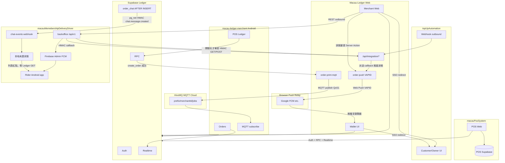
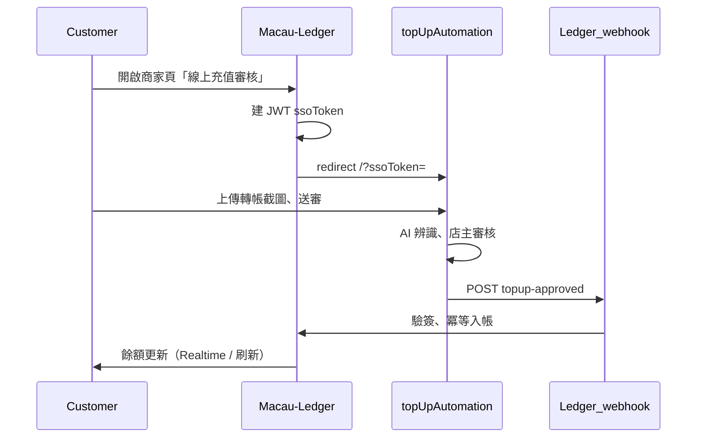
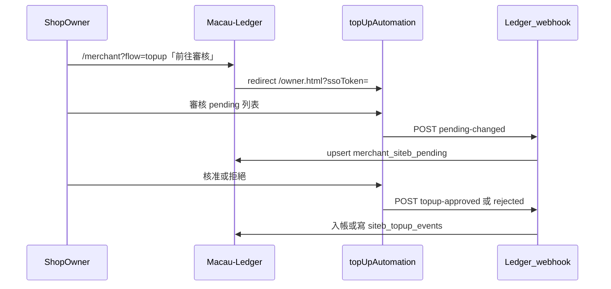
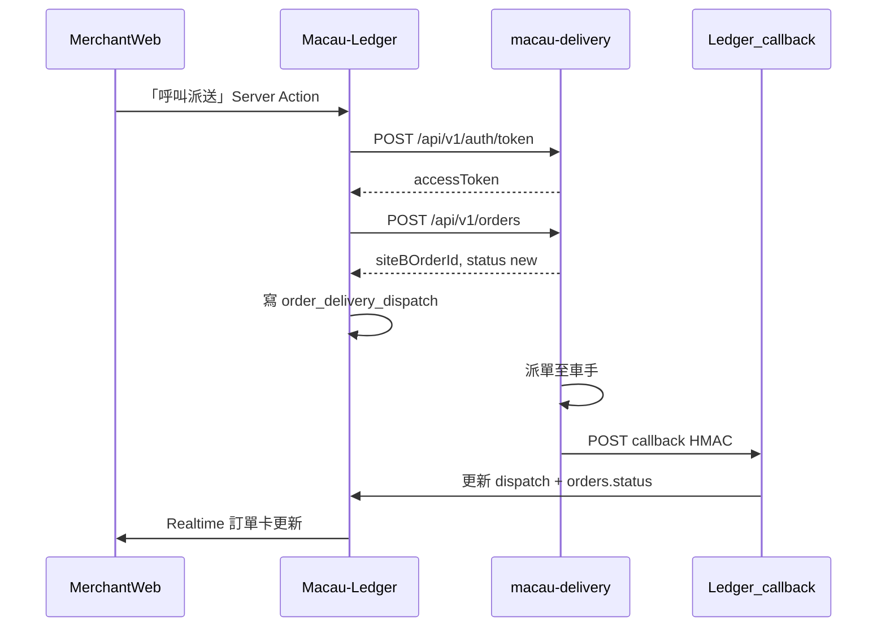
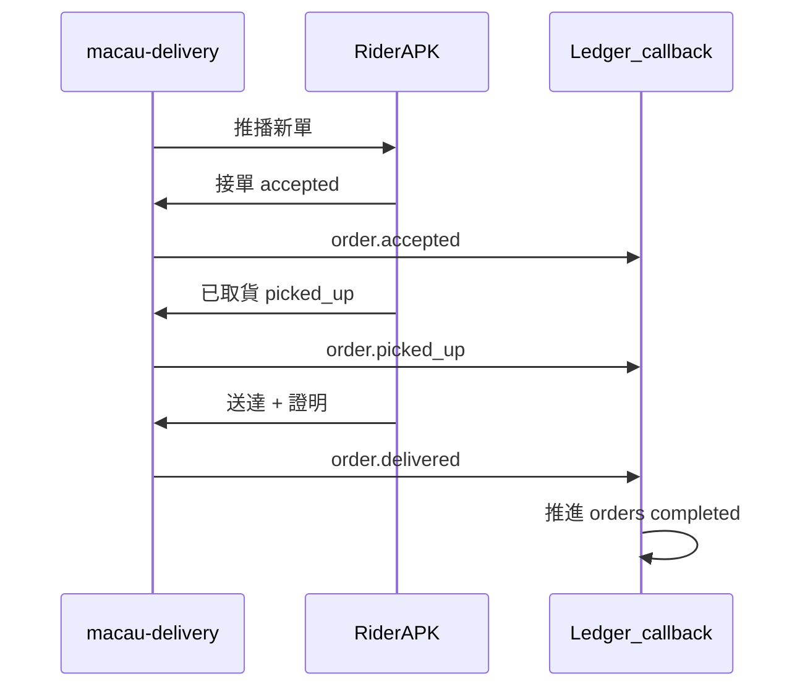
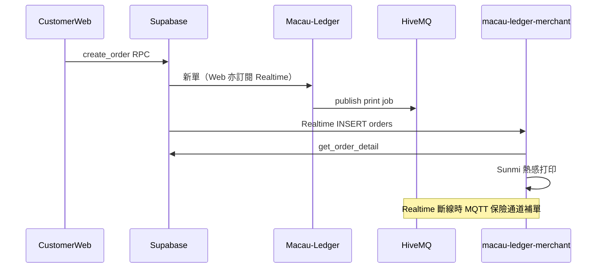
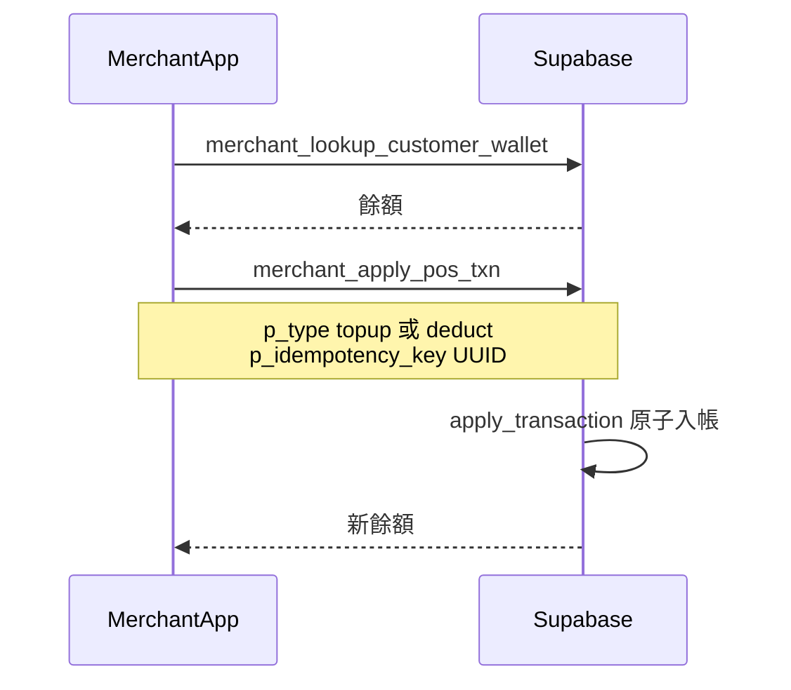

# 生態系模組整合總覽

> **狀態**：Phase 1 已落地（2026-07-09）  
> **用途**：跨 repo 單一入口——說明澳門會員通、商戶 Android App 與 homeu98-glitch 夥伴系統（充值／派送／第三方 POS）如何協作。  
> **最後更新**：2026-08-11（第三方 POS 整合契約 v2：訂單可寫 + Realtime）

## See also

- 充值 API 契約詳細：[sitea-topup-automation-poc.md](sitea-topup-automation-poc.md)
- 派送 API 契約詳細：[siteb-delivery-api.md](siteb-delivery-api.md)
- 訂單聊天（車手／SiteB）唯一對接：[siteb-order-chat-api.md](siteb-order-chat-api.md)（[ADR-033](../adr/ADR-033-order-chat.md)；**分**會員通訂單／外部派單 `ext-*`，回應 `roomKind`）→ [macauMemebershipDeliveryDriver](https://github.com/homeu98-glitch/macauMemebershipDeliveryDriver)
- 商戶 Android App：[ADR-024](../adr/ADR-024-macau-ledger-merchant-android.md)
- **第三方 POS ↔ Ledger 整合**：[pos-ledger-client-api.md](pos-ledger-client-api.md) → [homeu98-glitch/macauPosSystem](https://github.com/homeu98-glitch/macauPosSystem)

---

## 1. 模組總覽

| 模組 | GitHub Repo | 部署／執行 | 角色 |
|------|-------------|------------|------|
| **澳門會員通 Web** | [EricChang1015/Macau-Ledger](https://github.com/EricChang1015/Macau-Ledger) | `macau-ledger.vercel.app` | 會員／商戶／Admin Web；Supabase migrations 權威；整合 webhook 接收端 |
| **商戶 Android App** | [EricChang1015/macau-ledger-merchant](https://github.com/EricChang1015/macau-ledger-merchant) | APK OTA（RPC `get_latest_app_release`） | POS 記帳、接單、打印；**直連 Supabase**，不經 Ledger Vercel |
| **第三方 Web POS** | [homeu98-glitch/macauPosSystem](https://github.com/homeu98-glitch/macauPosSystem) | `macau-pos-system.vercel.app` | 店內 POS（**獨立 Supabase**）；Ledger 登入後 **client 直連** 同店線上單（**可寫 RPC + Realtime**）／報表／菜單（唯讀）；禁 polling、不經 Ledger Vercel |
| **充值審核服務** | [homeu98-glitch/topUpAutomation](https://github.com/homeu98-glitch/topUpAutomation) | `top-up-automation.vercel.app` | 顧客上傳轉帳截圖、AI 辨識、店主審核；SSO 進入 |
| **外賣派單平台** | [homeu98-glitch/macauMemebershipDeliveryDriver](https://github.com/homeu98-glitch/macauMemebershipDeliveryDriver) | API：`macau-delivery.vercel.app`（`backoffice/`）；騎手 APK 在 `app/` | 建單／催單／加價 REST API + 車手接單 Android App |

### 1.1 命名對照（程式 vs 產品）

| 產品用語 | 程式／env 慣例 | 說明 |
|----------|----------------|------|
| 充值審核服務 | `SITEA_*`、`SITE_B_BASE_URL` | Ledger 為 Site A；夥伴 top-up-automation 為 Site B |
| 外賣派單系統 | `SITEB_DELIVERY_*` | 與充值 Site B **不同系統**，env 前綴勿混淆 |

### 1.2 共用基礎設施

| 範圍 | 說明 |
|------|------|
| **Ledger + macau-ledger-merchant** | 共用**同一 Supabase 專案**（Auth、Postgres、RLS、RPC、Realtime、Storage） |
| **macauPosSystem** | **獨立 Supabase**（店內 POS）；商戶 Ledger 登入後 **client 直連 Ledger Supabase**（訂單可寫 RPC + Realtime；報表／菜單唯讀）；**無** Ledger webhook／Vercel（見 [pos-ledger-client-api.md](pos-ledger-client-api.md)） |
| **topUpAutomation** | **獨立 Supabase**；僅經 browser SSO redirect 與 HTTP webhook 與 Ledger 溝通 |
| **macauMemebershipDeliveryDriver** | **獨立 Supabase**；Ledger 經 REST 出站 + inbound callback 溝通；車手 APK 直連夥伴後台 |
| **HiveMQ MQTT** | Ledger 下單 publish `notifications`（提示音）、**接單後** publish `jobs`（打印）→ 商戶 App（及可選 pos-printer）subscribe（[ADR-023](../adr/ADR-023-pos-printing-mqtt.md)） |
| **Web Push（VAPID）** | Ledger 商戶改狀態／派送 callback 後 `notifyOrderStatusPush` → 瀏覽器 Push endpoint；Chrome 等**底層經 Google FCM 中繼**，Ledger **不**直接呼叫 Firebase Admin API（[ADR-027](../adr/ADR-027-customer-web-push.md)） |

---

## 2. 模組關係圖

### 2.1 MQTT 與推播說明

| 通道 | Macau-Ledger 角色 | 消費端 | 備註 |
|------|-------------------|--------|------|
| **HiveMQ MQTT** | `order-print-mqtt.ts`：下單 `notifications`、接單 `jobs` | macau-ledger-merchant subscribe；可選 [macau-ledger-pos-printer](https://github.com/EricChang1015/macau-ledger-pos-printer)（僅 jobs） | env：`MQTT_BROKER_URL`、`MQTT_TOPIC_PREFIX`；商戶 App **不依賴** FCM；Android 本機接單不經 Web MQTT，靠 Realtime／本地出單 |
| **Web Push → FCM 中繼** | `notifyOrderStatusPush`（VAPID + `web-push`） | 顧客 Wallet 瀏覽器（PWA） | env：`VAPID_*`；Ledger **無** Firebase 專案設定；Chrome 自動走 Google FCM |
| **Firebase FCM** | **非** Ledger 功能 | 外賣派單騎手 APK | 夥伴 `backoffice` Firebase Admin；與 Ledger Web Push 無關 |

---

## 3. 通訊方式矩陣

| 來源 | 目的地 | 協定 | 用途 |
|------|--------|------|------|
| Ledger Web | top-up-automation | Browser redirect + JWT `ssoToken` | 顧客／店主進充值審核 |
| topUpAutomation | Ledger | POST webhook（3 條） | 核准／拒絕／待審筆數 |
| Ledger Web | macau-delivery | REST `/api/v1/*` | 建單／取消／催單／加價／查單 |
| macau-delivery | Ledger | POST callback HMAC | 派送狀態推送 |
| Ledger Supabase | macau-delivery | `pg_net` POST Webhook HMAC | 顧客／商戶新聊天訊息事件；SiteB 本地未讀 |
| macau-delivery | Ledger | HMAC chat GET／POST | 車手開窗增量讀取／發訊；列表禁止逐單 GET |
| macau-delivery | Ledger | HMAC batch POST | 服務恢復時集合式 latest metadata 對帳；非常駐 polling |
| macau-ledger-merchant | Supabase | Auth + RPC + Realtime | 記帳／訂單（**無** Vercel） |
| macauPosSystem | Ledger Supabase | Auth + **read/write** RPC + **Realtime** `orders` | 同店線上單接單／狀態；報表／菜單唯讀；**禁** polling／**禁** Ledger Vercel |
| macauPosSystem | POS Supabase | 自有 schema | 店內 POS／打印／離線隊列 |
| Ledger Web | HiveMQ | MQTT publish | 下單 `notifications`／接單後 `jobs`（ADR-023） |
| macau-ledger-merchant | HiveMQ | MQTT subscribe | 下單音＋接單打印保險通道（ADR-023） |
| Ledger Server | 顧客瀏覽器 | Web Push VAPID | 訂單狀態推播（ADR-027）；Chrome 經 Google FCM 中繼 |
| macau-delivery backoffice | 騎手 APK | Firebase Admin FCM | 新單／狀態推播（夥伴系統，非 Ledger） |

---

## 4. API 端點速查

### 4.1 入站（夥伴 → Ledger）

| Method | 路徑 | 消費者 | Headers | 詳細 |
|--------|------|--------|---------|------|
| POST | `/api/integration/siteb/topup-approved` | topUpAutomation | `X-Topup-Event`、`X-Topup-Timestamp`、`X-Topup-Signature` | [sitea-topup §3](sitea-topup-automation-poc.md#3-webhook給夥伴設定) |
| POST | `/api/integration/siteb/topup-rejected` | topUpAutomation | 同上 | 同上 |
| POST | `/api/integration/siteb/pending-changed` | topUpAutomation | 同上 | 同上 |
| POST | `/api/integration/delivery/siteb/callback` | macau-delivery | `X-SiteB-Timestamp`、`X-SiteB-Signature` | [siteb-delivery §5](siteb-delivery-api.md#5-siteb--ledgerinbound-callback) |
| GET／POST | `/api/integration/delivery/siteb/orders/{externalOrderId}/chat` | macau-delivery | `X-SiteB-Timestamp`、`X-SiteB-Signature` | 開窗讀取／車手發訊；[order-chat](siteb-order-chat-api.md) |
| POST | `/api/integration/delivery/siteb/chat/batch` | macau-delivery 後端單例 | 同上 | 恢復對帳；預設最多 100 房 |

Ledger 實作：`src/lib/sitea-integration-webhook.ts`、`src/app/api/integration/delivery/siteb/callback/route.ts`

### 4.2 出站（Ledger → 充值審核服務）

| 角色 | Ledger 入口 | 跳轉 URL | 實作 |
|------|-------------|----------|------|
| 顧客 | `/wallet/merchant/[id]` →「線上充值審核」 | `{SITE_B_BASE_URL}/?ssoToken=` | `src/app/wallet/siteb-topup-actions.ts` |
| 店主／店員 | `/merchant?flow=topup` | `{SITE_B_BASE_URL}/owner.html?ssoToken=` | `src/app/merchant/siteb-review-actions.ts` |

JWT：`iss: site-a`、`aud: site-b`、HS256、`SITEA_SSO_SECRET`（見 `src/lib/sitea-integration-crypto.ts`）

### 4.3 出站（Ledger → 外賣派單系統）

Base：`{SITEB_DELIVERY_BASE_URL}`（例 `https://macau-delivery.vercel.app`）

| Method | 路徑 | 用途 |
|--------|------|------|
| POST | `/api/v1/auth/token` | JWT 認證 |
| POST | `/api/v1/orders` | 建單 |
| GET | `/api/v1/orders/{externalOrderId}` | 查單（手動同步） |
| POST | `/api/v1/orders/{externalOrderId}/cancel` | 取消派送 |
| POST | `/api/v1/orders/{externalOrderId}/hurry` | 催單 |
| POST | `/api/v1/orders/{externalOrderId}/raise-price` | 加價 |

實作：`src/lib/siteb-delivery-integration.ts`；詳細 payload 見 [siteb-delivery-api.md](siteb-delivery-api.md)

建單時 `shop` 與 `customer` 均須提供可解析澳門分區的 `latitude`／`longitude`；Ledger 的來源為 WGS84，明確傳 `coordSystem: "wgs84"`。顧客在地址簿或結帳新地址開啟設定位置 Sheet：優先既有座標，其次瀏覽器定位，失敗時以 authenticated Server Action 查 Nominatim（相同 URL 24h cache），並可在 Leaflet 地圖拖曳微調。外送下單強制座標並取得電話提供同意，`orders.delivery_phone_consented_at` 留存快照；缺座標或同意快照時 Ledger 不呼叫夥伴 API。

### 4.4 訂單聊天（Ledger → SiteB）

Ledger DB trigger 只對有效 SiteB 派送的顧客／商戶新訊息，以 `pg_net`
送 `POST /api/integration/ledger/chat-events`。事件僅含房間／訊息 id、
寄件角色、時間與是否有圖，不含 body／signed URL；SiteB 以獨立
`X-Ledger-*` HMAC 驗證後本地冪等 upsert。Webhook 漏送才由 SiteB 後端
呼叫 Ledger batch 對帳。完整流程、DDL、分塊與禁止輪詢規則見
[siteb-order-chat-api.md](siteb-order-chat-api.md)。

### 4.5 macau-ledger-merchant → Supabase RPC

App **不經** Ledger Vercel；以下為 Phase 1 主要 RPC（完整清單見 [ADR-024](../adr/ADR-024-macau-ledger-merchant-android.md)）：

| RPC | 用途 |
|-----|------|
| `list_merchant_orders` | 訂單列表 |
| `merchant_pending_order_count` | 待接單數 |
| `get_order_detail` | 明細、打印 |
| `update_order_status` | 接單／製作／配送／完成 |
| `accept_order_with_deduct` | 餘額扣點接單 |
| `accept_order_in_store` | 到店付款接單 |
| `merchant_apply_pos_txn` | 現場充值／扣點 |
| `merchant_lookup_customer_wallet` | 記帳查餘額 |
| `merchant_set_order_enabled` | 接單開關 |
| `get_latest_app_release` | OTA 版本檢查 |

### 4.6 macauPosSystem → Ledger Supabase（訂單可寫）

夥伴 POS **不經** Ledger Vercel；訂單以 **Realtime**（`orders`、`merchant_id` filter）同步為主，重連後 `list_merchant_orders` 增量補洞；**禁止**定時 polling。完整契約見 [pos-ledger-client-api.md](pos-ledger-client-api.md)。

**讀 RPC（唯讀）**

| RPC | 用途 |
|-----|------|
| `list_merchant_orders` | 同店線上訂單列表（可 `p_since` 增量） |
| `get_merchant_report_summary` | 區間營業額摘要（含 `order_*`） |
| `list_merchant_order_menu` | 菜單／售罄對照 |
| `get_order_detail` | 可選；點開單筆時才呼叫 |

**寫 RPC（白名單，與 Android 對齊）**

| RPC | 用途 |
|-----|------|
| `accept_order_with_deduct` | 餘額扣點接單（`p_idempotency_key`；**同一操作重試須重用 key**） |
| `accept_order_in_store` | 改到店付款接單 |
| `update_order_status` | 製作／就緒／完成／取消等狀態推進 |
| `set_order_paid_in_store` | 標記到店付款已收款 |

**不含**：SiteB 派送、訂單聊天、Ledger → POS webhook（Phase 1 不做）；POS 直連 RPC **不**觸發 Ledger MQTT／顧客 Web Push。白名單為**契約義務**（PostgREST 未技術封鎖其他 RPC，見主契約 §5.5.3）。

---

## 5. Use Case 時序圖

### A. 顧客線上充值審核

### B. 店主審核充值

### C. 商戶 Web 呼叫外賣派送

### D. 車手接單至送達

> 以下為夥伴 repo `backoffice/lib/siteb-callbacks.ts` 行為摘要；非 Ledger 原始碼。

### E. Android 商戶接單打印

### F. Android POS 現場充值／扣點

---

## 6. 能力邊界

| 功能 | Web | Android Merchant | topUpAutomation | Delivery |
|------|-----|------------------|-----------------|----------|
| 線上充值審核 SSO | ✅ | ❌ | ✅ UI | — |
| 現場 POS 充值／扣點 | ✅ | ✅ RPC | ❌ | — |
| 呼叫外賣車手 | ✅ | ❌（僅商家自送手動狀態） | — | ✅ API |
| 車手接單 App | — | — | — | ✅ `app/` |
| 商戶報表 | ✅ | ❌ Phase 1 | — | backoffice |
| 訂單接單／打印 | ✅ | ✅ | — | — |

**平台鐵則（各模組均須遵守）**：平台不經手金流；充值審核與派送費皆為商戶／顧客與夥伴線下結算，Ledger 僅記帳或記錄狀態。

---

## 7. 夥伴 repo 結構備註

### topUpAutomation

- 靜態前端：`public/index.html`（顧客）、`public/owner.html`（店主）
- 後端：`api/`（Vercel）、`lib/` 共用邏輯
- 整合指南：`membership-system-integration-guide.html`

### macauMemebershipDeliveryDriver（monorepo）

| 目錄 | 用途 |
|------|------|
| `backoffice/` | 外賣派單 REST API（`/api/v1/*`）+ 營運後台；deploy 至 `macau-delivery.vercel.app` |
| `app/` | 騎手 Android App（Kotlin） |
| `supabase/` | 派送平台 DB schema |
| 根目錄 `sitea-siteb-api-*.html` | Site A 整合指南 |

---

## 8. 相關文件索引

| 文件 | 內容 |
|------|------|
| [pos-ledger-client-api.md](pos-ledger-client-api.md) | 第三方 POS（macauPosSystem）↔ Ledger：訂單可寫 RPC、Realtime、安全／用量契約 |
| [sitea-topup-automation-poc.md](sitea-topup-automation-poc.md) | 充值 webhook、SSO、env |
| [siteb-delivery-api.md](siteb-delivery-api.md) | 派送 REST、callback、狀態機 |
| [ADR-024](../adr/ADR-024-macau-ledger-merchant-android.md) | 商戶 Android App |
| [ADR-029](../adr/ADR-029-delivery-hub-integration.md) | 派送整合決策 |
| [ADR-025 §C3](../adr/ADR-025-cost-and-serverless-optimization.md) | 充值紅點零 polling 策略 |
| [ADR-023](../adr/ADR-023-pos-printing-mqtt.md) | MQTT 打印 |
| [architecture.md §1.1](../architecture.md) | 分 repo 表格 |
| [deployment.md](../deployment.md) | env 與驗收 |
