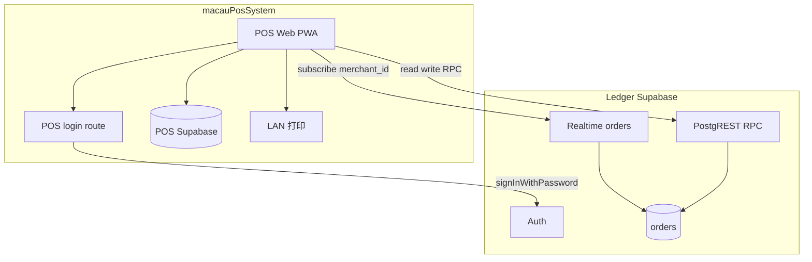
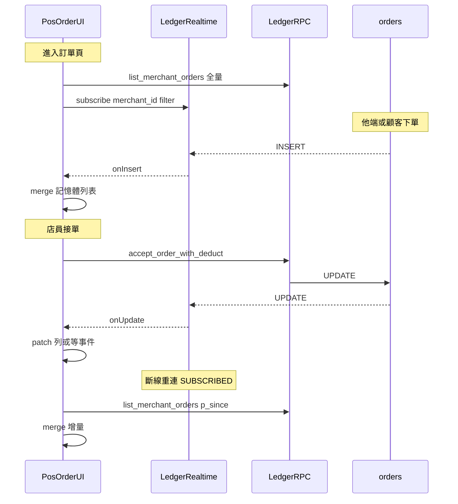

# 第三方 POS ↔ Ledger 整合（Client 直連 Supabase）

> **狀態**：Phase 1 契約 **v2**（2026-08-11）  
> **權威路徑**：[`pos-ledger-client-api.md`](pos-ledger-client-api.md)（舊 `pos-readonly-client-api.md` 僅留 stub 導向）  
> **夥伴 repo**：[homeu98-glitch/macauPosSystem](https://github.com/homeu98-glitch/macauPosSystem)（**獨立 Supabase**；店內 POS／打印／帳務由夥伴自理）  
> **決策依據**：[ADR-022](../adr/ADR-022-order-system.md)（訂單狀態機）、[ADR-024](../adr/ADR-024-macau-ledger-merchant-android.md)（client 直連 Supabase）、[ADR-025](../adr/ADR-025-cost-and-serverless-optimization.md)（禁高頻 polling、零 Ledger Vercel 增量）  
> **See also**：[生態系模組總覽](ecosystem-modules.md)

## 給夥伴的一頁摘要

| 問題 | 答案 |
|------|------|
| **訂單在哪？** | 會員通**線上**單以 Ledger `orders` 為**唯一權威**；POS 自有 DB 只存店內堂食／設備，**不得**再以 `online_orders` polling 鏡像會員通單。 |
| **能做什麼？** | **寫**：接單／改狀態／標記到店付款（白名單 RPC，與 Android 相同）。**讀**：報表、菜單、列表、詳情。 |
| **怎麼更新？** | 訂單頁 **訂閱 Supabase Realtime**（`merchant_id` filter）；重連後 `list_merchant_orders` 增量補洞。**禁止** 6s `setInterval` polling。 |
| **不能做什麼？** | SiteB 派送、訂單聊天、**Ledger Web 登出／HTTP**、Webhook Phase 1、Ledger MQTT 憑證。 |
| **需私下取得** | `NEXT_PUBLIC_SUPABASE_URL`、`NEXT_PUBLIC_SUPABASE_ANON_KEY`、`AUTH_PIN_PEPPER`。**勿**索取 `SUPABASE_SERVICE_ROLE_KEY`、MQTT 帳密。 |

---

## 1. 背景與範圍

澳門會員通（Ledger）與夥伴 POS 採**分帳架構**：

| 系統 | 職責 |
|------|------|
| **Ledger Supabase** | 會員通**線上**點餐、餘額記帳、商戶報表、**線上訂單狀態**權威 |
| **POS 自有 Supabase** | 店內堂食／快餐、設備設定、LAN 打印、離線隊列 |

本契約定義：已登入的 POS 前端如何**讀寫**同店 Ledger **線上訂單**，並**唯讀**取得報表／菜單對照。

### 1.1 本契約包含

- 商戶以 Ledger **8 位電話 + 4 位 PIN** 登入，取得 Supabase session（任一 `merchant_staff`，與 Web／Android 相同）
- Client **直連 Ledger Supabase**（PostgREST RPC + Realtime），**不經** Ledger Vercel Route Handler
- **訂單同步**：Supabase Realtime `public.orders`（`merchant_id=eq.<uuid>`）+ 重連／回前景增量 RPC
- **讀 RPC**：`list_merchant_orders`、`get_merchant_report_summary`、`list_merchant_order_menu`；明細可選 `get_order_detail`
- **寫 RPC**（§5.5）：`accept_order_with_deduct`、`accept_order_in_store`、`update_order_status`、`set_order_paid_in_store`

### 1.2 本契約不包含（非目標）

| 項目 | 說明 |
|------|------|
| **SiteB 派送** | `merchantRequestDeliveryDispatch`、外派 Tab、車手 callback — **僅 Ledger Web** |
| **訂單聊天** | `list/post_order_chat_message` |
| **顧客改單審核** | `merchant_*_order_change` |
| **下單** | `create_order`（顧客端） |
| **Webhook 推送** | Phase 1 **不做**；見 §8 |
| **Ledger Vercel HTTP** | 不得呼叫 `macau-ledger.vercel.app` 上任何 API／Server Action（**含登出**） |
| **Ledger MQTT** | 不向 POS 發 credentials；接單打印走 **POS LAN** |
| **POS 堂食單寫回 Ledger** | 店內 POS 營收留在 POS DB；Ledger 報表僅含**會員通線上**訂單與記帳 |
| **定時 polling** | 禁 `setInterval` 拉 `list_merchant_orders`／`merchant_pending_order_count`（Phase 1 以 Realtime 為主；未來 ≥5min count-only 備援非本契約） |

### 1.3 產品定位（不可偏離）

- 平台**不經手金流**；POS 顯示之線上訂單金額為 Ledger 記錄，非支付託管。
- 客戶個資（電話／地址）自 Ledger 讀出後**僅供當次畫面**；不得持久化至 POS Supabase 或 `localStorage`（見 §7）。

---

## 2. 架構概覽



**與 v1 唯讀版差異**

- RPC 節點為 **read + write**（非 readonly）
- Phase 1 **必須**訂閱 **Realtime**（僅訂單頁生命週期內）
- 圖中**不含** Ledger Vercel、HiveMQ、SiteB（明確在範圍外）

**網路路徑（鐵則）**

1. 登入、RPC、Realtime：**HTTPS / WSS → Ledger Supabase**（Auth / PostgREST / Realtime）。
2. **禁止**請求 `https://macau-ledger.vercel.app/*`（含 `/api/*`、RSC、Server Action）。
3. PIN 派生所需 `AUTH_PIN_PEPPER` **不得**打包進瀏覽器 bundle；應由 POS **自有後端**（夥伴 Vercel Route）持有並代為 `signInWithPassword`（與 Ledger Web 相同演算法，invocation 計入**夥伴** Vercel，不計入 Ledger）。

---

## 3. 環境變數（夥伴 POS 端）

| 變數 | 存放 | 說明 |
|------|------|------|
| `NEXT_PUBLIC_SUPABASE_URL` | POS 前端 | **Ledger** Supabase 專案 URL（與 Macau-Ledger 相同） |
| `NEXT_PUBLIC_SUPABASE_ANON_KEY` | POS 前端 | Ledger anon key；安全邊界靠 RLS + 商戶 session |
| `AUTH_PIN_PEPPER` | **POS 伺服器 only** | 與 Ledger 部署相同的 pepper；用於 PIN→Auth 密碼派生。**勿** commit 至公開 repo |

Ledger **無需**為 POS 新增 env 或 Route Handler。

---

## 4. 登入

### 4.1 演算法（與 Ledger Web／Android 一致）

程式權威：[`src/lib/pin.ts`](../../src/lib/pin.ts)、[`src/lib/phone.ts`](../../src/lib/phone.ts)

```text
email    = normalizePhone(phone) + "@phone.macau-ledger.app"
         // normalizePhone：去除非數字；澳門 8 位

password = HMAC-SHA256(
             key   = AUTH_PIN_PEPPER,
             message = normalizePhone(phone) + ":" + pin
           ).digest("hex")   // 64 字元小寫 hex
```

- PIN 格式：`/^\d{4}$/`
- 電話格式：`/^\d{8}$/`（normalize 後）

### 4.2 建議實作

| 步驟 | 作法 |
|------|------|
| 1 | 商戶在 POS 輸入電話 + PIN |
| 2 | POS **自有** `POST /api/ledger/login`（範例路徑）以 server env 計算 `password` |
| 3 | Server 呼叫 Supabase `auth.signInWithPassword({ email, password })` |
| 4 | 將 session（access／refresh token）回傳 POS 前端；前端以 `@supabase/supabase-js` 持有 session |
| 5 | 驗證 `merchant_staff` 存在且 `merchants.status` 為 `active` 或 `pending`；`suspended` 不得顯示資料（與 Ledger Web 報表閘門一致；RLS 允許店員讀自己店的 `status`） |

**禁止**：將 PIN 明文或 `AUTH_PIN_PEPPER` 寫入 POS 前端 JS、POS 自有 Supabase、analytics。

### 4.3 取得 `merchant_id` 與店員欄位

登入後 client 直查（RLS 允許本人列）。**欄位名為 `staff_role`（`owner`／`staff`），不存在 `role` 欄**——PostgREST 查錯欄位會 400（`42703 column does not exist`），Auth 已成功仍無法進 POS。

```sql
select merchant_id, staff_role
from merchant_staff
where user_id = auth.uid()
limit 1;
```

| 欄位 | 說明 |
|------|------|
| `merchant_id` | 後續 RPC／Realtime filter 用 |
| `staff_role` | `owner` 或 `staff`；映射 POS 本地權限用，**勿** invent `admin`／`role` 欄 |

若使用者非店員 → 不得呼叫下文 RPC；應**登出 Ledger session**（§4.4）並提示「非本店 Ledger 帳號」。

### 4.4 Session 與登出（僅 POS 端）

Ledger **不提供**夥伴可用的 Web 登出 API；**禁止**請求 `macau-ledger.vercel.app` 的 Server Action／RSC 登出。Session 生命週期**完全由 POS 自理**。

| 項目 | 要求 |
|------|------|
| **登入後持有** | POS 前端或 POS login route 回傳之 Ledger `access_token`／`refresh_token`（或 `@supabase/supabase-js` session） |
| **RPC／Realtime** | 同一 Ledger Supabase client 實例（或等效 `setSession`／`setAuth`） |
| **登出（必做）** | ① 離開訂單頁時 **unsubscribe** Realtime channel；② **`supabase.auth.signOut()`**（Ledger 專案 client）；③ 清除 POS **自有** session 快取（memory／`sessionStorage` 等，**勿**寫入 POS Supabase） |
| **禁止** | 導向 Ledger Web「登出」、呼叫 Ledger Server Action、只清 POS 本地 UI 而不 `signOut` Ledger Auth |
| **PWA** | 登入失敗／非店員／空狀態畫面**仍須**提供「登出」與「重新整理」；不可假設使用者能開瀏覽器網址列自救 |

**建議流程（概念）**

```typescript
async function logoutLedgerSession(supabase: SupabaseClient) {
  await supabase.removeAllChannels(); // 或逐 channel unsubscribe
  await supabase.auth.signOut(); // scope 預設 local；多 tab 共用 Ledger session 時可評估 global
  clearPosLedgerSessionStore(); // 夥伴自有：token、merchantId 等
}
```

登出後導回 POS 登入頁；**不得**留在僅顯示錯誤、無法切換帳號的死角畫面（獨立安裝 PWA 常見）。

---

## 5. RPC 契約

所有 RPC 須在 **authenticated** session 下呼叫。權限由 RPC 內 `is_merchant_staff(p_merchant_id)` 或 `auth.uid()` 保證。

### 5.1 `list_merchant_orders`（讀）

**用途**：同店 Ledger **線上**訂單列表；全量載入與 Realtime 重連增量。

**簽章**（migration `20260729172000`）：

```sql
list_merchant_orders(
  p_merchant_id uuid,
  p_status      public.order_status default null,
  p_limit         int default 50,
  p_since         timestamptz default null,
  p_since_id      uuid default null
) → jsonb   -- 陣列；空則 []
```

**參數**

| 參數 | 說明 |
|------|------|
| `p_merchant_id` | §4.3 取得之店 id |
| `p_status` | 可選篩選；`null` = 全部狀態 |
| `p_limit` | 1–100，預設 50 |
| `p_since` / `p_since_id` | 增量游標；見 §6 |

**回傳列欄位（每筆 object）**

| 欄位 | 型別 | 說明 |
|------|------|------|
| `id` | uuid | 訂單 id |
| `status` | text | `pending`／`accepted`／… |
| `total_avos` | int | 總額（分） |
| `pickup_code` | text | 取餐碼 |
| `customer_phone` | text | 客戶電話 |
| `customer_display_name` | text \| null | 顯示名 |
| `note` | text | 整單備註 |
| `payment_mode` | text | `balance`／`in_store` 等 |
| `payment_status` | text | |
| `paid_at` | timestamptz \| null | |
| `fulfillment_type` | text | `dine_in`／`takeaway`／`merchant_delivery` |
| `scheduled_pickup_at` | timestamptz \| null | 預約取餐 |
| `delivery_address_text` | text \| null | 外送地址 |
| `created_at` / `updated_at` | timestamptz | 排序／增量游標 |
| `item_count` | int | 品項數 |
| `first_item_name` | text | 列表摘要 |

> 上表為主要欄位；另有 `paid_by`、`takeaway_box_fee_avos`、`delivery_label`、`delivery_latitude`／`delivery_longitude`、`modify_count`、`change_request_*` 等，完整以 migration `20260729172000_list_merchant_orders_incremental_cursor.sql` 為準。

### 5.2 `get_merchant_report_summary`（讀）

**用途**：區間營業額／記帳摘要（含**線上訂單** `order_*` 欄位）。**Phase 1 唯讀**，POS 不得經此 RPC 改帳。

**簽章**：

```sql
get_merchant_report_summary(
  p_start       timestamptz,
  p_end         timestamptz default null,
  p_merchant_id uuid default null   -- 僅 admin；店員須省略，由 auth.uid() 推店
) → jsonb
```

**店員呼叫範例（本日，澳門時區）**

```text
p_start = "YYYY-MM-DDT00:00:00+08:00"   // 澳門當日 00:00
p_end   = "YYYY-MM-DDT23:59:59.999+08:00"
// p_merchant_id 省略
```

日期邊界算法見 [`src/lib/merchant-report-period.ts`](../../src/lib/merchant-report-period.ts)（`macauDateToStartISO`／`macauDateToEndISO`）。

**與 POS 相關的回傳欄位**

| 欄位 | 說明 |
|------|------|
| `order_count` | 區間內非取消訂單數 |
| `order_paid_avos` | 已完成且 `payment_status=paid` 之 `total_avos` 合計 |
| `order_balance_paid_avos` | 餘額扣點完成單 |
| `order_in_store_paid_avos` | 到店／貨到付款完成單 |
| `topup_avos` / `deduct_avos` 等 | 記帳交易（非 POS 堂食） |

**不含** POS 自有 Supabase 之店內現金單。

### 5.3 `list_merchant_order_menu`（讀）

**用途**：菜單／分類／售罄對照（唯讀；POS 本地菜單仍以 POS DB 為準，此 RPC 僅供**對照 Ledger 線上菜單**）。

**簽章**：

```sql
list_merchant_order_menu(p_merchant_id uuid) → jsonb
```

**頂層欄位**：`enabled`、`open_now`、`allow_balance_deduct`、`allow_pay_in_store`、`business_hours`、`fulfillment_discounts`、`categories[]`、`products[]`（含 `is_sold_out`、`promo_rate_permille` 等）。

店舖未啟用點餐時回傳 `enabled: false` 與空陣列。

### 5.4 `get_order_detail`（讀，可選）

**用途**：使用者**點開單筆**時才呼叫；禁止列表迴圈逐筆拉取。

```sql
get_order_detail(p_order_id uuid) → jsonb
```

含 `items[]` 明細。單次使用者操作 ≤ 1 次 RPC。

### 5.5 訂單寫入 RPC（白名單）

與 [macau-ledger-merchant](https://github.com/EricChang1015/macau-ledger-merchant) 共用同一組 RPC；**勿**自創狀態名（如 `ready_pickup`），須使用 Ledger `order_status` enum。

#### 5.5.1 狀態機

決策與守衛見 [ADR-022 §7](../adr/ADR-022-order-system.md)、migration [`20260707171000_order_status_delivering_flow.sql`](../../supabase/migrations/20260707171000_order_status_delivering_flow.sql)。

**通用（`dine_in`／`takeaway`）— 經 `update_order_status`**

| 現狀 `status` | 允許 `p_new_status` |
|---------------|---------------------|
| `pending` | `accepted`, `cancelled` |
| `accepted` | `preparing`, `cancelled` |
| `preparing` | `ready`, `cancelled` |
| `ready` | `completed` |
| `completed` / `cancelled` | 不可再改 |

**`merchant_delivery` 額外**

| 現狀 | 允許 `p_new_status` |
|------|---------------------|
| `ready` | `delivering`, `completed` |
| `delivering` | `completed` |

**守衛（POS 須解析 RPC 錯誤並顯示友善文案）**

| 條件 | 錯誤／行為 |
|------|------------|
| `payment_mode=balance` 且 `payment_status=unpaid` 的 `pending` | 不可 `update_order_status(..., 'accepted')` → `balance order requires deduct on accept` |
| 有進行中 SiteB 車手派送 | 手動 `completed` → `delivery dispatch active`（POS 無派送 UI，但 Ledger Web 可能已呼叫車手） |
| 非法 transition | `invalid transition` 或 `order already closed` |

#### 5.5.2 接單 RPC 選擇

| 情境 | RPC | 簽章 |
|------|-----|------|
| 餘額扣點單接單 | `accept_order_with_deduct` | `(p_order_id uuid, p_idempotency_key text)` → jsonb |
| 改到店付款接單（餘額不足等退路） | `accept_order_in_store` | `(p_order_id uuid)` → jsonb |
| `payment_mode=in_store` 的 pending 接單 | `update_order_status` | `(..., 'accepted')` |
| `payment_mode=balance` 的 pending | **不可**直接 `update_order_status(..., 'accepted')` | 須 `accept_order_with_deduct` 或 `accept_order_in_store` |
| 標記到店／貨到付款已收現 | `set_order_paid_in_store` | `(p_order_id uuid)` → jsonb；須 `payment_mode=in_store` |

**`accept_order_with_deduct` 與冪等（`p_idempotency_key`）**

RPC 內扣點經 `apply_transaction`，idempotency key 為 `'order-deduct:' || p_idempotency_key`（見 migration `20260617250000`）。**同一接單操作**（含網路逾時重試）**須重用同一 key**；`apply_transaction` 遇相同 key 會回傳既有交易、不重複扣點。若訂單已 `accepted` 且 `payment_status=paid`，RPC 亦會直接回傳現況（訂單層冪等）。

| 情境 | key 作法 |
|------|----------|
| 店員按一次「接單並扣點」 | 該次操作產生 **一個** UUID，存於記憶體至 RPC 成功或確定失敗 |
| 同一按鈕的網路重試 | **重用**上述 UUID |
| 店員再次點按（新操作） | 產生**新** UUID |
| 防雙擊 | UI 在 in-flight 期間 disable 按鈕；勿並行送兩個不同 key |

餘額不足 → `insufficient balance`；訂單留 `pending`，可改 `accept_order_in_store` 或取消。

**`update_order_status` 簽章**

```sql
update_order_status(p_order_id uuid, p_new_status public.order_status) → jsonb
```

取消已接單時 RPC 可能回傳 `print_kind: "cancel"`（供 Ledger Web MQTT 出取消單；POS 直連 RPC **不**觸發 MQTT，見 §7.5）。

#### 5.5.3 禁止呼叫的 RPC（非白名單）

`create_order`、`merchant_apply_pos_txn`（記帳另議）、派送相關 Server Action 等一切 **Ledger Vercel** 路徑；以及 `merchant_*_order_change`、訂單聊天 RPC。

> **技術說明**：PostgREST 對 `authenticated` 的 `GRANT EXECUTE` 範圍**大於**上表白名單（例如 `merchant_apply_pos_txn` 技術上可呼叫）。白名單是**整合契約義務**，Ledger 以合約／稽核約束，**並非** API gateway 強制封鎖。夥伴不得因「能呼叫」而擴張 scope。

---

## 6. 訂單同步與更新機制（Realtime 為主）

目標：**不增加 Ledger Vercel invocation**；訂單列表以 **Realtime 推送**為主，RPC 僅用於初始載入、重連補洞與使用者手動刷新。

### 6.1 三層更新模型



| 層級 | 機制 | 用途 |
|------|------|------|
| **推送** | Realtime `INSERT`／`UPDATE` | 新單、他端改狀態、本端 RPC 後 DB 變更 |
| **補洞** | 重連／回前景 → 增量 RPC | WebSocket 漏事件、背景 tab |
| **按需** | 手動刷新、點詳情 `get_order_detail` | 使用者明確操作 |

### 6.2 Realtime 實作契約

參考 Ledger Web：[`src/lib/use-orders-realtime.ts`](../../src/lib/use-orders-realtime.ts)

| 項目 | 要求 |
|------|------|
| 表 | `public.orders`（已在 `supabase_realtime` publication） |
| 事件 | `INSERT`, `UPDATE` |
| Filter | `merchant_id=eq.<merchant_id>`（**僅減少推送量**；授權邊界靠 RLS `orders_select_staff`，見 migration `20260617100000`） |
| 生命週期 | **僅「Ledger 線上訂單」頁** subscribe；**離開必須** `removeChannel` / unsubscribe |
| 重連 | `CHANNEL_ERROR`／`TIMED_OUT`／回前景 → 延遲重連（Ledger 用 3s）；`SUBSCRIBED` 時觸發增量 `list_merchant_orders` |
| 重連節流 | `onResubscribed` 增量 RPC 建議 **debounce ≥3s** 或合併短時間內多次 `SUBSCRIBED`，避免不穩網路放大 egress |
| Auth | 訂閱前須 `realtime.setAuth(access_token)`（等同 Web `ensureRealtimeAuth`）；**未帶 JWT 訂閱**會導致 filter 失敗（anon 無法用 `merchant_id`） |
| Payload 形狀 | Realtime 推送為 **`orders` 表列**（含 `customer_phone`、`delivery_address_text` 等），**不含** `list_merchant_orders` 的派生欄（如 `item_count`、`first_item_name`、`customer_display_name`）。列表摘要欄位不足時：樂觀顯示列 → 點開才 `get_order_detail`，或於重連增量 RPC merge |

**client 範例（概念）**

```typescript
const filter = `merchant_id=eq.${merchantId}`;
supabase
  .channel(`pos-orders:${merchantId}`)
  .on("postgres_changes", { event: "INSERT", schema: "public", table: "orders", filter }, onInsert)
  .on("postgres_changes", { event: "UPDATE", schema: "public", table: "orders", filter }, onUpdate)
  .subscribe((status) => {
    if (status === "SUBSCRIBED") onResubscribed(); // → 跑 p_since 增量
  });
```

### 6.3 寫入後 UI 策略

- **推薦**：RPC 成功 → 可樂觀更新 UI；以 Realtime `UPDATE` 為準修正不一致。
- **禁止**：寫入後 `setInterval` 輪詢列表確認。
- **冪等**：`accept_order_with_deduct` 同一按鈕 in-flight **重用** `p_idempotency_key`（見 §5.5.2）。
- **打印**：接單成功後由 POS **LAN 打印**（若需要）；不依賴 Ledger MQTT。

### 6.4 仍允許的非 Realtime 觸發

| 觸發 | 行為 |
|------|------|
| 進入訂單頁 | 1 次全量 `list_merchant_orders` + 建立 Realtime |
| 手動刷新 | 1 次增量或全量 |
| Tab 回前景 | Realtime 重連（`SUBSCRIBED` → 增量，見 §6.2）。**若該次重連已跑增量，勿再額外打一次** §6.4 的 ≥5min 同步。僅在「未觸發重連卻距上次成功同步 ≥5 分鐘」時可補 1 次增量 |
| 點開單筆詳情 | 可選 1 次 `get_order_detail` |
| 報表／菜單 Tab | 進頁 1 次 RPC；**不**訂閱 Realtime |

### 6.5 禁止行為

| 禁止 | 原因 |
|------|------|
| `setInterval`／週期拉 `list_merchant_orders` | 24h 背景 egress；macauPosSystem 舊 6s polling 須移除 |
| 週期拉 `merchant_pending_order_count` | Phase 1 以 Realtime 待接單 INSERT 為主 |
| 背景 tab 仍輪詢 RPC | 同上 |
| 訂單頁外常駐 Realtime channel | Free plan ~200 connections；一 tab 一 channel |
| 每次刷新打多輪 RPC（orders + menu + report 各 N 次） | 每輪每類 **最多 1 次** |
| 列表對每筆訂單呼叫 `get_order_detail` | N+1 egress |
| 任何對 Ledger Vercel 的 HTTP | 增加 invocation |

### 6.6 全量 vs 增量（`list_merchant_orders`）

| 情境 | 參數 |
|------|------|
| 首次進頁／session 內無游標 | `p_since = null` → 全量（`created_at` 新→舊，最多 `p_limit` 筆） |
| Realtime `SUBSCRIBED`／手動刷新且已有游標 | `p_since` = 上次成功同步之最大 `updated_at`；`p_since_id` = 同 timestamp 下已處理的最大 `id` |
| 增量回傳 | 合併至 POS **記憶體**狀態；**勿**因增量而額外定時再拉 |

增量語意見 migration `20260729172000` 註解；client 按 `id` merge 即可。

### 6.7 Realtime 連線配額

- Ledger Supabase Free tier 約 **200** concurrent Realtime connections。
- **Ledger 營運方監控**；夥伴須遵守：
  - 訂單頁才 subscribe、離頁 unsubscribe；
  - **避免**同一店多 tab／多裝置重複訂閱（與 Ledger Web、Android 疊加計入配額）；
  - **禁止**在 app layout 常駐訂單 Realtime channel。
- 同一店同時開啟「Ledger 線上訂單」頁的裝置數，建議 **≤2–3**（營運可另約）。
- 若監測到定時 polling、connection 濫用或異常 egress，Ledger 保留：要求修正 client、停用 Auth session、終止整合授權。

---

## 7. 信任邊界

### 7.1 憑證

| 項目 | 規則 |
|------|------|
| `AUTH_PIN_PEPPER` | **Tier-0 機密**；僅 POS **伺服器** env；與 Ledger 營運方私下交換；不得進 git／前端／log／support 截圖。外洩等同可對**任意** 8 位電話試 PIN 派生 Auth 密碼 |
| PIN 明文 | 僅用於登入請求當下；**不得** log、持久化、送 analytics |
| `service_role` | POS **不得**索取或使用 Ledger service_role |
| Session token | 存於商戶裝置；POS 自有後端若代理登入，不得將 token 寫入可公開查詢的 POS DB；**登出僅 POS 端** `auth.signOut`（§4.4），**不可**用 Ledger Web 登出 |
| 夥伴 login route | **HTTPS only**；須自建 **rate limit**（Ledger `auth_throttle`／`checkPhone` **不**套用於夥伴 Vercel login） |

### 7.2 個資（對齊條款 §6）

自 Ledger 取得之 `customer_phone`、`customer_display_name`、`delivery_address_text` 等（含 **RPC 回傳**與 **Realtime `payload.new` 整列**）：

- **允許**：當次 UI 渲染
- **禁止**：寫入 POS Supabase、`localStorage`／`IndexedDB` 長期快取、夥伴 analytics、**console.log／error reporting 上報完整 payload**
- **若未來需落地**：須先與 Ledger 協商，並更新 `src/lib/terms-content.ts` 商家版 §6／§11

### 7.3 寫入權限與 session 風險

v2 白名單 RPC 可對該店 pending 餘額單**扣點**、改狀態、取消（沖正）。**失竊或共用 staff session** 之 blast radius 與 Ledger Web／Android 相同。夥伴須：共用裝置登出、勿把 refresh token 寫入 POS DB、接單按鈕 in-flight 鎖定防雙擊。

### 7.4 資料權威

| 資料 | 權威 |
|------|------|
| 線上訂單狀態／金額 | Ledger `orders` |
| 店內 POS 單 | POS 自有 Supabase |
| 接單／改狀態 | Ledger Web、macau-ledger-merchant、**本 POS**（同一組 RPC） |

### 7.5 直連 RPC 與 Ledger Web 副作用差異

夥伴 client **直連 RPC** 時，下列僅在 Ledger **Server Action** 觸發（[`order-status-actions.ts`](../../src/app/merchant/order-status-actions.ts)），**不**保證發生：

| 副作用 | Ledger Web Server Action | POS 直連 RPC |
|--------|--------------------------|--------------|
| HiveMQ `jobs` 打印 | 接單 `accepted`、取消 `print_kind=cancel` | **通常不觸發** |
| 顧客 Web Push | `notifyOrderStatusPush` | **不觸發** |

**POS 須自行**：接單／取消後 **LAN 出單**（若需要）；顧客推播由 Ledger Web／callback 路徑負責。Android 對照：[ADR-024](../adr/ADR-024-macau-ledger-merchant-android.md) — Realtime + 本地打印。

---

## 8. Phase 2 展望：Webhook（目前不做）

若日後 POS **必須**在無人開訂單頁時仍收到新單通知，可評估 Ledger → POS 後端 webhook；**Phase 1 明確不做**。

啟用前置條件（全部滿足才開案）：

- Per-merchant `webhook_secret`（非全平台共用）
- HMAC 簽名 + `event_id` 冪等
- 重試與 batch 對帳 endpoint
- Payload 個資最小化
- 條款 §6 更新

在此之前，**Realtime + 手動刷新**即為正式同步方式。

---

## 9. 上線前驗收清單（雙方）

| # | 項目 | 通過標準 |
|---|------|----------|
| 1 | 無 Ledger Vercel | Network 面板無 `macau-ledger.vercel.app` 請求 |
| 2 | 無 polling | 源碼／Runtime 無 `setInterval` 拉 Ledger 訂單 RPC |
| 3 | Realtime 生命週期 | 訂單頁有 subscribe；離頁 unsubscribe |
| 4 | 重連 | 模擬斷網恢復後列表與 DB 一致 |
| 5 | 寫入 | 接單／改狀態／到店付款走 §5.5 白名單 RPC |
| 6 | 狀態機 | 非法 transition 顯示友善錯誤（含餘額扣點、派送進行中） |
| 7 | 個資 | 客戶電話／地址不進 `localStorage`／POS DB／analytics；Realtime payload 不 log |
| 8 | PIN／pepper | pepper 不進前端 bundle、不進 POS DB；login route 有 rate limit |
| 9 | 冪等 | 接單重試**重用**同一 `p_idempotency_key`；in-flight disable 雙擊 |
| 10 | 派送 | POS 無 SiteB 派送按鈕／API |
| 11 | 打印 | 接單後 POS 自行 LAN 出單（若需要） |
| 12 | 報表理解 | POS UI 標示「線上訂單／會員通」；不含店內 POS 現金單 |
| 13 | 登入 | 非店員帳號無法讀取他店資料；`merchant_staff` 查 **`staff_role`** 非 `role` |
| 14 | Realtime 節流 | `SUBSCRIBED` 增量 RPC 有 debounce；DevTools 可見離頁 channel 關閉 |
| 15 | 登出 | 僅 POS 端 Realtime unsubscribe + `auth.signOut` + 清自有 session；**無** Ledger HTTP |
| 16 | PWA 死角 | 錯誤／未綁定店員畫面仍有登出／重新整理 |

---

## 10. 夥伴遷移指引（macauPosSystem）

針對現有 [macauPosSystem](https://github.com/homeu98-glitch/macauPosSystem) 整合：

1. **停止**對會員通單的 `online_orders` **6s polling** 及寫入 POS DB 鏡像。
2. 列表資料源改 **Ledger `list_merchant_orders` + Realtime**。
3. 操作按鈕改呼叫 **§5.5 白名單 RPC**（狀態值對齊 ADR-022，勿自創 enum）。
4. 保留 POS DB 給店內堂食、設備、**LAN 打印**。
5. PWA 常開 tab 適合 Realtime；**不需**商戶 FCM（Web Push 為顧客端，見 ADR-027）。
6. 登入查 `merchant_staff.staff_role`（**非** `role`）；登出僅 POS 端 session（§4.4），勿用 Ledger Web。

---

## 11. 參考

| 文件 | 說明 |
|------|------|
| [ADR-022](../adr/ADR-022-order-system.md) | 訂單狀態機、付款模式 |
| [ADR-024](../adr/ADR-024-macau-ledger-merchant-android.md) | Android 直連 Supabase、RPC 對照 |
| [ADR-025 §K](../adr/ADR-025-cost-and-serverless-optimization.md) | egress／polling 成本 |
| [architecture.md §4](../architecture.md) | RPC 索引 |
| 夥伴 [integration-guide.md](https://github.com/homeu98-glitch/macauPosSystem/blob/main/docs/integration-guide.md) | POS 端 mock API（**僅供 POS 內部**；對 Ledger 以**本文件**為準） |

---

## 附：給夥伴的對外訊息草稿

> 整合契約 **v2（訂單可寫 + Realtime）** 權威文件：[`docs/integration/pos-ledger-client-api.md`](pos-ledger-client-api.md)（舊路徑 `pos-readonly-client-api.md` 為 stub）。
>
> **重點**：會員通線上單以 Ledger `orders` 為權威；請停止 `online_orders` polling。訂單頁訂閱 Supabase Realtime（`merchant_id` filter + `realtime.setAuth`），接單／改狀態用白名單 RPC；`accept_order_with_deduct` 同一操作重試須**重用** `p_idempotency_key`。登入後查 `merchant_staff.staff_role`（**勿**用不存在的 `role` 欄）。**登出僅 POS 端**（unsubscribe + `auth.signOut` + 清自有 session），**不可**呼叫 Ledger Web。報表與菜單仍唯讀。
>
> 請依文檔 §5 狀態機與 §6 同步流程實作，並用 §9 驗收清單自測。
