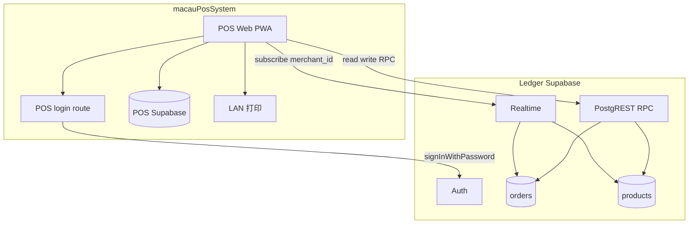
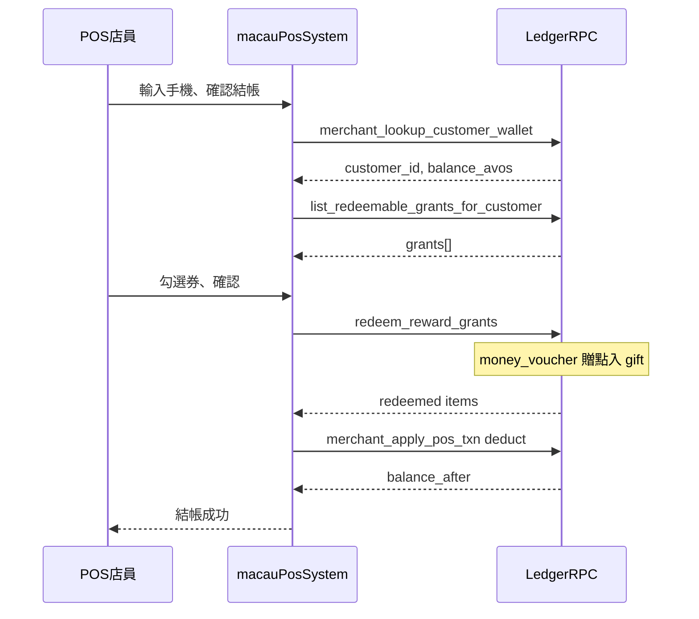
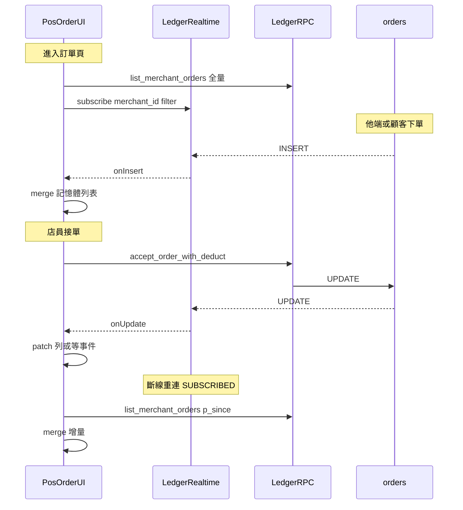
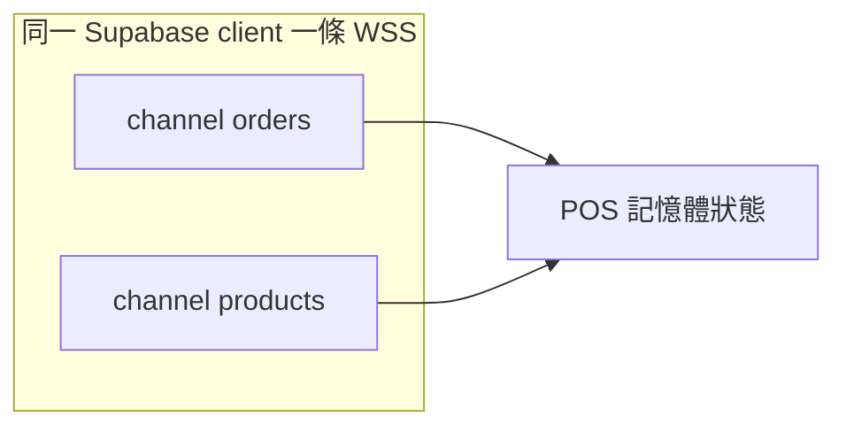

# 第三方 POS ↔ Ledger 整合（Client 直連 Supabase）

> **狀態**：Phase 1 契約 **v3.4**（2026-09-11；**v3.4 顧客掃碼登入 + 自讀本店餘額／積分／卡包**；v3.3 會員積分查詢／賺分 additive；v3.2 會員列表 + topup + 代建 HTTP；v3.1 菜單 Realtime）  
> **權威路徑**：[`pos-ledger-client-api.md`](pos-ledger-client-api.md)（舊 `pos-readonly-client-api.md` 僅留 stub 導向）  
> **夥伴 repo**：[homeu98-glitch/macauPosSystem](https://github.com/homeu98-glitch/macauPosSystem)（**獨立 Supabase**；店內 POS／打印／帳務由夥伴自理）  
> **決策依據**：[ADR-009](../adr/ADR-009-reward-coupons-phase1.md)（券）、[ADR-022](../adr/ADR-022-order-system.md)（訂單狀態機）、[ADR-024](../adr/ADR-024-macau-ledger-merchant-android.md)（client 直連 Supabase）、[ADR-025](../adr/ADR-025-cost-and-serverless-optimization.md)（禁高頻 polling；代建為窄幅 HTTP）  
> **See also**：[生態系模組總覽](ecosystem-modules.md)；店內單由商戶 App 代打見 [ADR-024 §4c](../adr/ADR-024-macau-ledger-merchant-android.md)（**非本契約 REST**）  
> **Android**：不需同步 APK。`list_merchant_customers` App 未使用（JSON 加欄向後相容）；`merchant_apply_pos_txn(topup)` App 已支援已註冊充值；未註冊代建仍僅 Web／本契約 HTTP。

## 給夥伴的一頁摘要

| 問題 | 答案 |
|------|------|
| **訂單在哪？** | 會員通**線上**單以 Ledger `orders` 為**唯一權威**；POS 自有 DB 只存店內堂食／設備，**不得**再以 `online_orders` polling 鏡像會員通單。 |
| **能做什麼？** | **寫（店員）**：接單／改狀態／標記到店付款；**店內扣點**、**已註冊充值**、**核銷券**。**讀（店員）**：報表、菜單、訂單；**查會員**、**本店會員列表**（§5.6.4）、**查可用券**、**查本店積分**（§5.6.5；或 lookup additive）。**讀（顧客 JWT）**：本店餘額／積分／卡包（§4.5、§5.11）。**代建未註冊**：僅 §5.7.7 窄幅 HTTP。**兌換積分**：P2 未開放（§5.10）。**顧客下單**：`create_order` 仍契約外。 |
| **怎麼更新？** | **訂單**：Realtime `orders` + 重連增量。**菜單／售罄**：Realtime `products` 局部 patch（§6.9）。**會員**：按需 RPC，**禁止** polling。 |
| **不能做什麼？** | SiteB 派送、訂單聊天、Ledger Web 登出／**除 §5.7.7 外的** HTTP、Webhook Phase 1、Ledger MQTT 憑證；`p_type=add` 假沖正、進頁 dump 全店會員進 localStorage。 |
| **需私下取得** | `NEXT_PUBLIC_SUPABASE_URL`、`NEXT_PUBLIC_SUPABASE_ANON_KEY`、`AUTH_PIN_PEPPER`。**勿**索取 `SUPABASE_SERVICE_ROLE_KEY`、MQTT 帳密。 |

---

## 1. 背景與範圍

澳門會員通（Ledger）與夥伴 POS 採**分帳架構**：

| 系統 | 職責 |
|------|------|
| **Ledger Supabase** | 會員通**線上**點餐、餘額記帳、商戶報表、**線上訂單狀態**權威 |
| **POS 自有 Supabase** | 店內堂食／快餐、設備設定、LAN 打印、離線隊列 |

本契約定義：已登入的 POS 前端如何**讀寫**同店 Ledger **線上訂單**、**查詢會員／券**、**店內扣點**，並**唯讀**取得報表／菜單對照。

### 1.1 本契約包含

- 商戶以 Ledger **8 位電話 + 4 位 PIN** 登入，取得 Supabase session（任一 `merchant_staff`，與 Web／Android 相同）
- **顧客**（v3.4）：同一套電話 + PIN → POS **自有後端** `signInWithPassword`（§4.5）；**不要**要求 `merchant_staff`。登入後可自讀本店餘額／積分／卡包（§5.11）。**掃碼（客人手機）無店員 session → 不可自助扣費／核銷**；Kiosk 平板若已持店員 session，扣費走既有 §5.7（顧客 JWT 另建 client）。**不含** `create_order`、不含顧客自助扣款 RPC
- Client **直連 Ledger Supabase**（PostgREST RPC + Realtime）。**唯一**允許的 Ledger Web HTTP 為 §5.7.7 `POST /api/integration/pos/ensure-customer`（未註冊代建／可附首充；POS **伺服器**代打，禁 polling）
- **訂單同步**：Supabase Realtime `public.orders`（`merchant_id=eq.<uuid>`）+ 重連／回前景增量 RPC
- **菜單／售罄同步**（v3.1）：Supabase Realtime `public.products`（同 filter）+ **`payload.new` 局部 patch**；全量 `list_merchant_order_menu` 僅 baseline／重連／手動刷新（§6.9）
- **讀 RPC（訂單／報表）**：`list_merchant_orders`、`get_merchant_report_summary`、`list_merchant_order_menu`；明細可選 `get_order_detail`
- **讀 RPC（會員／券／積分）**（§5.6）：`merchant_lookup_customer_wallet`（含 **additive** `points_balance`／`points_enabled`）、`merchant_get_customer_points`（§5.6.5）、`list_merchant_customers`（§5.6.4）、`list_redeemable_grants_for_customer`；會員頁可選 `list_customer_reward_grants`
- **寫 RPC（訂單）**（§5.5）：`accept_order_with_deduct`、`accept_order_in_store`、`update_order_status`、`set_order_paid_in_store`
- **寫 RPC（會員／券）**（§5.7）：`merchant_apply_pos_txn`（`deduct` 與 **已註冊 `topup`**）、`redeem_reward_grants`；可選 `redeem_reward`（掃券 QR）
- **寫 HTTP（代建）**（§5.7.7）：未註冊電話代建 Auth 帳號（`pin_set=false`）並可同時首充

### 1.2 本契約不包含（非目標）

| 項目 | 說明 |
|------|------|
| **SiteB 派送** | `merchantRequestDeliveryDispatch`、外派 Tab、車手 callback — **僅 Ledger Web** |
| **訂單聊天** | `list/post_order_chat_message` |
| **顧客改單審核** | `merchant_*_order_change` |
| **下單** | `create_order`（顧客端；v3.4 只開放登入與自讀，**仍不**含 POS 網域落單） |
| **Webhook 推送** | Phase 1 **不做**；見 §8 |
| **Ledger Vercel HTTP** | 除 §5.7.7 `POST /api/integration/pos/ensure-customer` 外，不得呼叫 Ledger 公開 Web 網域上任何 API／Server Action（**含登出**） |
| **Ledger MQTT** | 不向 POS 發 credentials；接單打印走 **POS LAN** |
| **POS 堂食單寫回 Ledger** | 店內 POS 現金／堂食單營收留在 POS DB；Ledger 報表僅含**會員通線上**訂單與**記帳流水**（`merchant_apply_pos_txn` 扣點會寫入 Ledger `transactions`，但**不**建立 `orders` 列） |
| **print-agent REST** | 商戶 App v1.1.8 可選當 POS 雲端 print relay（pair／claim／Realtime B）。API 在 **macauPosSystem Vercel**，不經 Ledger；見 [ADR-024 §4c](../adr/ADR-024-macau-ledger-merchant-android.md) |
| **未註冊代建帳號** | **v3.2 僅**經 §5.7.7 HTTP（與 Ledger Web POS 相同：`ensureUserByPhone`、`pin_set=false`）。**禁止** POS 索取 `service_role` 或自建 Auth 用戶 |
| **現場充值 topup** | **v3.2 開放**：已註冊走 `merchant_apply_pos_txn(topup)`；未註冊須先 §5.7.7 代建（可同請求附金額首充）。**禁止** `p_type=add`（不是沖正） |
| **合併原子結帳 RPC** | 扣點 + 核銷券為**兩步** RPC（§5.7.3）；Phase 1 不提供單一合併 RPC |
| **percent／疊加券模型** | Phase 1 僅 `money_voucher`／`text_gift`（[ADR-009](../adr/ADR-009-reward-coupons-phase1.md)）；無 `percent_off`、`stackable` |
| **定時 polling** | 禁 `setInterval` 拉訂單／會員／券／**菜單** RPC（訂單與菜單以 Realtime 為主；會員見 §6.8） |

### 1.3 產品定位（不可偏離）

- 平台**不經手金流**；POS 顯示之線上訂單金額為 Ledger 記錄，非支付託管。
- 客戶個資（電話／地址）自 Ledger 讀出後**僅供當次畫面**；不得持久化至 POS Supabase 或 `localStorage`（見 §7）。

---

## 2. 架構概覽



**與 v1 唯讀版差異**

- RPC 節點為 **read + write**（非 readonly）
- Phase 1 **必須**訂閱 **Realtime**：訂單頁 `orders`；菜單對照另訂 `products`（**同一 client**，§6.9）
- 圖中**不含** Ledger Vercel、HiveMQ、SiteB（明確在範圍外）

**網路路徑（鐵則）**

1. 登入、RPC、Realtime：**HTTPS / WSS → Ledger Supabase**（Auth / PostgREST / Realtime）。
2. **禁止**請求 Ledger 公開 Web 網域上**除** `POST /api/integration/pos/ensure-customer` **以外**的任何路徑（含 `/api/*`、RSC、Server Action、登出）。
3. PIN 派生所需 `AUTH_PIN_PEPPER` **不得**打包進瀏覽器 bundle；應由 POS **自有後端**（夥伴 Vercel Route）持有並代為 `signInWithPassword`（與 Ledger Web 相同演算法，invocation 計入**夥伴** Vercel，不計入 Ledger）。
4. **§5.7.7** 亦應由 POS **自有後端**以 staff `access_token` 代打 Ledger；**禁止**瀏覽器對 Ledger 域名開 CORS 常駐輪詢。

---

## 3. 環境變數（夥伴 POS 端）

| 變數 | 存放 | 說明 |
|------|------|------|
| `NEXT_PUBLIC_SUPABASE_URL` | POS 前端 | **Ledger** Supabase 專案 URL（與 Macau-Ledger 相同） |
| `NEXT_PUBLIC_SUPABASE_ANON_KEY` | POS 前端 | Ledger anon key；安全邊界靠 RLS + 商戶 session |
| `AUTH_PIN_PEPPER` | **POS 伺服器 only** | 與 Ledger 部署相同的 pepper；用於 PIN→Auth 密碼派生。**勿** commit 至公開 repo |

Ledger **無需**為 POS 新增 env 或 Route Handler。

---

## 4. 登入

### 4.1 演算法（與 Ledger Web／Android 一致）

程式權威：[`src/lib/pin.ts`](../../src/lib/pin.ts)、[`src/lib/phone.ts`](../../src/lib/phone.ts)

```text
email    = normalizePhone(phone) + "@phone.macau-ledger.app"
         // normalizePhone：去除非數字；澳門 8 位

password = HMAC-SHA256(
             key   = AUTH_PIN_PEPPER,
             message = normalizePhone(phone) + ":" + pin
           ).digest("hex")   // 64 字元小寫 hex
```

- PIN 格式：`/^\d{4}$/`
- 電話格式：`/^\d{8}$/`（normalize 後）

### 4.2 建議實作

| 步驟 | 作法 |
|------|------|
| 1 | 商戶在 POS 輸入電話 + PIN |
| 2 | POS **自有** `POST /api/ledger/login`（範例路徑）以 server env 計算 `password` |
| 3 | Server 呼叫 Supabase `auth.signInWithPassword({ email, password })` |
| 4 | 將 session（access／refresh token）回傳 POS 前端；前端以 `@supabase/supabase-js` 持有 session |
| 5 | 驗證 `merchant_staff` 存在且 `merchants.status` 為 `active` 或 `pending`；`suspended` 不得顯示資料（與 Ledger Web 報表閘門一致；RLS 允許店員讀自己店的 `status`） |

**禁止**：將 PIN 明文或 `AUTH_PIN_PEPPER` 寫入 POS 前端 JS、POS 自有 Supabase、analytics。

### 4.3 取得 `merchant_id` 與店員欄位

登入後 client 直查（RLS 允許本人列）。**欄位名為 `staff_role`（`owner`／`staff`），不存在 `role` 欄**——PostgREST 查錯欄位會 400（`42703 column does not exist`），Auth 已成功仍無法進 POS。

```sql
select merchant_id, staff_role
from merchant_staff
where user_id = auth.uid()
limit 1;
```

| 欄位 | 說明 |
|------|------|
| `merchant_id` | 後續 RPC／Realtime filter 用 |
| `staff_role` | `owner` 或 `staff`；映射 POS 本地權限用，**勿** invent `admin`／`role` 欄 |

若使用者非店員 → 不得呼叫下文 RPC；應**登出 Ledger session**（§4.4）並提示「非本店 Ledger 帳號」。

### 4.4 Session 與登出（僅 POS 端）

Ledger **不提供**夥伴可用的 Web 登出 API；**禁止**請求 Ledger 公開 Web 網域的 Server Action／RSC 登出。Session 生命週期**完全由 POS 自理**。

| 項目 | 要求 |
|------|------|
| **登入後持有** | POS 前端或 POS login route 回傳之 Ledger `access_token`／`refresh_token`（或 `@supabase/supabase-js` session） |
| **RPC／Realtime** | 同一 Ledger Supabase client 實例（或等效 `setSession`／`setAuth`） |
| **登出（必做）** | ① 離開訂單頁時 **unsubscribe** Realtime channel；② **`supabase.auth.signOut()`**（Ledger 專案 client）；③ 清除 POS **自有** session 快取（memory／`sessionStorage` 等，**勿**寫入 POS Supabase） |
| **禁止** | 導向 Ledger Web「登出」、呼叫 Ledger Server Action、只清 POS 本地 UI 而不 `signOut` Ledger Auth |
| **PWA** | 登入失敗／非店員／空狀態畫面**仍須**提供「登出」與「重新整理」；不可假設使用者能開瀏覽器網址列自救 |

**建議流程（概念）**

```typescript
async function logoutLedgerSession(supabase: SupabaseClient) {
  await supabase.removeAllChannels(); // 或逐 channel unsubscribe
  await supabase.auth.signOut(); // scope 預設 local；多 tab 共用 Ledger session 時可評估 global
  clearPosLedgerSessionStore(); // 夥伴自有：token、merchantId 等
}
```

登出後導回 POS 登入頁；**不得**留在僅顯示錯誤、無法切換帳號的死角畫面（獨立安裝 PWA 常見）。

### 4.5 顧客登入（v3.4；掃碼下單／顧客端）

**與 §4.1–§4.2 同一套 Auth**（同一顆 `AUTH_PIN_PEPPER`、同一 HMAC、同一 `signInWithPassword`）。一個電話 = 一個 Ledger Auth 帳號 = 一組 PIN。**沒有** `login`／`verify_pin`／`check_phone` Postgres RPC；**禁止**打 Ledger Web `/wallet/login` 或 Server Action。

**與店員登入的唯一行為差異**：成功後**不要**以「沒有 `merchant_staff`」為由登出。一般會員沒有 staff 列。店員用顧客掃碼頁登入是合法的（Auth 成功；POS **勿**把該 JWT 當成收銀台／Kiosk 店員 session）。

#### 4.5.0 掃碼 vs Kiosk（身份，不是 UI）

扣費／核銷 RPC（`merchant_apply_pos_txn`、`redeem_reward_grants`）檢查的是 **`is_merchant_staff`**，不是「在哪種頁面」。

| 入口 | 裝置上的 Ledger session | 登入 + §5.11 自讀 | 扣費／核銷 |
|------|-------------------------|-------------------|------------|
| **掃碼**（客人手機掃桌上碼） | 僅顧客 JWT | ✅ | ❌ 顧客 JWT 會被拒。v1：顧客揀、**收銀台店員**代做（既有 §5.7） |
| **Kiosk**（綁機平板） | 店員 JWT（綁機時 §4 登入）＋可另持顧客 JWT | ✅（顧客須**第二個** supabase client） | ⚠️ 用**店員** JWT 走 §5.7。禁止顧客 `setSession` 蓋掉店員單例 |
| **收銀台** | 店員 JWT | 店員用 §5.6 查別人 | ✅ 既有 |

Phase 1 **不**提供 `customer_self_deduct`（POS docs/121 方案 S2）。Phase 1 **不**認可 POS 伺服器為掃碼場景長期託管店員 token 代客扣（方案 S1）。Kiosk／收銀台使用當下裝置上的店員 session 不屬 S1。

#### 4.5.1 演算法

與 §4.1 完全相同。程式權威：[`src/lib/pin.ts`](../../src/lib/pin.ts)、[`src/lib/phone.ts`](../../src/lib/phone.ts)。

```text
email    = normalizePhone(phone) + "@phone.macau-ledger.app"
password = HMAC-SHA256(
             key     = AUTH_PIN_PEPPER,   // UTF-8 字串本身；不要先 hex-decode
             message = normalizePhone(phone) + ":" + pin
           ).digest("hex")               // 64 字元小寫 hex
```

| 欄位 | 規則 |
|------|------|
| 電話 | normalize（去掉非數字）後 `/^\d{8}$/`；不加 `+853` |
| PIN | `/^\d{4}$/` |

#### 4.5.2 建議實作

| 步驟 | 作法 |
|------|------|
| 1 | 顧客在 POS **掃碼頁**輸入電話 + PIN（PIN 只到 POS 後端） |
| 2 | POS 自有後端以 server env 計算 `password`。**可重用 HMAC helper**；若現有店員 `/api/ledger/login` 硬查 `merchant_staff`，**另開**顧客 route，勿改壞店員登入 |
| 3 | Server `auth.signInWithPassword({ email, password })`（Ledger URL + anon） |
| 4 | 將 `access_token`／`refresh_token` 回前端；`setSession` 到 **Ledger** `@supabase/supabase-js` |
| 5 | **跳過** §4.3 `merchant_staff` 檢查 |
| 6 | 按需讀 §5.11（本店餘額／積分／卡包） |

**REST 等價**

```http
POST {LEDGER_SUPABASE_URL}/auth/v1/token?grant_type=password
apikey: {LEDGER_ANON_KEY}
Authorization: Bearer {LEDGER_ANON_KEY}
Content-Type: application/json

{ "email": "60000003@phone.macau-ledger.app", "password": "<64-hex>" }
```

Auth 失敗（帳號不存在、未設 PIN、PIN 錯）對使用者統一「密碼錯誤」，避免枚舉。POS 後端應對同 IP／同電話做失敗限流（建議 15 分鐘 5 次鎖 15 分鐘）。

#### 4.5.3 誰登得進去

| 狀態 | 結果 |
|------|------|
| 已在會員通設過 4 位 PIN | 應成功 |
| §5.7.7 代建、`pin_set=false` | 失敗。須先到 Ledger `/wallet/login` **自行設 PIN**。POS **不能**代設（無 `service_role`） |
| 完全未註冊 | 失敗（顯示「密碼錯誤」） |
| pepper／UAT↔正式混用 | 失敗 |

Ledger `checkPhone` 是 Web Server Action，POS **不得**呼叫。顧客頁不要做「先查電話再註冊」。

登出同 §4.4：POS 端 `signOut` + 清自有 session；禁止 Ledger Web 登出。

短清單（可轉貼）：[pos-v3.4-partner-handover-customer-login.md](pos-v3.4-partner-handover-customer-login.md)。

---

## 5. RPC 契約

所有 RPC 須在 **authenticated** session 下呼叫。權限由 RPC 內 `is_merchant_staff(p_merchant_id)` 或 `auth.uid()` 保證。

### 5.1 `list_merchant_orders`（讀）

**用途**：同店 Ledger **線上**訂單列表；全量載入與 Realtime 重連增量。

**簽章**（migration `20260729172000`）：

```sql
list_merchant_orders(
  p_merchant_id uuid,
  p_status      public.order_status default null,
  p_limit         int default 50,
  p_since         timestamptz default null,
  p_since_id      uuid default null
) → jsonb   -- 陣列；空則 []
```

**參數**

| 參數 | 說明 |
|------|------|
| `p_merchant_id` | §4.3 取得之店 id |
| `p_status` | 可選篩選；`null` = 全部狀態 |
| `p_limit` | 1–100，預設 50 |
| `p_since` / `p_since_id` | 增量游標；見 §6 |

**回傳列欄位（每筆 object）**

| 欄位 | 型別 | 說明 |
|------|------|------|
| `id` | uuid | 訂單 id |
| `status` | text | `pending`／`accepted`／… |
| `total_avos` | int | 總額（分） |
| `pickup_code` | text | 取餐碼 |
| `customer_phone` | text | 客戶電話 |
| `customer_display_name` | text \| null | 顯示名 |
| `note` | text | 整單備註 |
| `payment_mode` | text | `balance`／`in_store` 等 |
| `payment_status` | text | |
| `paid_at` | timestamptz \| null | |
| `fulfillment_type` | text | `dine_in`／`takeaway`／`merchant_delivery` |
| `scheduled_pickup_at` | timestamptz \| null | 預約取餐 |
| `delivery_address_text` | text \| null | 外送地址 |
| `created_at` / `updated_at` | timestamptz | 排序／增量游標 |
| `item_count` | int | 品項數 |
| `first_item_name` | text | 列表摘要 |

> 上表為主要欄位；另有 `paid_by`、`takeaway_box_fee_avos`、`delivery_label`、`delivery_latitude`／`delivery_longitude`、`modify_count`、`change_request_*` 等，完整以 migration `20260729172000_list_merchant_orders_incremental_cursor.sql` 為準。

### 5.2 `get_merchant_report_summary`（讀）

**用途**：區間營業額／記帳摘要（含**線上訂單** `order_*` 欄位）。**Phase 1 唯讀**，POS 不得經此 RPC 改帳。

**簽章**：

```sql
get_merchant_report_summary(
  p_start       timestamptz,
  p_end         timestamptz default null,
  p_merchant_id uuid default null   -- 僅 admin；店員須省略，由 auth.uid() 推店
) → jsonb
```

**店員呼叫範例（本日，澳門時區）**

```text
p_start = "YYYY-MM-DDT00:00:00+08:00"   // 澳門當日 00:00
p_end   = "YYYY-MM-DDT23:59:59.999+08:00"
// p_merchant_id 省略
```

日期邊界算法見 [`src/lib/merchant-report-period.ts`](../../src/lib/merchant-report-period.ts)（`macauDateToStartISO`／`macauDateToEndISO`）。

**與 POS 相關的回傳欄位**

| 欄位 | 說明 |
|------|------|
| `order_count` | 區間內非取消訂單數 |
| `order_paid_avos` | 已完成且 `payment_status=paid` 之 `total_avos` 合計 |
| `order_balance_paid_avos` | 餘額扣點完成單 |
| `order_in_store_paid_avos` | 到店／貨到付款完成單 |
| `topup_avos` / `deduct_avos` 等 | 記帳交易（非 POS 堂食） |

**不含** POS 自有 Supabase 之店內現金單。

### 5.3 `list_merchant_order_menu`（讀）

**用途**：菜單／分類／售罄對照（唯讀 baseline；**v3.1** 售罄等變更以 Realtime `products` 局部 patch 同步，§6.9）。POS 本地菜單仍以 POS DB 為準，此 RPC 供**對照 Ledger 線上菜單**。

**簽章**：

```sql
list_merchant_order_menu(p_merchant_id uuid) → jsonb
```

**頂層欄位**：`enabled`、`open_now`、`allow_balance_deduct`、`allow_pay_in_store`、`business_hours`、`fulfillment_discounts`、`categories[]`、`products[]`（含 `is_sold_out`、`promo_rate_permille` 等）。

店舖未啟用點餐時回傳 `enabled: false` 與空陣列。

### 5.4 `get_order_detail`（讀，可選）

**用途**：使用者**點開單筆**時才呼叫；禁止列表迴圈逐筆拉取。

```sql
get_order_detail(p_order_id uuid) → jsonb
```

含 `items[]` 明細。單次使用者操作 ≤ 1 次 RPC。

### 5.5 訂單寫入 RPC（白名單）

與 [macau-ledger-merchant](https://github.com/EricChang1015/macau-ledger-merchant) 共用同一組 RPC；**勿**自創狀態名（如 `ready_pickup`），須使用 Ledger `order_status` enum。

#### 5.5.1 狀態機

決策與守衛見 [ADR-022 §7](../adr/ADR-022-order-system.md)、migration [`20260707171000_order_status_delivering_flow.sql`](../../supabase/migrations/20260707171000_order_status_delivering_flow.sql)。

**通用（`dine_in`／`takeaway`）— 經 `update_order_status`**

| 現狀 `status` | 允許 `p_new_status` |
|---------------|---------------------|
| `pending` | `accepted`, `cancelled` |
| `accepted` | `preparing`, `cancelled` |
| `preparing` | `ready`, `cancelled` |
| `ready` | `completed` |
| `completed` / `cancelled` | 不可再改 |

**`merchant_delivery` 額外**

| 現狀 | 允許 `p_new_status` |
|------|---------------------|
| `ready` | `delivering`, `completed` |
| `delivering` | `completed` |

**守衛（POS 須解析 RPC 錯誤並顯示友善文案）**

| 條件 | 錯誤／行為 |
|------|------------|
| `payment_mode=balance` 且 `payment_status=unpaid` 的 `pending` | 不可 `update_order_status(..., 'accepted')` → `balance order requires deduct on accept` |
| 有進行中 SiteB 車手派送 | 手動 `completed` → `delivery dispatch active`（POS 無派送 UI，但 Ledger Web 可能已呼叫車手） |
| 非法 transition | `invalid transition` 或 `order already closed` |

#### 5.5.2 接單 RPC 選擇

| 情境 | RPC | 簽章 |
|------|-----|------|
| 餘額扣點單接單 | `accept_order_with_deduct` | `(p_order_id uuid, p_idempotency_key text)` → jsonb |
| 改到店付款接單（餘額不足等退路） | `accept_order_in_store` | `(p_order_id uuid)` → jsonb |
| `payment_mode=in_store` 的 pending 接單 | `update_order_status` | `(..., 'accepted')` |
| `payment_mode=balance` 的 pending | **不可**直接 `update_order_status(..., 'accepted')` | 須 `accept_order_with_deduct` 或 `accept_order_in_store` |
| 標記到店／貨到付款已收現 | `set_order_paid_in_store` | `(p_order_id uuid)` → jsonb；須 `payment_mode=in_store` |

**`accept_order_with_deduct` 與冪等（`p_idempotency_key`）**

RPC 內扣點經 `apply_transaction`，idempotency key 為 `'order-deduct:' || p_idempotency_key`（見 migration `20260617250000`）。**同一接單操作**（含網路逾時重試）**須重用同一 key**；`apply_transaction` 遇相同 key 會回傳既有交易、不重複扣點。若訂單已 `accepted` 且 `payment_status=paid`，RPC 亦會直接回傳現況（訂單層冪等）。

| 情境 | key 作法 |
|------|----------|
| 店員按一次「接單並扣點」 | 該次操作產生 **一個** UUID，存於記憶體至 RPC 成功或確定失敗 |
| 同一按鈕的網路重試 | **重用**上述 UUID |
| 店員再次點按（新操作） | 產生**新** UUID |
| 防雙擊 | UI 在 in-flight 期間 disable 按鈕；勿並行送兩個不同 key |

餘額不足 → `insufficient balance`；訂單留 `pending`，可改 `accept_order_in_store` 或取消。

**`update_order_status` 簽章**

```sql
update_order_status(p_order_id uuid, p_new_status public.order_status) → jsonb
```

取消已接單時 RPC 可能回傳 `print_kind: "cancel"`（供 Ledger Web MQTT 出取消單；POS 直連 RPC **不**觸發 MQTT，見 §7.5）。

#### 5.5.3 禁止呼叫的 RPC（非白名單）

`create_order`、派送相關 Server Action 等一切 **Ledger Vercel** 路徑；`merchant_*_order_change`、訂單聊天 RPC；**禮券管理**（`create_reward_campaign`、`issue_reward_to_customers`、`archive_reward_campaign` 等）；**Admin 報表** RPC。

會員／記帳相關：**禁止** §5.7 白名單以外之記帳變體（例如直接呼叫底層 `apply_transaction`）；**禁止** `p_type=add`。未註冊代建**禁止**繞過 §5.7.7。

> **技術說明**：PostgREST 對 `authenticated` 的 `GRANT EXECUTE` 範圍**大於**上表白名單（例如 `merchant_apply_pos_txn(topup)` 技術上可呼叫）。白名單是**整合契約義務**，Ledger 以合約／稽核約束，**並非** API gateway 強制封鎖。夥伴不得因「能呼叫」而擴張 scope。

### 5.6 會員／券讀取 RPC（白名單）

與 [macau-ledger-merchant](https://github.com/EricChang1015/macau-ledger-merchant) 記帳 Tab 及 Ledger Web POS 對齊；migration `20260708100000`、`20260608130000_coupon_expiry_and_close.sql`。

#### 5.6.1 `merchant_lookup_customer_wallet`

**用途**：會員頁搜尋、收銀台輸入 8 位手機後查本店錢包摘要。

**簽章**：

```sql
merchant_lookup_customer_wallet(p_merchant_id uuid, p_phone text) → jsonb
```

**回傳欄位**

| 欄位 | 型別 | 說明 |
|------|------|------|
| `registered` | boolean | 平台是否已有此電話之 `profiles` |
| `customer_phone` | text | normalize 後 8 位 |
| `customer_id` | uuid \| null | 已註冊時之 user id |
| `display_name` | text \| null | `profiles.display_name` |
| `balance_avos` | int | **paid + gift 合計**（本店 wallet；無 wallet 列時為 0） |
| `gift_balance_avos` | int | 贈送池（券核銷贈點等） |
| `points_balance` | int | **additive（ADR-037）** 本店積分快取（**avos**，與 `balance_avos` 同單位）；舊 client 可忽略 |
| `points_enabled` | boolean | **additive（ADR-037 P1）** 該店是否**對顧客／POS 顯示**積分（關仍會累積） |

**錯誤（RPC exception message）**

| 訊息 | 店員文案建議 |
|------|--------------|
| `invalid phone` | 電話須為 8 位數字 |
| `not authorized` | 無本店操作權限 |
| `merchant suspended` | 商家已停用 |

**注意**：`registered=false` 時回傳 200 jsonb（非 error）；扣點須已註冊。查詢**不含**可用券列表，券須另呼叫 §5.6.2。

#### 5.6.2 `list_redeemable_grants_for_customer`

**用途**：扣點／結帳確認前，列出該會員**當前可核銷**之券（現金券 + 禮品券）。含 `ended`／`archived` 活動之未過期 `issued` 券（與掃碼核銷同一判定，見 §5.7.5／ADR-013 §5）。

**簽章**：

```sql
list_redeemable_grants_for_customer(p_merchant_id uuid, p_customer_id uuid) → jsonb
```

回傳 **jsonb 陣列**（空則 `[]`）。每筆 object：

| 欄位 | 說明 |
|------|------|
| `grant_id` | 券實例 id（POS 需求書之 `coupon_id` 請映射此欄） |
| `prize_type` | `money_voucher`（現金券）或 `text_gift`（禮品券） |
| `title` | 活動標題 |
| `reward_amount_avos` | 面額（avos；禮品券可為 0） |
| `ends_at` | 活動結束時間 |
| `expires_at` | 該張券有效到期（含「發券後 N 天」規則） |

Phase 1 **無** `stackable`、`min_spend_avos`、`percent_off`、`p_order_amount_avos` 伺服器過濾。POS 須依 Web 相同規則自行計算「現金券合計能否補足扣款」（僅 `money_voucher` 計入補足；見 §5.7.3）。

#### 5.6.3 `list_customer_reward_grants`（可選）

**用途**：會員頁展示**全部**持券（含已兌換／過期），分「可用／已失效」兩區；**禁止**結帳前對每張券迴圈呼叫。

**簽章**：

```sql
list_customer_reward_grants(p_merchant_id uuid, p_customer_id uuid) → jsonb
```

回傳 jsonb 陣列；每筆含 `grant_id`、`campaign_id`、`title`、`prize_type`、`reward_amount_avos`、`issued_at`、`redeemed_at`、`expires_at`、`status`（`issued`／`redeemed`／`expired` 等）。

#### 5.6.4 `list_merchant_customers`（v3.2 白名單）

**用途**：會員頁「本店會員」**搜尋提交後**分頁瀏覽。RPC 自 20260530 即存在（店員本店列表；Admin 可傳 `p_merchant_id`）。**不是**新建函式。

**簽章**（migration `20260609110000`；`20260828120000` 加 paid／gift；`20260903120000` 加積分／`p_sort`，**DROP** 舊 4 參）：

```sql
list_merchant_customers(
  p_merchant_id uuid default null,  -- 店員必須省略；傳了 → not admin
  p_search      text default null,
  p_page        integer default 1,
  p_page_size   integer default 50, -- 硬上限 50
  p_sort        text default 'balance'  -- 'balance' | 'points'；不傳＝餘額高→低
) → jsonb  -- { items, total, page, page_size, total_balance_avos, total_points_avos }
```

**店員呼叫**：只傳 `p_search`／`p_page`／`p_page_size`，**不要傳** `p_merchant_id`（與 `get_merchant_report_summary` 相同；與 `merchant_lookup_customer_wallet` **相反**，lookup **必須**傳店 id）。

**POS 契約義務（RPC 本身仍允許空搜尋，因 Web 報表要用）**

| 規則 | 要求 |
|------|------|
| 搜尋 | POS **必須**帶非空 `p_search`：至少 2 字或完整 8 位電話。禁止空搜尋當「全店一覽」 |
| 分頁 | 每次點「下一頁」1 次；`p_page_size≤50`；**單次操作 ≤1 頁** |
| 禁止 | 進頁 loop `page=1..N` 直到 `total`；`setInterval`；`wallets` Realtime |
| 快取 | **記憶體／sessionStorage** 只存**目前搜尋結果頁**，TTL 5–10 min，登出清空。localStorage **只許**非 PII（`lastFetchedAt`、`memberCount`） |
| 餘額 | `balance_avos` = **paid+gift 合計**（與 lookup 相同）。另有 `paid_balance_avos`／`gift_balance_avos`。**禁止** `balance + gift` 再加一次。結帳前須再 lookup 或採扣點 RPC 的 `balance_after` |
| 個資 | 電話／姓名不得寫入 POS DB、`localStorage`／IndexedDB（§7.2） |

**`items[]` 欄位**：`wallet_id`、`customer_id`、`phone`、`display_name`、`nick_name`、`balance_avos`、`paid_balance_avos`、`gift_balance_avos`、**`points_balance`**（avos 整數；非現金）。信封另有 **`total_balance_avos`／`total_points_avos`**（目前搜尋之全量合計，非本頁）。

> **積分**：`points_balance` 為 **additive**。POS 未啟用積分模組可**安全忽略**。單筆查詢仍可用 §5.6.1 lookup 或 §5.6.5。`p_sort` 可不傳。

#### 5.6.5 `merchant_get_customer_points`（v3.3 白名單）

**用途**：店員查指定 8 位電話在**本店**的積分餘額與開關狀態。若收銀台已呼叫 §5.6.1 lookup，可**不必**再呼叫本 RPC（lookup 已含相同積分欄位）。

**簽章**（migration `20260831140000`）：

```sql
merchant_get_customer_points(p_merchant_id uuid, p_phone text) → jsonb
```

**回傳**

| 欄位 | 型別 | 說明 |
|------|------|------|
| `phone` | text | normalize 後 8 位 |
| `points_enabled` | boolean | 該店是否**顯示**積分（`merchants.points_display_enabled`；預設 false） |
| `points_balance` | int | 本店積分餘額（**avos**；無 wallet 或未註冊 = 0） |

**錯誤**：`invalid phone`、`not authorized`（與 §5.6.1 相同）。

**契約義務**：僅在店員提交搜尋或進入結帳 modal 時呼叫；**禁止** polling、`wallets` Realtime。積分與 MOP 餘額不同帳本，**不可**用 `merchant_apply_pos_txn` 扣積分。

### 5.7 會員／券寫入 RPC（白名單）

#### 5.7.1 `merchant_apply_pos_txn`（店內扣點／已註冊充值）

**用途**：店內 POS 結帳自會員錢包扣款，或對**已註冊**電話充值（**非**線上 `orders` 接單；線上餘額單仍用 `accept_order_with_deduct`）。

**簽章**（migration `20260708100000`）：

```sql
merchant_apply_pos_txn(
  p_merchant_id      uuid,   -- 店員必須傳 §4.3 之店 id
  p_type             text,   -- 'deduct' 或 'topup'
  p_phone            text,   -- 8 位
  p_amount_avos      bigint,  -- 正整數
  p_idempotency_key  text
) → jsonb
```

**回傳（成功）**：`ok`、`txn_id`、`type`、`amount_avos`、`balance_after`、`customer_phone`、`created_at`。**additive（ADR-037 P1）**：`points_earned`（本次賺分 **avos**，可能 0；**與 display 開關無關**）、`points_balance_after`（avos）。舊 client 可忽略。簽章不變。

**守衛**

| 條件 | 錯誤 |
|------|------|
| 電話未在平台註冊（deduct） | `customer not registered` |
| 電話未在平台註冊（topup） | `customer not registered for topup` → 改走 §5.7.7 |
| 餘額不足（gift+paid 合計，僅 deduct） | `insufficient balance` |
| 空 idempotency key | `idempotency key required` |
| `p_type` 非 `deduct`／`topup` | `invalid txn type`（**禁止**自創 `add`） |

**冪等**：`p_idempotency_key` 直接傳入 `apply_transaction`（**不同於** `accept_order_with_deduct` 的 `'order-deduct:' || key` 前綴）。同一結帳 in-flight **須重用**同一 key；重試勿換 key。

**扣款順序**：RPC 內部 deduct **先扣 gift 池、再扣 paid 池**（與 Web 一致）。topup 進入 **paid** 池。

**與店內單對帳**：Ledger `transactions.note` 為「商家扣點」或「商家充值」；POS 店內單號請存 POS DB，**Phase 1 不**寫入 Ledger `p_reference` 欄（RPC 無此參數）。

#### 5.7.2 `merchant_apply_pos_txn(topup)` — v3.2 已註冊開放

已註冊電話可 client 直連送 `p_type='topup'`（與 Android 記帳 Tab 相同）。**未註冊不可**經此 RPC 建帳；須 §5.7.7。

**禁止**把 topup 當返結／退款（gift／paid 不會按原交易還原，報表會算成新充值）。返結另案（`revert_transaction`），本版不開放 POS 沖正 RPC。

#### 5.7.3 核銷券 + 扣點流程（兩步，非原子）

對齊 Ledger Web [`merchantRedeemThenApplyDeduct`](../../src/app/merchant/actions.ts) 與 [ADR-009](../adr/ADR-009-reward-coupons-phase1.md)：

1. `list_redeemable_grants_for_customer`（可略過若不用券）
2. `redeem_reward_grants` — 現金券贈點入 **gift 池**；禮品券僅標記已兌換
3. `merchant_apply_pos_txn` — `deduct`；deduct 可用 gift+paid 合計支付



**部分失敗**：若步驟 2 成功、步驟 3 失敗，Ledger **不會**自動沖正已核銷券。店員重試 deduct 時**重用**同一 `p_idempotency_key`；**勿**對已 redeemed 的 `grant_id` 再呼叫 `redeem_reward_grants`。

**餘額檢查**：扣款前 POS 應確認 `(balance_avos + 所選 money_voucher 面額合計) >= 扣款金額`（對齊 Web 邏輯）。

#### 5.7.4 `redeem_reward_grants`

**用途**：結帳時批次核銷所選券。

**簽章**：

```sql
redeem_reward_grants(p_grant_ids uuid[], p_operator_id uuid) → jsonb
```

- `p_operator_id` **必須** = `auth.uid()`（店員本人）
- 回傳：`redeemed`（成功張數）、`items[]`（每張 `grant_id`、`title`、`prize_type`、`reward_amount_avos`）
- 冪等：每張 grant 內部 idempotency 為 `'redeem:' || grant_id`；已 redeemed 之 grant 會 skip（`redeemed` 可能小於選取數）

#### 5.7.5 `redeem_reward`（可選）

**用途**：掃描用戶券詳情 QR 之 `redemption_code` 單張核銷（與 Web「掃描優惠券」相同）。

**簽章**：

```sql
redeem_reward(p_code text, p_operator_id uuid) → jsonb
```

`p_operator_id` 須 = `auth.uid()`。

**可否核銷**（2026-08-23，ADR-013 §5）：僅看 `reward_grants.status='issued'`、有效到期（`_reward_grant_effective_expiry`）、店員是否本店 staff。**campaign `archived`／`ended` 不阻擋**；作廢須 grant 為 `revoked` 或已過期。`list_redeemable_grants_for_customer` 與掃碼核銷同一套判定。

#### 5.7.6 新增會員 vs 充值

| 操作 | 含義 | v3.2 POS |
|------|------|----------|
| **新增會員**（建檔） | 建立平台 Auth + `profiles` + 本店 `wallets`（餘額通常 0；`pin_set=false`） | **§5.7.7 HTTP**（client RPC 做不到 Auth Admin） |
| **充值 topup** | 已註冊 wallet 增加 paid 池 | **`merchant_apply_pos_txn(topup)`**；未註冊先 §5.7.7 |
| **扣點 deduct** | 已註冊會員扣款 | **`merchant_apply_pos_txn(deduct)`** |

顧客首次登入 [`/wallet/login`](../../src/app/wallet/login/page.tsx) 自設 PIN 後即可用會員通。首次對已註冊會員扣點或充值時，RPC 內 `_ensure_customer_wallet` 會建立本店 wallet。

#### 5.7.7 `POST /api/integration/pos/ensure-customer`（代建 ± 首充）

Auth Admin 無法從 PostgREST RPC 呼叫，故這是本契約**唯一**允許的 Ledger Vercel 路徑。對齊 Ledger Web `merchantApplyTxn` 充值代建。

| 項目 | 要求 |
|------|------|
| URL | `{NEXT_PUBLIC_APP_URL}/api/integration/pos/ensure-customer`（正式 `https://membership.macau-tech.com`；UAT 見 ADR-036） |
| 方法 | `POST` |
| 授權 | `Authorization: Bearer <Ledger access_token>`（店員 session；POS **伺服器**代打） |
| 限流 | 每店／每操作者 15 分鐘最多 30 次（防批量建號） |
| 禁止 | `setInterval`、背景 tab、瀏覽器對 Ledger 域名常駐連線 |

**Body**

```json
{
  "merchantId": "<uuid>",
  "phone": "62881234",
  "displayName": "阿明",
  "amountAvos": 10000,
  "idempotencyKey": "pos-topup-<uuid>"
}
```

| 欄位 | 必填 | 說明 |
|------|------|------|
| `merchantId` | 是 | 須為該 token 所屬本店 |
| `phone` | 是 | 8 位 |
| `displayName` | 否 | 最多 50 字；**僅當**該電話尚無平台姓名（`display_name` 為 null）時寫入；已有姓名不覆寫 |
| `amountAvos` | 否 | 正整數則同時 topup（paid 池）；省略＝只建檔／綁本店錢包 |
| `idempotencyKey` | 有金額時必填 | 8–128 字元；重試重用 |

**成功 200**：`ok`、`customerId`、`customerPhone`、`displayName`、`accountCreated`、`walletId`；有充值時另有 `txnId`、`amountAvos`、`balanceAfter`。

**建議分流（省 Ledger invocation）**

1. 先 `merchant_lookup_customer_wallet`
2. `registered=true` → 充值用 client `merchant_apply_pos_txn(topup)`（**0** Ledger Vercel）
3. `registered=false` → 本端點 1 次（代建；可附 `amountAvos`）

### 5.10 會員積分（v3.3，ADR-037 P1）

**範圍**：店內積分與 MOP 餘額、優惠券為**不同帳本**。單位與餘額相同（**avos**）。平台不經手金流；積分不可折現、不可跨店、不可提現。顯示用 1 MOP = 100 avos 格式化，並標「會員積分（非現金）」。

**P1**：查積分、deduct 後自動賺分（回傳 additive JSON；**永遠計分**）。**P2 未開放**：兌換規則、`redeem_loyalty_reward`、積分折抵結帳 — POS **不得**自創 RPC 或把積分當餘額扣。

#### 5.10.1 顯示開關

`points_enabled` = `merchants.points_display_enabled`（預設 false）。Admin 或商戶經 Ledger Web／RPC `merchant_set_loyalty_enabled` 改**同一欄**。**POS Phase 1 不必**實作開關 UI；只讀 `points_enabled` 決定是否**顯示**積分區。關閉顯示**不停止**後台累積。

#### 5.10.2 計分口徑（POS 僅展示，由 DB trigger 執行）

| 規則 | 說明 |
|------|------|
| 計分基礎 | 僅 `transactions.paid_amount_avos`（**gift 禮券池不計**） |
| 換算 | **1:1 avos**（`points_earned = paid_amount_avos`） |
| 觸發 | 原始 `deduct` 寫入後（含 `merchant_apply_pos_txn(deduct)`、線上 `accept_order_with_deduct`） |
| 顯示開關 | **不影響**計分；關顯示時 `points_earned` 仍可 >0 |
| topup | 不加分 |
| gift-only deduct | `paid_amount_avos = 0` → **0** |
| 到店付款訂單 | 無 balance deduct → 不加分 |
| 歷史 | UAT 已回填後再 ×100 轉 avos（`20260901100000`） |

#### 5.10.3 POS 整合要點

| 動作 | RPC／欄位 |
|------|-----------|
| 查積分 | §5.6.1 `points_balance`／`points_enabled`，或 §5.6.5 專用 RPC |
| 賺積分 | §5.7.1 成功回傳 `points_earned`、`points_balance_after` |
| 兌換積分 | **P2 未開放** — 見 [ADR-037](../adr/ADR-037-merchant-loyalty-points.md) §8 |

**禁止**：polling 積分、`wallets` Realtime、client 直寫 `points_balance`、用 `merchant_apply_pos_txn` 模擬兌換。

#### 5.10.4 P2 預告（非正式契約）

Ledger 計劃新增兌換規則表與 `redeem_loyalty_reward`（店員或顧客發起、帶冪等鍵）。正式簽章與錯誤碼以 P2 migration 與契約更新為準；夥伴短清單將另發 [pos-v3.3-partner-handover-loyalty-points.md](pos-v3.3-partner-handover-loyalty-points.md) 修訂版。

### 5.11 顧客自讀：餘額／積分／卡包（v3.4 白名單）

**誰**：§4.5 取得的**顧客** Ledger JWT（`auth.uid()` = 該會員）。掃碼與 Kiosk 登入後讀資料都走本節。  
**範圍**：僅**當店**（`merchant_id`，掃碼 URL 的 `store`＝`merchants.id`）。按需各打 **1 次**（進頁或結帳前）。  
**禁止**：`setInterval`、`wallets` Realtime、把電話／PIN／餘額／券寫入 POS Supabase 或 `localStorage`、顧客 JWT 呼叫 §5.6／§5.7 店員 RPC。  
**仍契約外**：`create_order`、積分兌換寫入、顧客自助核銷、顧客自助扣款 RPC。  
**訂單歸因（§7.2）**：POS 店內單可存 Ledger `customer_id`（uuid）；**不可**存電話。

金額一律 **avos 整數**（`1 MOP = 100 avos`）。禁止 float。禁止 client `update`／`insert` `wallets`。

#### 5.11.1 本店儲值餘額（PostgREST `wallets`）

會員通購物車同一路徑。RLS：顧客可讀自己的列；**店員 JWT 還能讀全店錢包**，故必須過濾 `customer_id`。

```sql
select id, balance_avos, paid_balance_avos, gift_balance_avos, points_balance, currency
from wallets
where customer_id = auth.uid()
  and merchant_id = :scan_merchant_id;
```

```ts
const { data } = await ledger
  .from("wallets")
  .select("id, balance_avos, paid_balance_avos, gift_balance_avos, points_balance, currency")
  .eq("customer_id", user.id)
  .eq("merchant_id", merchantId)
  .maybeSingle();
const balanceAvos = data?.balance_avos ?? 0; // 無列＝未在本店建過錢包＝0
```

| 欄位 | 說明 |
|------|------|
| `balance_avos` | paid + gift **合計**。顯示 `MOP (avos/100)`，例 `1500` → `MOP 15.00` |
| `paid_balance_avos` | 實際充值 |
| `gift_balance_avos` | 贈送池 |
| `points_balance` | 積分快取（**非現金**；正式積分請用 §5.11.2） |

**不要**用 §5.6.1 `merchant_lookup_customer_wallet`（須店員）。

#### 5.11.2 本店積分 — `get_my_merchant_points`

```sql
get_my_merchant_points(p_merchant_id uuid) → jsonb
```

回傳：`{ merchant_id, points_enabled, points_balance, updated_at }`（`points_balance` 為 avos；關顯示仍回餘額）。

| UI | 要求 |
|----|------|
| `points_enabled=false` | **不要**顯示積分區（與會員通顧客端一致） |
| `points_enabled=true` | 整數顯示、**不加** `MOP` 前綴（avos 向零捨去到「分」再當整數點亦可；與 Ledger `loyalty-points.ts` 顧客顯示一致即可） |

可選流水（僅使用者打開紀錄時）：

```sql
list_my_point_ledger(p_merchant_id uuid, p_limit int default 50, p_before timestamptz default null, p_before_id uuid default null) → jsonb
```

回傳 `{ items, next_before, next_before_id }`。積分不可折現、不可當 `merchant_apply_pos_txn` 扣款、不可跨店。兌換 P2 未開放（§5.10.4）。

#### 5.11.3 本店卡包 — `list_my_rewards`

```sql
list_my_rewards(p_merchant_id uuid default null) → jsonb  -- 陣列
```

掃碼頁**應傳**本店 `p_merchant_id`。省略則為該用戶全部店的券（較大，勿預設）。

每筆常用欄位：`grant_id`、`campaign_id`、`merchant_id`、`merchant_name`、`prize_type`（`money_voucher`／`text_gift`）、`title`、`description`、`image_url`、`reward_amount_avos`、`expires_at`、`issued_at`、`redeemed_at`、`status`、`redemption_code`、`source_type`（如積分兌換）。

單張：`get_my_reward_grant(p_grant_id uuid) → jsonb`。  
核銷仍為店員 §5.7.4／§5.7.5；顧客 JWT **不得**自核銷。

---

## 6. 訂單同步與更新機制（Realtime 為主）

目標：**不增加 Ledger Vercel invocation**；訂單列表以 **Realtime 推送**為主，RPC 僅用於初始載入、重連補洞與使用者手動刷新。

### 6.1 三層更新模型



| 層級 | 機制 | 用途 |
|------|------|------|
| **推送** | Realtime `INSERT`／`UPDATE` | 新單、他端改狀態、本端 RPC 後 DB 變更 |
| **補洞** | 重連／回前景 → 增量 RPC | WebSocket 漏事件、背景 tab |
| **按需** | 手動刷新、點詳情 `get_order_detail` | 使用者明確操作 |

### 6.2 Realtime 實作契約

參考 Ledger Web：[`src/lib/use-orders-realtime.ts`](../../src/lib/use-orders-realtime.ts)

| 項目 | 要求 |
|------|------|
| 表 | `public.orders`（已在 `supabase_realtime` publication） |
| 事件 | `INSERT`, `UPDATE` |
| Filter | `merchant_id=eq.<merchant_id>`（**僅減少推送量**；授權邊界靠 RLS `orders_select_staff`，見 migration `20260617100000`） |
| 生命週期 | **僅「Ledger 線上訂單」頁** subscribe；**離開必須** `removeChannel` / unsubscribe |
| 重連 | `CHANNEL_ERROR`／`TIMED_OUT`／回前景 → 延遲重連（Ledger 用 3s）；`SUBSCRIBED` 時觸發增量 `list_merchant_orders` |
| 重連節流 | `onResubscribed` 增量 RPC 建議 **debounce ≥3s** 或合併短時間內多次 `SUBSCRIBED`，避免不穩網路放大 egress |
| Auth | 訂閱前須 `realtime.setAuth(access_token)`（等同 Web `ensureRealtimeAuth`）；**未帶 JWT 訂閱**會導致 filter 失敗（anon 無法用 `merchant_id`） |
| Payload 形狀 | Realtime 推送為 **`orders` 表列**（含 `customer_phone`、`delivery_address_text` 等），**不含** `list_merchant_orders` 的派生欄（如 `item_count`、`first_item_name`、`customer_display_name`）。列表摘要欄位不足時：樂觀顯示列 → 點開才 `get_order_detail`，或於重連增量 RPC merge |

**client 範例（概念）**

```typescript
const filter = `merchant_id=eq.${merchantId}`;
supabase
  .channel(`pos-orders:${merchantId}`)
  .on("postgres_changes", { event: "INSERT", schema: "public", table: "orders", filter }, onInsert)
  .on("postgres_changes", { event: "UPDATE", schema: "public", table: "orders", filter }, onUpdate)
  .subscribe((status) => {
    if (status === "SUBSCRIBED") onResubscribed(); // → 跑 p_since 增量
  });
```

### 6.3 寫入後 UI 策略

- **推薦**：RPC 成功 → 可樂觀更新 UI；以 Realtime `UPDATE` 為準修正不一致。
- **禁止**：寫入後 `setInterval` 輪詢列表確認。
- **冪等**：`accept_order_with_deduct` 同一按鈕 in-flight **重用** `p_idempotency_key`（見 §5.5.2）。
- **打印**：接單成功後由 POS **LAN 打印**（若需要）；不依賴 Ledger MQTT。

### 6.4 仍允許的非 Realtime 觸發

| 觸發 | 行為 |
|------|------|
| 進入訂單頁 | 1 次全量 `list_merchant_orders` + 建立 Realtime |
| 手動刷新 | 1 次增量或全量 |
| Tab 回前景 | Realtime 重連（`SUBSCRIBED` → 增量，見 §6.2）。**若該次重連已跑增量，勿再額外打一次** §6.4 的 ≥5min 同步。僅在「未觸發重連卻距上次成功同步 ≥5 分鐘」時可補 1 次增量 |
| 點開單筆詳情 | 可選 1 次 `get_order_detail` |
| 報表 Tab | 進頁 1 次 RPC；**不**訂 Realtime |
| 菜單 Tab | 進頁 1 次 `list_merchant_order_menu`（baseline）+ 訂閱 `products` Realtime（§6.9）；離頁 unsubscribe |
| 訂單頁（已訂 `orders`） | 可於**同一 Supabase client** 加訂 `products` channel（不新增 connection）；離線／登出時一併 `removeChannel` |

### 6.5 禁止行為

| 禁止 | 原因 |
|------|------|
| `setInterval`／週期拉 `list_merchant_orders` | 24h 背景 egress；macauPosSystem 舊 6s polling 須移除 |
| 週期拉 `merchant_pending_order_count` | Phase 1 以 Realtime 待接單 INSERT 為主 |
| 背景 tab 仍輪詢 RPC | 同上 |
| 訂單頁外常駐 Realtime channel | Free plan ~200 connections；一 tab 一 client |
| **Realtime `products` 收到事件後全量 `list_merchant_order_menu`** | **鐵則禁止**（§6.9）；`UPDATE`／`INSERT` 以 `payload.new` 局部 patch／upsert；`DELETE` 以 `id` 移除；僅 baseline／重連／手動刷新才允許全量 |
| **回前景／切 Tab 週期拉整包 menu** | 與 Realtime 並用時**不需要**；徒增 egress |
| 每次刷新打多輪 RPC（orders + menu + report 各 N 次） | 每輪每類 **最多 1 次** |
| 列表對每筆訂單呼叫 `get_order_detail` | N+1 egress |
| 任何對 Ledger Vercel 的 HTTP | 增加 invocation |

### 6.6 全量 vs 增量（`list_merchant_orders`）

| 情境 | 參數 |
|------|------|
| 首次進頁／session 內無游標 | `p_since = null` → 全量（`created_at` 新→舊，最多 `p_limit` 筆） |
| Realtime `SUBSCRIBED`／手動刷新且已有游標 | `p_since` = 上次成功同步之最大 `updated_at`；`p_since_id` = 同 timestamp 下已處理的最大 `id` |
| 增量回傳 | 合併至 POS **記憶體**狀態；**勿**因增量而額外定時再拉 |

增量語意見 migration `20260729172000` 註解；client 按 `id` merge 即可。

### 6.7 Realtime 連線配額

- Ledger Supabase Free tier 約 **200** concurrent Realtime connections。
- **Ledger 營運方監控**；夥伴須遵守：
  - 訂單頁才訂 `orders`、需菜單對照時才訂 `products`；**同一** `@supabase/supabase-js` client（不新增 connection）；離頁／登出 `removeChannel`；
  - **避免**同一店多 tab／多裝置重複訂閱（與 Ledger Web、Android 疊加計入配額）；
  - **禁止**為菜單另開第二個 Supabase client，或在 app layout 常駐多餘 channel。
- 同一店同時開啟「Ledger 線上訂單」頁的裝置數，建議 **≤2–3**（營運可另約）。
- 若監測到定時 polling、connection 濫用或異常 egress，Ledger 保留：要求修正 client、停用 Auth session、終止整合授權。

### 6.8 會員／券 RPC 呼叫頻率（無 polling）

會員能力**不**訂閱 Realtime（含 **禁止 `wallets` Realtime**）。按需 RPC。代建 HTTP **每名新客最多 1 次**；已註冊充值走 client RPC（零 Ledger Vercel）。

| 場景 | 上限 | 禁止 |
|------|------|------|
| **單次店內結帳**（含用券） | lookup ≤1、`list_redeemable` ≤1、`redeem_reward_grants` ≤1、`merchant_apply_pos_txn` ≤1 | 同一操作換不同 `p_idempotency_key` 重試扣款 |
| **會員頁搜尋** | 8 位湊齊後 1 次 lookup；或 debounce **≥300ms** | 每鍵一 RPC、`setInterval` |
| **會員列表** | 提交搜尋後 `list_merchant_customers` 1 頁；下一頁再 1 次 | 進頁全量 loop、空搜尋、背景輪詢、寫入 localStorage PII |
| **代建／未註冊首充** | §5.7.7 ≤1（該次操作） | polling、對已註冊客每次充值都打 HTTP |
| **已註冊充值** | `merchant_apply_pos_txn(topup)` ≤1 | 用 HTTP 取代 RPC 做日常充值 |
| **背景 tab** | 0 次週期 RPC／HTTP | 常駐輪詢餘額／券／待審（若待審須打 Ledger Auth，間隔須 ≥5 min 且僅開面板時） |
| **券詳情** | 會員頁進入時 1 次 `list_customer_reward_grants` | 對 grant 列表逐張額外 RPC |

### 6.9 菜單／售罄同步（Realtime + 局部 patch，v3.1）

Ledger Web 或 Android 商戶在本店改**商品售罄**、上下架、改價、規格選項售罄等，會更新 `public.products`。夥伴 POS 須即時同步至本地菜單對照，**不得**依賴定時重刷整包 menu RPC。

#### 6.9.1 鐵則（必讀）

| 規則 | 說明 |
|------|------|
| **禁止** | 每次 `products` Realtime 事件都呼叫 `list_merchant_order_menu` |
| **禁止** | 為同步售罄而 `setInterval`／回前景週期拉整包 menu |
| **必須** | `UPDATE`／`INSERT` 以 `payload.new` **局部 patch／upsert**；`DELETE` 以 `id` 從本地移除 |
| **允許全量 menu RPC 僅限** | ① 首次進菜單 Tab（baseline）；② Realtime `SUBSCRIBED` 重連 debounce 補洞（≥3s）；③ 使用者手動「刷新菜單」 |

違反上表會造成 Supabase egress 暴增（整包 menu 通常 50–150 KB／次），且仍可能不如局部 patch 即時。

#### 6.9.2 Realtime 契約

| 項目 | 要求 |
|------|------|
| 表 | `public.products`（migration `20260813180000` 起在 `supabase_realtime` publication） |
| 事件 | `INSERT`、`UPDATE`、`DELETE` |
| Filter | `merchant_id=eq.<merchant_id>`（授權靠 RLS `products_select_staff`）。表為 `REPLICA IDENTITY FULL`（同 `orders`），UPDATE／DELETE 的 `merchant_id` filter 才會推送 |
| Client | **與 `orders` 同一** `@supabase/supabase-js` 實例 → **不新增** WebSocket connection |
| Auth | 訂閱前 `realtime.setAuth(access_token)`（同 §6.2） |
| 生命週期 | 登入 session 內、需菜單對照時 subscribe；登出 `removeChannel` |

**client 範例（概念）**

```typescript
const filter = `merchant_id=eq.${merchantId}`;

supabase
  .channel(`pos-menu:${merchantId}`)
  .on(
    "postgres_changes",
    { event: "UPDATE", schema: "public", table: "products", filter },
    ({ new: row }) => {
      // ✅ 局部 patch — 禁止在此呼叫 list_merchant_order_menu
      patchLocalProduct(String(row.id), {
        is_sold_out: row.is_sold_out === true,
        is_active: row.is_active !== false,
        spec_groups: row.spec_groups,
        price_avos: Number(row.price_avos) || 0,
        name: String(row.name),
        promo_rate_permille: row.promo_rate_permille ?? null,
        promo_limit_qty: row.promo_limit_qty ?? null,
        category_id: String(row.category_id),
        sort_order: Number(row.sort_order) || 0,
      });
    },
  )
  .on(
    "postgres_changes",
    { event: "INSERT", schema: "public", table: "products", filter },
    ({ new: row }) => {
      // ✅ upsert 同一組欄位 — 禁止為此再拉整包 menu
      upsertLocalProduct(row);
    },
  )
  .on(
    "postgres_changes",
    { event: "DELETE", schema: "public", table: "products", filter },
    ({ old: row }) => {
      if (row?.id) removeLocalProduct(String(row.id));
    },
  )
  .subscribe((status) => {
    if (status === "SUBSCRIBED") scheduleMenuFullResyncDebounced(); // 僅重連補洞
  });
```

#### 6.9.3 局部 patch 欄位對照

`list_merchant_order_menu` 的 `products[]` 與 Realtime `payload.new` 對齊欄位（夥伴本地 cache 應存同集合）：

| 欄位 | 何時 patch | 備註 |
|------|------------|------|
| `is_sold_out` | 售罄／取消售罄 | **最常見**；單次推送通常 &lt; 2 KB |
| `spec_groups` | 加購選項批次售罄／下架 | Web RPC `merchant_update_spec_option_state` 亦寫入此欄 |
| `is_active` | 上下架 | `false` 時本地應隱藏或標下架 |
| `price_avos`、`promo_*` | 改價／促銷 | |
| `name`、`description`、`image_url`、`sort_order`、`category_id` | 編輯商品 | |

**`list_merchant_order_menu` 僅回傳 `is_active = true` 且分類 active 的商品**；Realtime 可能推送 `is_active = false` 的列，本地應依此移除或灰顯，無須為此多打 RPC。

#### 6.9.4 允許全量 `list_merchant_order_menu` 的時機

| 時機 | 次數上限 |
|------|----------|
| 首次進入菜單 Tab（session 內尚無 baseline） | 1 |
| Realtime 重連 `SUBSCRIBED` | debounce ≥3s 合併為 **1** 次 |
| 使用者點「刷新菜單」 | 按需 |
| **`UPDATE`／`INSERT`／`DELETE`** | **0**（patch／upsert／remove） |

新商品的 `category_id` 若本地尚無該分類名稱，可先以 id 掛上；分類改名／新增分類靠重連全量補洞（§6.9.6）。

#### 6.9.5 與訂單 Realtime 並用



- 同一 tab **一條** WebSocket；`orders` + `products` 為兩個 channel。
- 僅開訂單頁、不顯示菜單時：可只訂 `orders`；若結帳須對照 Ledger 售罄，建議 session 內兩者皆訂。

#### 6.9.6 分類（`product_categories`）變更

v3.1 **未**將 `product_categories` 加入 Realtime publication。分類改名／排序／上下架較少見；重連時 baseline 全量可補洞。若夥伴強需求，另開後續版本再議（與 v3.2 會員能力無關）。

---

## 7. 信任邊界

### 7.1 憑證

| 項目 | 規則 |
|------|------|
| `AUTH_PIN_PEPPER` | **Tier-0 機密**；僅 POS **伺服器** env；與 Ledger 營運方私下交換；不得進 git／前端／log／support 截圖。外洩等同可對**任意** 8 位電話試 PIN 派生 Auth 密碼 |
| PIN 明文 | 僅用於登入請求當下；**不得** log、持久化、送 analytics |
| `service_role` | POS **不得**索取或使用 Ledger service_role |
| Session token | 存於商戶裝置；POS 自有後端若代理登入，不得將 token 寫入可公開查詢的 POS DB；**登出僅 POS 端** `auth.signOut`（§4.4），**不可**用 Ledger Web 登出 |
| 夥伴 login route | **HTTPS only**；須自建 **rate limit**（Ledger `auth_throttle`／`checkPhone` **不**套用於夥伴 Vercel login） |

### 7.2 個資（對齊條款 §6）

自 Ledger 取得之 `customer_phone`、`customer_display_name`、`delivery_address_text`、**會員查詢回傳之姓名／電話**等（含 **RPC 回傳**與 **Realtime `payload.new` 整列**）：

- **允許**：當次 UI 渲染（會員頁、結帳 modal、掃碼／Kiosk 登入後餘額卡）
- **允許（訂單歸因）**：POS 自有訂單列可存 **Ledger `customer_id`（uuid）**，供收銀台認出「誰點的」
- **禁止**：寫入**電話**、PIN、完整券／餘額 payload 至 POS Supabase、`localStorage`／`IndexedDB` 長期快取（含 macauPosSystem 既有 `pos_members` mock）、夥伴 analytics、**console.log／error reporting 上報完整 payload**
- **若需落地電話／姓名**：須先與 Ledger 協商，並更新 `src/lib/terms-content.ts` 商家版 §6／§11

### 7.3 寫入權限與 session 風險

v2/v3 白名單 RPC 可對該店 pending 餘額單**扣點**、改狀態、取消（沖正）；**店內扣點**（§5.7）可扣已註冊會員 wallet。**失竊或共用 staff session** 之 blast radius 與 Ledger Web／Android 相同。夥伴須：共用裝置登出、勿把 refresh token 寫入 POS DB、接單／扣點按鈕 in-flight 鎖定防雙擊。

Kiosk／掃碼若同時有顧客 JWT：必須**兩個 Ledger supabase client**。顧客 `setSession` 蓋掉店員單例會讓整台機失去 §5.7 寫入權，或反過來把店員權限暴露給顧客頁。**禁止**為掃碼（客人手機）在 POS 伺服器長期託管店員 token 代扣。

### 7.4 資料權威

| 資料 | 權威 |
|------|------|
| 線上訂單狀態／金額 | Ledger `orders` |
| 會員餘額／記帳流水 | Ledger `wallets`／`transactions`（含 POS 店內 deduct） |
| 券狀態 | Ledger `reward_grants` |
| 店內 POS 單（現金等） | POS 自有 Supabase |
| 接單／改狀態 | Ledger Web、macau-ledger-merchant、**本 POS**（同一組訂單 RPC） |
| 店內扣點／核銷券 | Ledger Web、macau-ledger-merchant、**本 POS**（§5.7 RPC） |

### 7.5 直連 RPC 與 Ledger Web 副作用差異

夥伴 client **直連 RPC** 時，下列僅在 Ledger **Server Action** 觸發（[`order-status-actions.ts`](../../src/app/merchant/order-status-actions.ts)），**不**保證發生：

| 副作用 | Ledger Web Server Action | POS 直連 RPC |
|--------|--------------------------|--------------|
| HiveMQ `jobs` 打印 | 接單 `accepted`、取消 `print_kind=cancel` | **通常不觸發** |
| 顧客 Web Push | `notifyOrderStatusPush` | **不觸發** |

**POS 須自行**：接單／取消後 **LAN 出單**（若需要）；顧客推播由 Ledger Web／callback 路徑負責。Android 對照：[ADR-024](../adr/ADR-024-macau-ledger-merchant-android.md) — Realtime + 本地打印。

---

## 8. Phase 2 展望：Webhook（目前不做）

若日後 POS **必須**在無人開訂單頁時仍收到新單通知，可評估 Ledger → POS 後端 webhook；**Phase 1 明確不做**。

啟用前置條件（全部滿足才開案）：

- Per-merchant `webhook_secret`（非全平台共用）
- HMAC 簽名 + `event_id` 冪等
- 重試與 batch 對帳 endpoint
- Payload 個資最小化
- 條款 §6 更新

在此之前，**Realtime + 手動刷新**即為正式同步方式。

---

## 9. 上線前驗收清單（雙方）

| # | 項目 | 通過標準 |
|---|------|----------|
| 1 | 無多餘 Ledger Vercel | Network 面板除 §5.7.7 代建外，無 `membership.macau-tech.com`／`macau-ledger.vercel.app` 等 Ledger Web 請求 |
| 2 | 無 polling | 源碼／Runtime 無 `setInterval` 拉 Ledger 訂單 RPC |
| 3 | Realtime 生命週期 | 訂單頁有 subscribe；離頁 unsubscribe |
| 4 | 重連 | 模擬斷網恢復後列表與 DB 一致 |
| 5 | 寫入 | 接單／改狀態／到店付款走 §5.5 白名單 RPC |
| 6 | 狀態機 | 非法 transition 顯示友善錯誤（含餘額扣點、派送進行中） |
| 7 | 個資 | 客戶電話／地址不進 `localStorage`／POS DB／analytics；Realtime payload 不 log |
| 8 | PIN／pepper | pepper 不進前端 bundle、不進 POS DB；login route 有 rate limit |
| 9 | 冪等 | 接單重試**重用**同一 `p_idempotency_key`；in-flight disable 雙擊 |
| 10 | 派送 | POS 無 SiteB 派送按鈕／API |
| 11 | 打印 | 接單後 POS 自行 LAN 出單（若需要） |
| 12 | 報表理解 | POS UI 標示「線上訂單／會員通」；不含店內 POS 現金單 |
| 13 | 登入 | 非店員帳號無法讀取他店資料；`merchant_staff` 查 **`staff_role`** 非 `role` |
| 14 | Realtime 節流 | `SUBSCRIBED` 增量 RPC 有 debounce；DevTools 可見離頁 channel 關閉 |
| 15 | 登出 | 僅 POS 端 Realtime unsubscribe + `auth.signOut` + 清自有 session；**無** Ledger HTTP |
| 16 | PWA 死角 | 錯誤／未綁定店員畫面仍有登出／重新整理 |
| 17 | 會員查詢 | 測試手機 lookup 餘額與 Ledger Web／Android **一致** |
| 18 | 會員列表 | 提交搜尋才 `list_merchant_customers`；店員**省略** `p_merchant_id`；禁止空搜尋／全量 dump／localStorage PII |
| 19 | 已註冊充值 | `merchant_apply_pos_txn(p_type:"topup")`；同 idempotency key 不重複充；禁止 `add` |
| 20 | 未註冊代建 | 僅 `POST /api/integration/pos/ensure-customer`（POS **伺服器** Bearer）；禁止 client RPC 自創帳；禁止 polling |
| 21 | 店內扣點 | `merchant_apply_pos_txn(deduct)` 寫入 Ledger 流水；同 idempotency key 重試**不重複扣**；禁止 `add` 當返結 |
| 22 | 券核銷 | 用券後 Ledger 標記 redeemed；同一 grant **不可**再核銷 |
| 23 | 會員無 polling | 源碼／Runtime 無 `setInterval` 拉會員／券／餘額（§6.8）；**無** `wallets` Realtime |
| 24 | 未註冊扣點 | 未註冊電話 deduct 顯示友善錯誤；改走 §5.7.7 或請顧客自設 PIN |
| 25 | 菜單 Realtime | 已訂 `products`（`merchant_id` filter）；與 `orders` 同一 client **不**多占 connection |
| 26 | 菜單局部 patch | Ledger Web 改售罄後 POS **數秒內**反映；Network **無**每次事件的全量 `list_merchant_order_menu` |
| 27 | 菜單 egress | DevTools：10 次售罄同步 ≈ 0 次 menu RPC；**禁止**回前景週期拉整包 menu（§6.9） |
| 28 | 積分查詢 | `points_enabled=true` 時 lookup 或 `merchant_get_customer_points` 與 Ledger 一致（單位 avos）；**無** polling |
| 29 | 積分賺取 | `merchant_apply_pos_txn(deduct)` 純 paid MOP 10 → `points_earned=1000`（avos）；gift-only → 0；關顯示仍賺分；**禁止**自創兌換 RPC |
| 30 | 顧客登入 | §4.5：正確 PIN 得 session；錯 PIN「密碼錯誤」；pepper 不在前端 bundle；**無** `merchant_staff` 仍成功 |
| 31 | 顧客自讀 | §5.11：本店 `wallets.balance_avos`（無列＝0）、`get_my_merchant_points`、`list_my_rewards` 與會員通一致；**無** polling／`wallets` Realtime |
| 32 | 顧客越權 | 顧客 JWT **不能**成功 `merchant_apply_pos_txn`；未設 PIN 之代建號登入失敗並引導 `/wallet/login` |
| 33 | 掃碼 vs Kiosk | 掃碼頁 Network 無店員 JWT 打 §5.7；Kiosk 扣費用店員 client、顧客讀取用第二個 client（未互蓋 session） |

---

## 10. 夥伴遷移指引（macauPosSystem）

針對現有 [macauPosSystem](https://github.com/homeu98-glitch/macauPosSystem) 整合：

1. **停止**對會員通單的 `online_orders` **6s polling** 及寫入 POS DB 鏡像。
2. 列表資料源改 **Ledger `list_merchant_orders` + Realtime**。
3. 操作按鈕改呼叫 **§5.5 訂單白名單 RPC**（狀態值對齊 ADR-022，勿自創 enum）。
4. **會員／結帳**：廢棄 `/api/members` 與 `localStorage` mock；改 **§5.6／§5.7 client 直連 RPC**；列表走 §5.6.4；未註冊代建走 §5.7.7（POS 伺服器）。
5. **扣點 + 券**：依 §5.7.3 兩步流程；勿假設單一原子 RPC。
6. **Phase 2 未開放**：沖正 RPC、**積分兌換**（§5.10.4）、預約、percent 券、Webhook、`p_reference` 店內單號。
7. 保留 POS DB 給店內堂食、設備、**LAN 打印**。
8. PWA 常開 tab 適合 Realtime；**不需**商戶 FCM（Web Push 為顧客端，見 ADR-027）。
9. 登入查 `merchant_staff.staff_role`（**非** `role`）；登出僅 POS 端 session（§4.4），勿用 Ledger Web。
10. **v3.1 菜單／售罄**：同一 Supabase client 訂閱 `products` Realtime（§6.9）；`UPDATE`／`INSERT` **只**局部 patch／upsert，`DELETE` 以 `id` 移除；**禁止**每次事件全量 `list_merchant_order_menu`；全量僅進菜單 Tab／重連 debounce／手動刷新。
11. **v3.2 會員列表**：`list_merchant_customers` 店員**省略** `p_merchant_id`；非空搜尋；JSON 用 `paid_balance_avos`／`gift_balance_avos`，勿把 `balance_avos` 再加一次 gift。
12. **v3.2 充值／代建**：已註冊 `merchant_apply_pos_txn(topup)`；未註冊僅 POS 伺服器 `POST /api/integration/pos/ensure-customer`。禁止 `p_type=add`、禁止 polling。給夥伴的短清單：[pos-v3.2-partner-handover.md](pos-v3.2-partner-handover.md)。
13. **v3.3 會員積分（P1）**：lookup additive `points_balance`（avos）／`points_enabled`（display）；可選 `merchant_get_customer_points`；deduct 回傳 `points_earned`（avos，永遠計分）／`points_balance_after`；**兌換積分 P2 未開放**。短清單：[pos-v3.3-partner-handover-loyalty-points.md](pos-v3.3-partner-handover-loyalty-points.md)。
14. **v3.4 顧客登入**：§4.5 HMAC + `signInWithPassword`，**跳過** `merchant_staff`；自讀 §5.11。掃碼無店員 session → 扣費收銀代做；Kiosk 用裝置上店員 session 走 §5.7，顧客另建 client。**不含** `create_order`、不含顧客自助扣款 RPC。短清單：[pos-v3.4-partner-handover-customer-login.md](pos-v3.4-partner-handover-customer-login.md)。

---

## 11. 參考

| 文件 | 說明 |
|------|------|
| [ADR-009](../adr/ADR-009-reward-coupons-phase1.md) | 券模型、核銷流程 |
| [ADR-022](../adr/ADR-022-order-system.md) | 訂單狀態機、付款模式 |
| [ADR-024](../adr/ADR-024-macau-ledger-merchant-android.md) | Android 直連 Supabase、RPC 對照 |
| [ADR-025 §K](../adr/ADR-025-cost-and-serverless-optimization.md) | egress／polling 成本 |
| [architecture.md §4](../architecture.md) | RPC 索引 |
| 夥伴 [pos-member-system-requirements.md](https://github.com/homeu98-glitch/macauPosSystem/blob/main/docs/integration/pos-member-system-requirements.md) | POS 方 v0.1 需求（**以本文件為準**） |
| 夥伴 [integration-guide.md](https://github.com/homeu98-glitch/macauPosSystem/blob/main/docs/integration-guide.md) | POS 端 mock API（**僅供 POS 內部**；對 Ledger 以**本文件**為準） |
| [pos-v3.2-partner-handover.md](pos-v3.2-partner-handover.md) | 給 macauPosSystem 的 v3.2 實作交接清單（可轉貼） |
| [pos-v3.3-partner-handover-loyalty-points.md](pos-v3.3-partner-handover-loyalty-points.md) | 給 macauPosSystem 的 v3.3 會員積分交接（查分／賺分；兌換 P2） |
| [pos-v3.4-partner-handover-customer-login.md](pos-v3.4-partner-handover-customer-login.md) | 給 macauPosSystem 的 v3.4 顧客登入／自讀餘額／積分／卡包交接 |
| [ADR-037](../adr/ADR-037-merchant-loyalty-points.md) | 積分 schema、計分口徑、分期 |
| migration `20260831140000_merchant_loyalty_points.sql` | 積分表／trigger／RPC（v3.3 P0） |
| migration `20260901100000_loyalty_merge_merchants_display_only.sql` | P1 合表／avos／永遠計分（**須 db push**） |
| migration `20260813180000_products_realtime.sql` | `products` 加入 Realtime publication（v3.1） |
| migration `20260828120000_list_merchant_customers_gift_paid.sql` | `list_merchant_customers` JSON 加 paid／gift（簽章不變；v3.2） |

---

## 附：給夥伴的對外訊息草稿

完整短清單（可整份轉貼）：v3.2 [pos-v3.2-partner-handover.md](pos-v3.2-partner-handover.md)；v3.3 積分 [pos-v3.3-partner-handover-loyalty-points.md](pos-v3.3-partner-handover-loyalty-points.md)；v3.4 顧客登入 [pos-v3.4-partner-handover-customer-login.md](pos-v3.4-partner-handover-customer-login.md)。

> 整合契約 **v3.4** 權威文件：[`docs/integration/pos-ledger-client-api.md`](pos-ledger-client-api.md)。
>
> **v3.4 新增（顧客登入）**：同一套 HMAC + `signInWithPassword`（§4.5），**不要**擋非店員；自讀本店 `wallets`／`get_my_merchant_points`／`list_my_rewards`（§5.11）。掃碼（客人手機）**不能**自助扣費／核銷；Kiosk 有店員 session 才走 §5.7。**不含** `create_order`。pepper 仍只在 POS 伺服器。
>
> **v3.3 新增（會員積分，ADR-037 P1）**：`merchant_lookup_customer_wallet` 與 `merchant_apply_pos_txn` **additive** 積分欄位（簽章不變；單位 **avos**）；可選 `merchant_get_customer_points`。賺分由 DB **永遠**自動處理（只計 paid deduct，gift 不計；`points_enabled` 只控顯示）。**積分兌換 P2 未開放**，請勿實作 `redeem_loyalty_reward`。須 UAT `db push` `20260901100000` 後聯測。
>
> **v3.2 新增**：本店會員列表 `list_merchant_customers`（店員**省略** `p_merchant_id`；須提交搜尋、禁止空搜尋／全量 dump／localStorage 電話）；已註冊充值 `merchant_apply_pos_txn(topup)`；未註冊代建僅 `POST /api/integration/pos/ensure-customer`（POS **伺服器** Bearer，禁止 polling）。**禁止** `p_type=add`、禁止 `wallets` Realtime。
>
> **v3.1 菜單／售罄 Realtime** — `public.products` 已加入 Supabase Realtime。請在**與訂單相同的 Supabase client** 上訂閱 `INSERT`／`UPDATE`／`DELETE`（filter：`merchant_id=eq.<uuid>`）。收到事件時以 `payload.new` **局部 patch／upsert**，**不要**再打 `list_merchant_order_menu`。
>
> 訂單仍用 §6 Realtime `orders` + 白名單 RPC。登出 unsubscribe + `auth.signOut`，勿用 Ledger Web。
