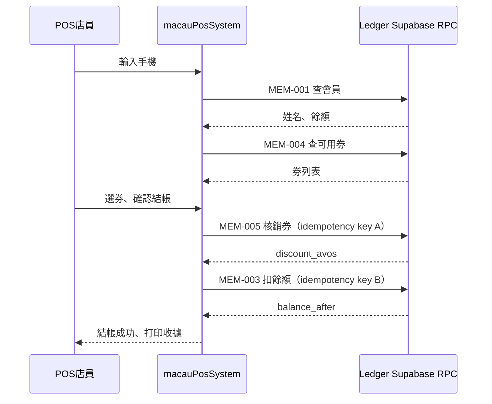

# macauPosSystem × Ledger 會員系統對接需求書

> **文件版本**：v0.1（POS 方提出）  
> **日期**：2026-08-13  
> **提出方**：macauPosSystem（Web POS PWA）  
> **期望產出**：Ledger 團隊回覆正式 **《POS 會員整合契約》**（RPC 白名單、簽章、錯誤碼、個資規則、冪等規則），格式可對齊現有 [ledger-client-api.md](./ledger-client-api.md)。

---

## 1. 背景與目標

macauPosSystem 已完成 Ledger **登入**、**線上訂單**（Realtime + 白名單 RPC）對接。下一階段需對接 **Ledger 會員通／錢包／優惠券** 能力，取代 POS 本地 mock 會員資料（`pos_members`、localStorage 假資料）。

**整合原則（與訂單 Phase 1 一致）**

| 項目 | 要求 |
|------|------|
| 連線方式 | 商戶 POS **client 直連 Ledger Supabase**（PostgREST RPC）；登入仍經 POS server `POST /api/ledger/login` |
| 禁止 | 呼叫 `macau-ledger.vercel.app` HTTP API；禁止 POS 使用 Ledger `service_role` |
| 權限 | 所有 RPC 在 `authenticated` + `merchant_staff` 守衛下執行 |
| 資料權威 | 會員餘額／積分／券狀態以 **Ledger DB 為唯一權威** |
| 參考實作 | Android 商戶 App（[macau-ledger-merchant](https://github.com/EricChang1015/macau-ledger-merchant)）已有部分 RPC，見 §3 |

**名詞說明**

- **餘額／積分**：POS 端統稱「會員可用於抵扣的金額或點數」。請 Ledger 在回覆契約中明確欄位名稱、單位（MOP avos／點數）、以及與 Android 是否同一錢包。
- **優惠券／現金券**：結帳時可選、可核銷的券；需區分「查詢可用」與「核銷／占用」兩階段。

---

## 2. 使用場景（User Stories）

### 2.1 會員頁 `/members`

| # | 場景 | 說明 |
|---|------|------|
| M1 | 搜尋會員 | 店員輸入 **8 位澳門手機**，查該店下會員摘要 |
| M2 | 新增會員 | 店員輸入姓名 + 8 位手機，在本店（或平台）建立會員／綁定錢包 |
| M3 | 查看券列表 | 顯示該會員 **可用** 優惠券／現金券（含門檻、有效期、是否可疊加） |

> Phase 1 **不要求** POS 會員頁「現場充值」；若 Android 已有 `merchant_apply_pos_txn` topup，可列 Phase 2。

### 2.2 收銀台結帳（`/` 主點餐頁）

| # | 場景 | 說明 |
|---|------|------|
| C1 | 結帳前查會員 | 輸入手機 → 顯示姓名、可用餘額／積分、可用券 |
| C2 | 扣減餘額／積分 | 結帳時從會員錢包扣指定金額（可與現金／其他支付方式組合） |
| C3 | 選券 | 列出符合 **本單金額／商品** 的可用券供選擇 |
| C4 | 核銷券 | 結帳確認時核銷所選券，並回寫折抵金額 |
| C5 | 失敗回滾 | 扣點或核銷失敗時，整筆結帳需可取消或重試（需 Ledger 定義原子性／冪等） |

### 2.3 與線上訂單的關係

- 線上訂單餘額扣點目前已走 `accept_order_with_deduct`（接單時扣）。
- **店內 POS 單**需獨立 RPC 或共用 `merchant_apply_pos_txn`，請 Ledger 說明與線上扣點是否同一 ledger 交易流水、如何避免重複扣款。

---

## 3. 功能需求明細

### 3.1 會員查詢

**需求 ID**：`MEM-001`

| 項目 | 內容 |
|------|------|
| 觸發 | 會員頁搜尋；收銀台輸入手機 |
| 輸入 | `p_merchant_id`（uuid）、`p_phone`（8 位字串） |
| 輸出（期望欄位） | `customer_id`／`user_id`、`display_name`、`phone`（若允許回傳）、`balance_avos` 或 `points`、`level`／`tier`（若有）、`member_since`（可選） |
| 錯誤 | 非本店會員、手機格式錯誤、查無此人 — 需穩定 error code／message |
| 已知參考 | Android 使用 `merchant_lookup_customer_wallet`（見 [ecosystem-modules.md](./ecosystem-modules.md) §4.5） |

**待 Ledger 確認**

- [ ] 是否沿用 `merchant_lookup_customer_wallet`，或提供新 RPC 名稱？
- [ ] 是否支援「模糊搜尋／列表分頁」（會員頁是否要 list RPC）？
- [ ] 回傳是否含 **可用券摘要** 或需另呼叫券 RPC？

---

### 3.2 新增會員

**需求 ID**：`MEM-002`

| 項目 | 內容 |
|------|------|
| 觸發 | 會員頁「新增會員」 |
| 輸入 | `p_merchant_id`、`p_phone`（8 位）、`p_display_name`（必填）、其他 Ledger 必要欄位 |
| 行為 | 若手機已在平台註冊 → **綁定至本店**；若不存在 → **建立顧客並開錢包** |
| 輸出 | 新建／綁定後的會員 id、初始餘額（通常 0） |
| 錯誤 | 手機已存在本店、手機格式錯誤、權限不足 |

**待 Ledger 確認**

- [ ] 是否有現成 RPC（名稱、簽章）？
- [ ] 是否需要顧客 SMS／同意條款（POS 是否可省略）？
- [ ] `owner`／`staff` 是否皆可呼叫？

---

### 3.3 扣會員積分（餘額）

**需求 ID**：`MEM-003`

| 項目 | 內容 |
|------|------|
| 觸發 | 店內 POS 結帳確認 |
| 輸入 | `p_merchant_id`、`p_customer_id` 或 `p_phone`、`p_amount_avos`（正整數）、`p_type`（如 `deduct`）、`p_idempotency_key`（uuid）、`p_reference`（店內單號，可選）、`p_note`（可選） |
| 行為 | 原子扣減；餘額不足須失敗且 **不部分扣款**（除非 Ledger 另有規則） |
| 輸出 | 交易 id、`balance_after`、是否重複請求（冪等命中） |
| 已知參考 | Android `merchant_apply_pos_txn` + 底層 `apply_transaction` |

**冪等（必須）**

- 同一結帳操作（含網路逾時重試）**須重用同一 `p_idempotency_key`**。
- 與 `accept_order_with_deduct` 的 key 命名空間需說明是否共用或分離。

**待 Ledger 確認**

- [ ] 是否沿用 `merchant_apply_pos_txn`？
- [ ] 是否允許納入 **Web POS 白名單**（現 [ledger-client-api.md](./ledger-client-api.md) §5.5.3 列為「記帳另議／禁止」）？
- [ ] 扣款與 **店內訂單 id** 如何關聯（便於對帳）？

---

### 3.4 取得會員優惠券／現金券

**需求 ID**：`MEM-004`

| 項目 | 內容 |
|------|------|
| 觸發 | 會員頁；收銀台綁定會員後 |
| 輸入 | `p_merchant_id`、`p_customer_id` 或 `p_phone`；可選 `p_order_amount_avos`（預估訂單金額，用於過濾不可用券） |
| 輸出（每張券） | `coupon_id`、`title`、`type`（`amount_off`／`percent_off`／`cash_voucher` 等）、`amount_off_avos`、`percent_off_permille`、`max_off_avos`、`min_spend_avos`、`stackable`、`expires_at`、`status`（`available`／`used`／`expired`） |
| 過濾 | 僅回傳 **當前可用**；已用／過期不顯示或標記 disabled |

**待 Ledger 確認**

- [ ] RPC 名稱與是否存在？
- [ ] 券是否分 **商戶券／平台券**？
- [ ] 是否支援 Realtime 推送券變更（Phase 2 可選）？

---

### 3.5 使用（核銷）優惠券／現金券

**需求 ID**：`MEM-005`

| 項目 | 內容 |
|------|------|
| 觸發 | 店內 POS 結帳確認（可與 MEM-003 同一交易或分步） |
| 輸入 | `p_merchant_id`、`p_customer_id`、`p_coupon_id`（可數組若允許疊加）、`p_order_reference`（店內單號）、`p_order_amount_avos`、`p_idempotency_key` |
| 行為 | 驗證門檻 → 計算折抵 → 標記券已使用；**不可重複核銷** |
| 輸出 | 實際折抵金額 `discount_avos`、券狀態、若與扣點同交易則回傳統一 receipt |

**業務規則（POS 期望，可由 Ledger 調整）**

- 預設 **不可疊加券** 與 **可疊加券** 規則由 Ledger 回傳 `stackable` 決定。
- Percent 券需支援 `max_off` 上限。
- 核銷失敗時，已扣餘額是否自動沖正 — 需 Ledger 定義（建議同一 DB transaction）。

**待 Ledger 確認**

- [ ] 單獨 RPC 還是合併進 `merchant_apply_pos_txn`？
- [ ] 是否支援一次選多券？

---

## 4. 建議 RPC 白名單（供 Ledger 審核）

以下為 POS **期望最小集**；名稱可調整，請 Ledger 在回覆契約中定稿。

> **v3.2（2026-08-28）已定稿** — 下表「新建？」為**本提案初稿時期**嘅標註，現況見
> `docs/integration/ledger-client-api.md` §5.6–§5.9：
> - `list_merchant_customers`：**唔係新建**。自 `20260530160000` 已喺 DB（Ledger Web
>   `/merchant/reports/users` 日常使用）；v3.2 只係列入 POS 白名單＋加
>   `paid_balance_avos`／`gift_balance_avos`（`20260828120000`）。
> - MEM-002：Ledger 以 **HTTP `ensure-customer`** 提供（**已上線**），POS 伺服器代打，唔係 RPC。
> - MEM-003 `merchant_apply_pos_txn`：**已開放** POS，限 `p_type: "topup" | "deduct"`，禁 `add`。

| 類型 | RPC（暫定名） | 對應需求 | v3.2 狀態 |
|------|---------------|----------|-----------|
| 讀 | `merchant_lookup_customer_wallet`（沿用？） | MEM-001 | ✅ 沿用（§5.6） |
| 讀 | `list_merchant_customer_coupons`（新建？） | MEM-004 | 見 `rewards.ts` |
| 讀 | `list_merchant_customers`（~~新建？，可 Phase 2~~） | 會員列表 | ✅ **已存在＋v3.2 白名單**（§5.7） |
| 寫 | ~~`merchant_register_customer` 或等價（新建？）~~ | MEM-002 | ✅ 改走 **HTTP `ensure-customer`**（§5.9，已上線） |
| 寫 | `merchant_apply_pos_txn`（沿用？） | MEM-003 | ✅ 已開放，限 topup/deduct（§5.8） |
| 寫 | `merchant_redeem_customer_coupon`（新建？） | MEM-005 | 見 `rewards.ts` |

**請 Ledger 標註**：哪些可開放給 **Web POS**，哪些僅 Android／Ledger Web。
（v3.2 已回答：上列 ✅ 項均開放 Web POS。）

---

## 5. 非功能需求

### 5.1 個資與快取（對齊 ledger-client-api §7.2）

| 資料 | POS 行為 |
|------|----------|
| 手機、姓名 | 允許 **當次 UI** 顯示（會員頁、結帳 modal） |
| 長期快取 | **預設禁止** 寫入 POS Supabase、`localStorage` 持久化會員 PII |
| 例外 | 若 Ledger 要求離線查詢，需另簽協議並更新條款 |

### 5.2 效能與呼叫頻率

| 場景 | 期望 |
|------|------|
| 單次結帳 | 查會員 ≤ 1、查券 ≤ 1、扣點 + 核銷 ≤ 2（或 1 個合併 RPC） |
| 會員頁 | 搜尋採 **debounce**，禁止 `setInterval` 輪詢 |
| 列表 | 若提供 list RPC，需分頁參數 `p_limit`／cursor |

### 5.3 錯誤處理

POS 需將 RPC 錯誤映射為店員可讀中文，例如：

- 餘額不足
- 券已使用／已過期／未達低消
- 非本店會員
- 冪等重複（視為成功並顯示原交易結果）

請 Ledger 提供 **穩定 error code 表**（`SQLSTATE`／自定 `code` 欄位）。

### 5.4 安全

- 沿用現有 POS 登入：`merchant_staff` + 店舖 `merchant_id` 範圍。
- 寫入 RPC 必須 in-flight 鎖定（防雙擊重複扣款）。
- 所有寫 RPC 必須支援 **`p_idempotency_key`**。

---

## 6. POS 端實作範圍（供 Ledger 了解）

| 模組 | 現狀 | 對接後 |
|------|------|--------|
| `/members` | mock + `pos_members` | 改 Ledger RPC |
| 結帳 modal | `/api/members` 本地查詢 | 改 Ledger RPC |
| `/api/members` | 本地 CRUD | **廢棄或 410** |
| `macau-pos/members` localStorage | 假資料 | **清除**，不再持久化 PII |

**不在本次需求**

- 會員現場充值（topup）— 可 Phase 2，除非 Ledger 要求與 Android 同步上線
- 會員等級／營銷規則配置 — 只讀展示
- 跨店會員通兌 — 以 Ledger 規則為準

---

## 7. 驗收標準（Acceptance Criteria）

Ledger 交付契約後，POS 將依下列場景驗收：

1. **查詢**：輸入測試手機，回傳與 Ledger Web／Android **相同餘額**。
2. **新增**：新手機建檔後，Ledger Web 可見該會員。
3. **扣點**：店內結帳扣 MOP 10，Ledger 流水 `-10`，餘額一致；重試同 idempotency key **不重複扣**。
4. **查券**：顯示可用券數量與 Ledger 後台一致。
5. **核銷**：用券後 Ledger 標記已用，同一券不可再用。
6. **組合**：扣點 + 用券 + 現金補差 同一單完成，Ledger 有一致 audit trail。

---

## 8. 時序參考（店內結帳）

> 若 Ledger 提供 **單一合併 RPC**（扣點+核銷原子化），POS 可簡化為一步。

---

## 9. 請 Ledger 回覆的交付物

請 Ledger 團隊在本 repo 或 Macau-Ledger repo 提供：

1. **《POS 會員整合契約》** markdown（建議檔名：`ledger-pos-member-api.md`）
2. **RPC 完整簽章**（參數、回傳 jsonb 範例、錯誤碼）
3. **Web POS 白名單** 更新（併入或引用 `ledger-client-api.md`）
4. **Migration／ADR** 連結（若新建 RPC）
5. **測試商戶** 測試手機、PIN、預置券與餘額說明
6. **與 Android 差異表**（若 Web POS 能力子集不同）

---

## 10. 修訂紀錄

| 版本 | 日期 | 說明 |
|------|------|------|
| v0.1 | 2026-08-13 | POS 初稿，待 Ledger 審閱 |

---

## 11. 聯絡與參考

- POS 訂單契約：[ledger-client-api.md](./ledger-client-api.md)
- 生態系 RPC 索引：[ecosystem-modules.md](./ecosystem-modules.md) §4.5
- Android 參考：`merchant_lookup_customer_wallet`、`merchant_apply_pos_txn`
- POS repo：`macauPosSystem` — 實作將在收到 Ledger 契約後進行
